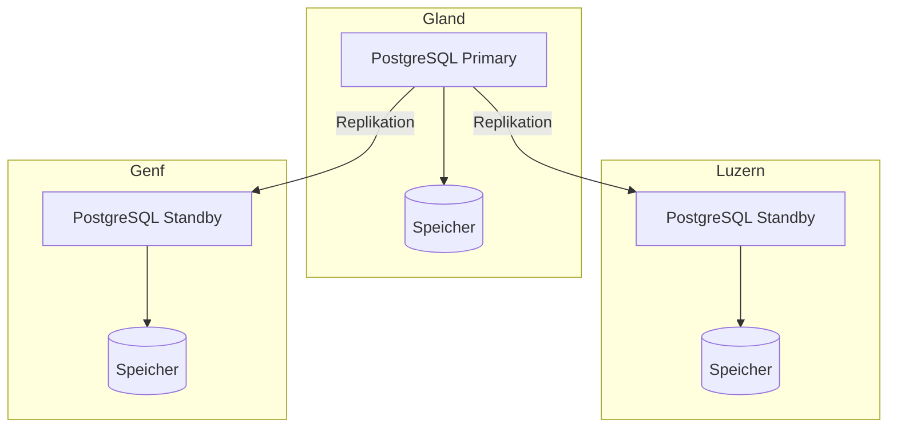

import NavigationFooter from '@site/src/components/NavigationFooter';

# PostgreSQL auf Hikube

Hikube bietet einen verwalteten PostgreSQL-Service an.
Die Plattform übernimmt die Bereitstellung und Verwaltung eines **replizierten und selbstheilenden** PostgreSQL-Clusters, den Sie in der [Hikube-Konsole](https://console.hikube.cloud) erstellen und verwalten (Menü **DB & Messaging** → **PostgreSQL**).

---

## Architektur und Funktionsweise

Die Plattform automatisiert die Verwaltung des Lebenszyklus der Datenbank: Erstellung, Aktualisierung, Replikation und Wiederherstellung nach einem Vorfall.

Die Architektur basiert auf einem **replizierten Cluster**:

- Ein **Primärknoten** (Primary), der die Schreibvorgänge verarbeitet und als Referenz für die Datenkonsistenz dient.
- Eine oder mehrere **Replicas** (Standby), die die Änderungen fortlaufend per Replikation erhalten.
- Ein **Auto-Failover**-Mechanismus, der bei einem Ausfall automatisch eine Replica zum neuen Primary befördert, ohne manuellen Eingriff.

Dieser Ansatz gewährleistet:

- **Resilienz** gegenüber Hardware- oder Softwareausfällen
- **Lese-Skalierbarkeit** durch die Verteilung der Anfragen auf die Replicas
- **Betriebliche Einfachheit**, da die Plattform die Koordination und Wartung des Clusters übernimmt

```mermaid
graph TD
    subgraph Gland
        P1[PostgreSQL Primary] --> PVC1[(Speicher)]
    end

    subgraph Luzern
        P2[PostgreSQL Standby] --> PVC2[(Speicher)]
    end

    subgraph Genf
        P3[PostgreSQL Standby] --> PVC3[(Speicher)]
    end

    P1 -->|Replikation| P2
    P1 -->|Replikation| P3
```

---

## Was Sie in der Konsole verwalten

| Funktion | Verfügbar |
|----------|------------|
| Erstellung eines Clusters (Version 15 bis 18, Preset, Disk-Größe, 1 bis 3 Replicas, externer Zugriff) | Ja |
| Datenbanken und PostgreSQL-Erweiterungen | Ja |
| Benutzer, Rechte pro Datenbank (Admin / nur Lesen), Passwortrotation | Ja |
| Änderung der Version, des Presets, der Disk-Größe und des externen Zugriffs | Ja |
| Änderung der Anzahl der Replicas nach der Erstellung | Nein, [wenden Sie sich an den Support](mailto:support@hidora.io) |
| Backups und Wiederherstellung | Nein, [wenden Sie sich an den Support](mailto:support@hidora.io) |

---

## Anwendungsfälle

- **Geschäftskritische Anwendungen**, die eine zuverlässige und hochverfügbare Datenbank benötigen
- **E-Commerce und ERP**, bei denen die Dienstkontinuität unerlässlich ist
- **Multi-Tenant-SaaS**, bei dem sich die Last zwischen Primary und Replicas verteilen lässt
- **Business Intelligence und Reporting** dank optimierter Lesezugriffe auf den Replicas
- **Cloud-native Anwendungen**, die auf Ihren Hikube-Kubernetes-Clustern bereitgestellt werden

<NavigationFooter
  nextSteps={[
    {label: "Konzepte", href: "../concepts"},
    {label: "Schnellstart", href: "../quick-start"},
  ]}
  seeAlso={[
    {label: "Alle Datenbanken", href: "../../"},
  ]}
/>
