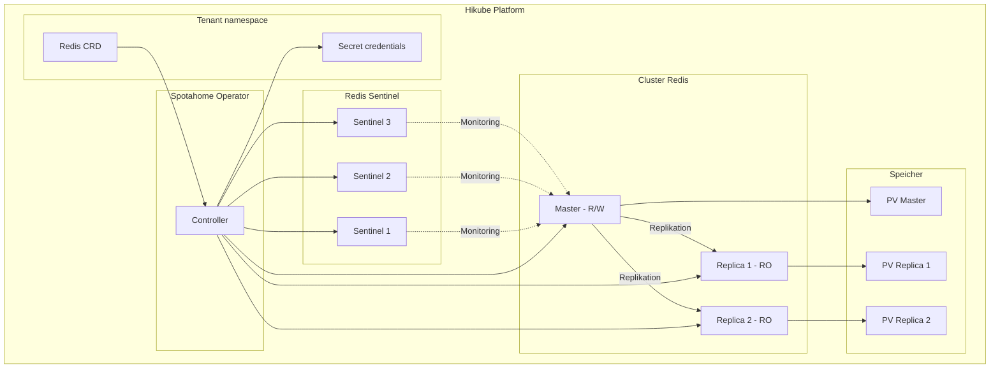
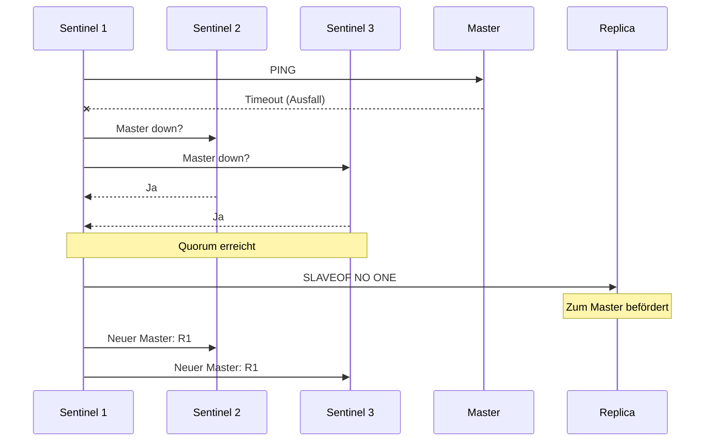

# Konzepte — Redis

## Architektur

Redis auf Hikube ist ein verwalteter Dienst basierend auf dem Operator **Spotahome Redis Operator**. Jede über die Ressource `Redis` bereitgestellte Instanz erstellt einen Master-Replika-Cluster mit **Redis Sentinel** für automatisches Failover.

---

## Terminologie

| Begriff | Beschreibung |
|---------|-------------|
| **Redis** | Kubernetes-Ressource (`apps.cozystack.io/v1alpha1`), die einen verwalteten Redis-Cluster darstellt. |
| **Master** | Hauptinstanz, die Lese- und Schreibvorgänge akzeptiert. |
| **Replica** | Schreibgeschützte Instanz, die vom Master synchronisiert wird. |
| **Sentinel** | Überwachungsprozess, der Ausfälle des Masters erkennt und das automatische Failover orchestriert. |
| **Spotahome Redis Operator** | Kubernetes-Operator, der die Bereitstellung und den Lebenszyklus von Redis-Clustern verwaltet. |
| **authEnabled** | Aktiviert die Passwort-Authentifizierung (`requirepass`). |
| **resourcesPreset** | Vordefiniertes Ressourcenprofil (nano bis 2xlarge). |

---

## Hochverfügbarkeit mit Sentinel

Redis Sentinel gewährleistet Hochverfügbarkeit durch:

1. **Permanente Überwachung** des Masters und der Replikas
2. **Erkennung** eines Master-Ausfalls durch Konsens (Quorum zwischen den Sentinels)
3. **Automatische Beförderung** eines Replikas zum neuen Master
4. **Rekonfiguration** der übrigen Replikas zur Replikation vom neuen Master

:::tip
Konfigurieren Sie mindestens `replicas: 3`, um das Sentinel-Quorum zu gewährleisten und automatisches Failover zu ermöglichen.
:::

---

## Persistenz

Redis auf Hikube unterstützt persistenten Speicher:

| Parameter | Beschreibung |
|-----------|-------------|
| `size` | Größe des persistenten Volumes (z.B.: `10Gi`) |
| `storageClass` | `local` (Leistung) oder `replicated` (Hochverfügbarkeit) |

Die Redis-Daten werden über die nativen Redis-Mechanismen (RDB/AOF) auf die Festplatte geschrieben und gewährleisten so die Haltbarkeit auch bei einem Neustart.

:::warning
Verwenden Sie in der Produktion immer `storageClass: replicated`, um Daten gegen einen Knotenausfall zu schützen.
:::

---

## Authentifizierung

Redis unterstützt optionale Authentifizierung:

- `authEnabled: true` — ein Passwort wird generiert und im Secret `<instance>-credentials` gespeichert
- `authEnabled: false` — Zugriff ohne Passwort (in der Produktion zu vermeiden)

---

## Ressourcen-Presets

| Preset | CPU | Speicher |
|--------|-----|----------|
| `nano` | 250m | 128Mi |
| `micro` | 500m | 256Mi |
| `small` | 1 | 512Mi |
| `medium` | 1 | 1Gi |
| `large` | 2 | 2Gi |
| `xlarge` | 4 | 4Gi |
| `2xlarge` | 8 | 8Gi |

:::warning
Wenn das Feld `resources` (explizite CPU/Speicher) definiert ist, wird `resourcesPreset` ignoriert.
:::

---

## Limits und Kontingente

| Parameter | Wert |
|-----------|------|
| Max. Replikas | Je nach Tenant-Kontingent |
| Speichergröße (`size`) | Variabel (in Gi) |
| Redis-Datenbanken | Einzelne Datenbank (db 0 standardmäßig) |

---

## Weiterführende Informationen

- [Übersicht](./overview.md): Vorstellung des Dienstes
- [API-Referenz](./api-reference.md): Alle Parameter der Redis-Ressource
