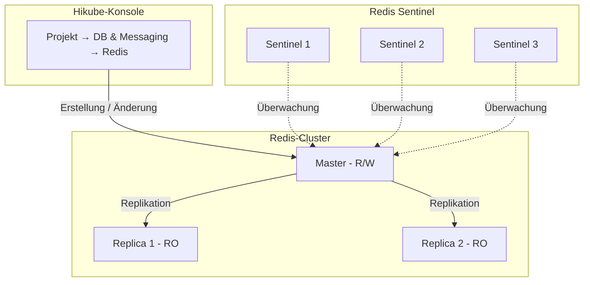
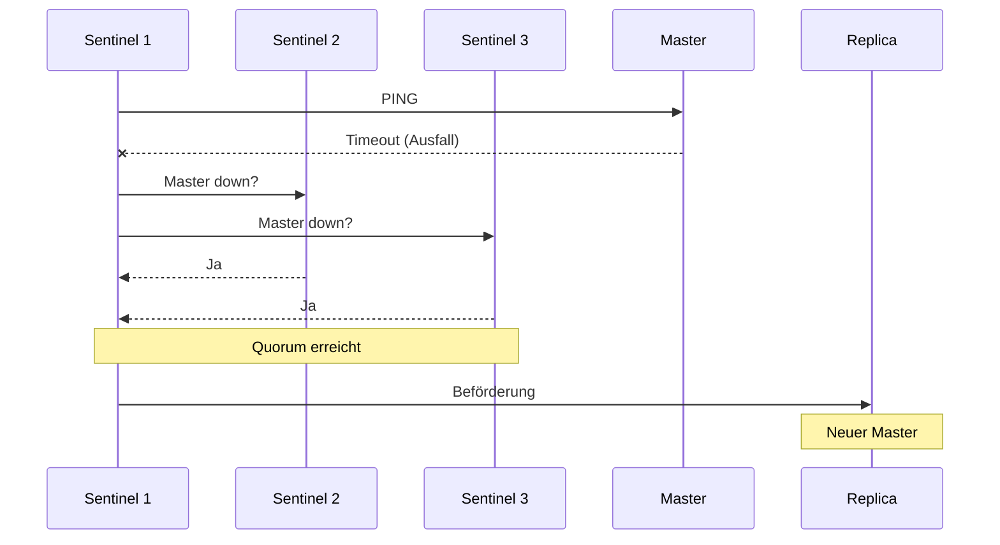

# Konzepte — Redis

## Architektur

Redis auf Hikube ist ein verwalteter Dienst. Jeder über die Konsole erstellte Cluster ist ein Master-Replicas-Verbund, der von **Redis Sentinel** für das automatische Failover überwacht wird. Er gehört zu einem **Projekt** und verbraucht die Quotas dieses Projekts.

```mermaid
graph TB
    subgraph "Hikube-Konsole"
        UI[Projekt → DB & Messaging → Redis]
    end

    subgraph "Redis-Cluster"
        M[Master - R/W]
        R1[Replica 1 - RO]
        R2[Replica 2 - RO]
    end

    subgraph "Redis Sentinel"
        S1[Sentinel 1]
        S2[Sentinel 2]
        S3[Sentinel 3]
    end

    UI -->|Erstellung / Änderung| M
    M -->|Replikation| R1
    M -->|Replikation| R2
    S1 -.->|Überwachung| M
    S2 -.->|Überwachung| M
    S3 -.->|Überwachung| M
```

---

## Terminologie

| Begriff | Beschreibung |
|-------|-------------|
| **Redis-Cluster** | Verwaltete Instanz, die über die Konsole erstellt wird, bestehend aus einem Master und gegebenenfalls Replicas. |
| **Projekt** | Isolierter Bereich, der Ihre Ressourcen bündelt und die Quotas trägt. |
| **Master** | Hauptinstanz, die Lese- und Schreibvorgänge annimmt. |
| **Replica** | Schreibgeschützte Instanz, die vom Master synchronisiert wird. |
| **Sentinel** | Überwachungsprozess, der Ausfälle des Masters erkennt und das automatische Failover steuert. |
| **Preset** | Ressourcenprofil (CPU, Arbeitsspeicher), das jedem Knoten des Clusters zugewiesen wird. |
| **Public network** | Option (auch **External access** genannt), die den Cluster über eine öffentliche IP-Adresse im Internet erreichbar macht. |
| **Authentifizierung** | Schutz des Zugriffs durch ein globales Passwort für den Cluster. |

---

## Hochverfügbarkeit mit Sentinel

Redis Sentinel stellt die Hochverfügbarkeit sicher, indem es:

1. Den Master und die Replicas fortlaufend **überwacht**
2. Den Ausfall des Masters per Konsens zwischen den Sentinels **erkennt**
3. Automatisch eine Replica zum neuen Master **befördert**
4. Die übrigen Replicas so **umkonfiguriert**, dass sie dem neuen Master folgen

```mermaid
sequenceDiagram
    participant S1 as Sentinel 1
    participant S2 as Sentinel 2
    participant S3 as Sentinel 3
    participant M as Master
    participant R1 as Replica

    S1->>M: PING
    M--xS1: Timeout (Ausfall)
    S1->>S2: Master down?
    S1->>S3: Master down?
    S2-->>S1: Ja
    S3-->>S1: Ja
    Note over S1,S3: Quorum erreicht
    S1->>R1: Beförderung
    Note over R1: Neuer Master
```

Die **Number of replicas** wird bei der Erstellung gewählt (1 bis 8).

:::tip
Das automatische Failover funktioniert ab **2 Replicas**: Es werden immer drei Sentinels bereitgestellt, die das Quorum bilden. Wählen Sie für die Produktion **3 Replicas** oder mehr, um mehr Ausfälle zu tolerieren.
:::

:::warning
Die Anzahl der Replicas kann nach der Erstellung nicht geändert werden („The mode cannot be changed after creation“). Um sie zu ändern, [wenden Sie sich an den Support](mailto:support@hidora.io).
:::

---

## Persistenz

Jeder Knoten verfügt über ein persistentes Volume, dessen Kapazität im Feld **Volume size (GB)** festgelegt wird („Storage capacity allocated to each node in the cluster.“). Redis schreibt seine Daten über seine nativen Mechanismen auf die Disk, sodass sie Neustarts überstehen.

---

## Authentifizierung

Die Option **Enable authentication** ist im Assistenten standardmäßig aktiviert:

- **Aktiviert**: Bei der Erstellung wird ein Passwort generiert und einmalig zusammen mit dem Benutzer `default` angezeigt. Sie können es jederzeit im Abschnitt **Security** der Cluster-Seite erneuern (**Rotate password**).
- **Deaktiviert**: Der Cluster nimmt Verbindungen ohne Passwort an. Zu vermeiden, insbesondere bei aktiviertem öffentlichem Netzwerk.

Redis auf Hikube bietet in der Konsole keine Verwaltung mehrerer Benutzer (ACL): Der Zugriff beruht auf diesem globalen Passwort.

---

## Netzwerkzugriff

- **Öffentliches Netzwerk deaktiviert** (Standard, „Private“ in der Übersicht): Der Cluster ist nicht im Internet erreichbar. Der Abschnitt **Connection** der Cluster-Seite zeigt anstelle des Hosts „Waiting for allocation...“ an.
- **Öffentliches Netzwerk aktiviert** („Public“): Die Plattform weist eine öffentliche IP-Adresse zu, die im Feld **Host** angezeigt wird. Sie gewährt Zugriff auf den Master über den Redis-Standardport `6379` und folgt dem Master nach einem Failover.

---

## Presets

Das **Preset** legt die Kapazität fest, die **jedem Knoten** des Clusters zugewiesen wird. Maßgeblich ist die im Assistenten angezeigte Liste; zur Orientierung:

| Preset | CPU | Arbeitsspeicher |
|--------|-----|---------|
| `nano` | 250m | 128Mi |
| `micro` | 500m | 256Mi |
| `small` | 1 | 512Mi |
| `medium` | 1 | 1Gi |
| `large` | 2 | 2Gi |
| `xlarge` | 4 | 4Gi |
| `2xlarge` | 8 | 8Gi |

Der Arbeitsspeicher des Presets begrenzt die Größe des Datenbestands, den Redis im Arbeitsspeicher halten kann. Frei definierbare CPU-/Arbeitsspeicher-Ressourcen werden in der Konsole nicht angeboten; wenden Sie sich an den Support.

---

## Quotas und Kosten

Der Assistent zeigt die **Estimated Cost** und die Auswirkung des Clusters auf die Quotas des Projekts an. Überschreitet der Cluster die verfügbaren Quotas, bleibt die Schaltfläche **Next** inaktiv.

| Parameter | Wert |
|-----------|--------|
| Replicas | 1 bis 8 |
| Volume-Größe | 1 bis 4 096 GB pro Knoten, im Rahmen des Quotas des Projekts |
| Redis-Datenbanken | Standardmäßig logische Datenbank `0` |

---

## Weiterführende Informationen

- [Übersicht](./overview.md): Vorstellung des Dienstes
- [Schnellstart](./quick-start.md): Ihren ersten Cluster erstellen
