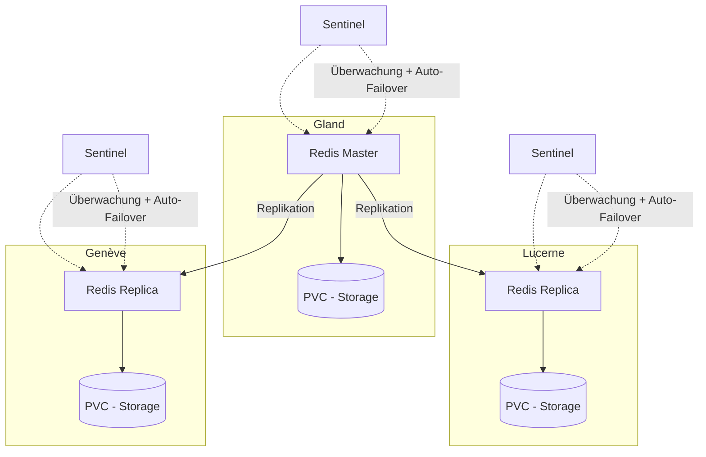

# Redis auf Hikube

Hikube bietet einen **verwalteten Redis-Dienst**, basierend auf dem Operator **[Spotahome Redis Operator](https://github.com/spotahome/redis-operator)**, der in der Community weit verbreitet ist.
Die Plattform unterstützt die Bereitstellung und Verwaltung eines **replizierten und selbstheilenden** Redis-Clusters und stützt sich auf **Redis Sentinel** zur Fehlererkennung und zum Auto-Failover.
Dieser Dienst garantiert Geschwindigkeit, geringe Latenz und Hochverfügbarkeit, ohne Aufwand seitens des Benutzers.

---

## Grundstruktur

### **Redis-Ressource**

#### YAML-Konfigurationsbeispiel

```yaml
apiVersion: apps.cozystack.io/v1alpha1
kind: Redis
metadata:
  name: example
spec:
```

---

## 🏗️ Architektur und Funktionsweise

Der verwaltete Redis-Dienst auf Hikube ist für **Hochverfügbarkeit** und **Resilienz** durch eine replizierte Architektur konzipiert.

- Ein **Master-Knoten** verwaltet alle Schreibvorgänge und dient als Datenquelle der Wahrheit.
- Ein oder mehrere **Replika-Knoten** empfangen Daten über Replikation für Lese-Skalierbarkeit.
- **Redis Sentinel** überwacht permanent den Clusterstatus, erkennt Ausfälle und kann automatisch ein Replika zum neuen Master befördern (**Auto-Failover**).

Diese Kombination garantiert:

- **Kontinuierliche Verfügbarkeit** auch bei einem Ausfall des Masters
- **Hohe Leistung** durch Verteilung der Lesevorgänge auf die Replikas
- **Betriebliche Einfachheit**, da die Verwaltung durch die Plattform und den Spotahome-Operator automatisiert ist



## 🎯 Anwendungsfälle

Der **verwaltete Redis-Dienst auf Hikube** eignet sich besonders für:

- **Anwendungs-Cache**: Beschleunigung von Webanwendungen (E-Commerce, SaaS, API) durch Reduzierung der Antwortzeit dank In-Memory-Speicherung.
- **Verteilte Sessions**: Schnelle und zuverlässige Verwaltung von Benutzersitzungen in Multi-Instanz-Umgebungen.
- **Warteschlangen und leichtes Streaming**: Verwendung von Redis als Message Broker (Pub/Sub, Queues) für Echtzeitkommunikation.
- **Echtzeit-Analytics**: Schnelle Verarbeitung von Metriken, Logs oder Events im Streaming.
- **Gaming und IoT**: Verwaltung temporärer Zustände, Ranglisten und flüchtiger Daten mit geringer Latenz.
