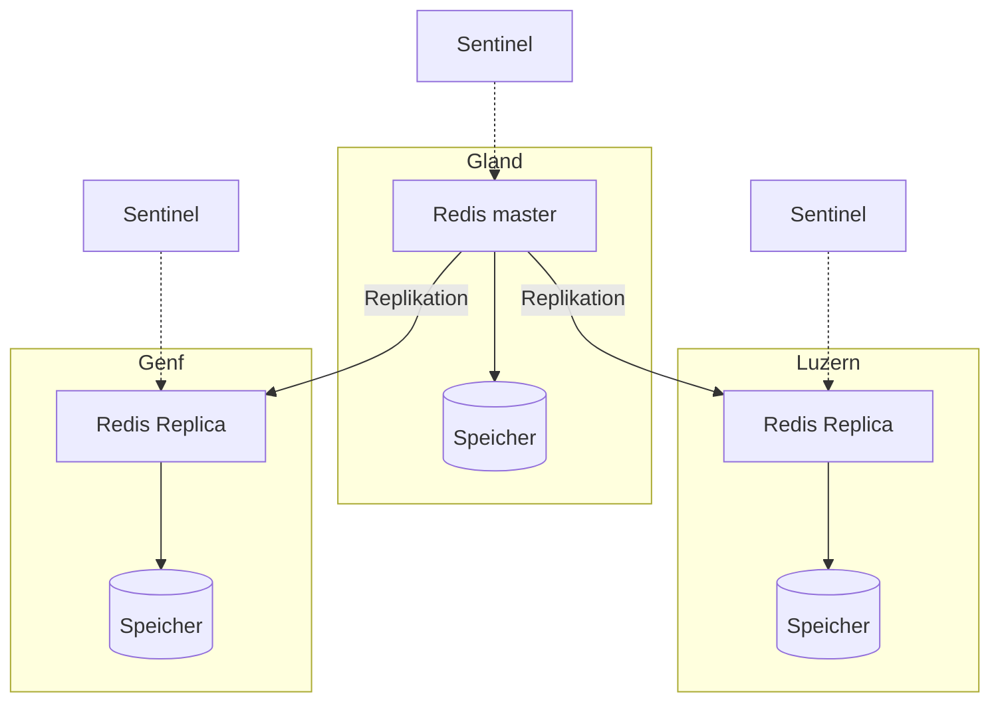

import NavigationFooter from '@site/src/components/NavigationFooter';

# Redis auf Hikube

Hikube bietet einen **verwalteten Redis-Dienst**.
Die Plattform übernimmt die Bereitstellung und Verwaltung eines **replizierten und selbstheilenden** Redis-Clusters und stützt sich dabei auf **Redis Sentinel** für die Fehlererkennung und das Auto-Failover. Sie erstellen und verwalten Ihre Cluster über die [Hikube-Konsole](https://console.hikube.cloud) (Menü **DB & Messaging** → **Redis**).

---

## Architektur und Funktionsweise

Der verwaltete Redis-Dienst auf Hikube ist darauf ausgelegt, dank einer replizierten Architektur **Hochverfügbarkeit** und **Resilienz** zu bieten:

- Ein **Master-Knoten** verarbeitet alle Schreibvorgänge und dient als maßgebliche Quelle für die Daten.
- Ein oder mehrere **Replica-Knoten** erhalten die Daten per Replikation, um die Leseskalierbarkeit sicherzustellen.
- **Redis Sentinel** überwacht fortlaufend den Zustand des Clusters, erkennt Ausfälle und kann automatisch eine Replica zum neuen Master befördern (**Auto-Failover**).

Diese Kombination gewährleistet:

- **Kontinuierliche Verfügbarkeit**, auch bei einem Ausfall des Masters
- **Hohe Leistung** durch die Verteilung der Lesezugriffe auf die Replicas
- **Einfachen Betrieb**, da die Verwaltung von der Plattform automatisiert wird

```mermaid
graph TD
    subgraph Gland
        M1[Redis master] --> PVC1[(Speicher)]
    end

    subgraph Luzern
        R1[Redis Replica] --> PVC2[(Speicher)]
    end

    subgraph Genf
        R2[Redis Replica] --> PVC3[(Speicher)]
    end

    S1[Sentinel] -.-> M1
    S2[Sentinel] -.-> R1
    S3[Sentinel] -.-> R2

    M1 -->|Replikation| R1
    M1 -->|Replikation| R2
```

---

## Was Sie über die Konsole verwalten

| Funktion | Verfügbar |
|----------|------------|
| Erstellung eines Clusters (Version 7 oder 8, Preset, 1 bis 8 Replicas, Volume-Größe, öffentliches Netzwerk, Authentifizierung) | Ja |
| Passwortrotation | Ja |
| Änderung der Version, des Presets, der Volume-Größe, des externen Zugriffs und der Authentifizierung | Ja |
| Änderung der Anzahl der Replicas nach der Erstellung | Nein, [wenden Sie sich an den Support](mailto:support@hidora.io) |

---

## Anwendungsfälle

- **Anwendungscache**: Webanwendungen (E-Commerce, SaaS, API) beschleunigen, indem die Antwortzeit dank In-Memory-Speicherung verkürzt wird.
- **Verteilte Sitzungen**: Benutzersitzungen in Umgebungen mit mehreren Instanzen schnell und zuverlässig verwalten.
- **Warteschlangen und leichtgewichtiges Streaming**: Pub/Sub, Listen und Streams für Echtzeitkommunikation.
- **Echtzeit-Analytics**: schnelle Verarbeitung von Metriken, Zählern oder Ereignissen.
- **Gaming und IoT**: Ranglisten, temporäre Zustände und flüchtige Daten mit geringer Latenz.

<NavigationFooter
  nextSteps={[
    {label: "Konzepte", href: "../concepts"},
    {label: "Schnellstart", href: "../quick-start"},
  ]}
  seeAlso={[
    {label: "Alle Datenbanken", href: "../../"},
  ]}
/>
