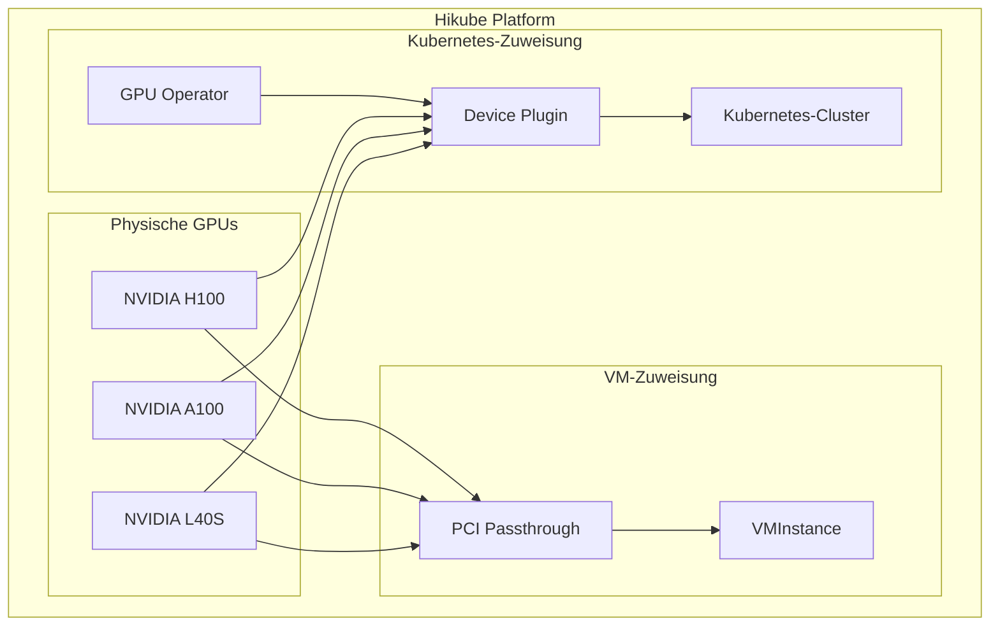
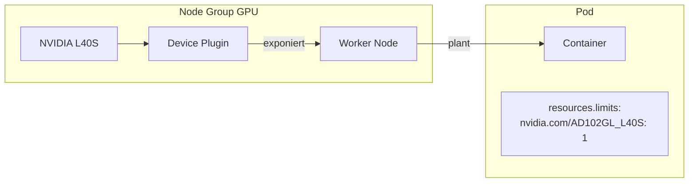

# Konzepte — GPU

## Architektur

Hikube ermöglicht es, NVIDIA-GPUs direkt an virtuelle Maschinen und Kubernetes-Cluster anzuhängen. Die GPU-Zuweisung wird auf Kubernetes-Seite durch den **NVIDIA GPU Operator** und auf VM-Seite (KubeVirt) durch **PCI Passthrough** verwaltet.

---

## Terminologie

| Begriff | Beschreibung |
|---------|-------------|
| **GPU Operator** | NVIDIA GPU Operator — verwaltet automatisch die Treiber, das Device Plugin und die GPU-Laufzeitumgebung auf den Kubernetes-Knoten. |
| **Device Plugin** | Kubernetes-Plugin, das GPUs als planbare Ressourcen exponiert (`nvidia.com/<model>`). |
| **PCI Passthrough** | Technik, die einen physischen GPU direkt einer VM zuweist und native Leistung bietet. |
| **CUDA** | NVIDIA-Plattform für paralleles Rechnen, verwendet für GPU-Beschleunigung (ML, HPC, Rendering). |
| **Instance Type** | CPU/RAM-Ressourcenprofil der VM. Dimensioniert nach der Anzahl der GPUs (8-16 vCPU pro GPU empfohlen). |

---

## Verfügbare GPU-Typen

| GPU | Architektur | Speicher | Leistung (INT8) | Anwendungsfall |
|-----|-------------|---------|-------------------|-------------|
| **L40S** | Ada Lovelace | 48 GB GDDR6 | 362 TOPS | Inferenz, Entwicklung, Prototyping |
| **A100** | Ampere | 80 GB HBM2e | 312 TOPS | ML-Training, Fine-Tuning |
| **H100** | Hopper | 80 GB HBM3 | 1979 TOPS | LLM, Exascale-Rechnen, verteiltes Training |

### GPU-Bezeichner in den Manifesten

| GPU | Wert `gpus[].name` / `nvidia.com/` |
|-----|---------------------------------------|
| L40S | `nvidia.com/AD102GL_L40S` |
| A100 | `nvidia.com/GA100_A100_PCIE_80GB` |
| H100 | `nvidia.com/H100_94GB` |

---

## GPU auf virtuellen Maschinen

GPUs werden über **PCI Passthrough** an VMs angehängt:

- Der physische GPU ist der VM dediziert (native Leistung)
- Deklariert in `spec.gpus[]` des `VMInstance`-Manifests
- Multi-GPU möglich (Einträge in `gpus[]` wiederholen)
- NVIDIA-Treiber müssen in der VM installiert werden

:::tip Empfohlenes CPU/GPU-Verhältnis
Planen Sie **8 bis 16 vCPU pro GPU**. Für einen einzelnen GPU ist ein `u1.2xlarge` (8 vCPU, 32 GB RAM) ein guter Ausgangspunkt.
:::

---

## GPU auf Kubernetes

GPUs werden den Pods über das **NVIDIA Device Plugin** exponiert:

- Der GPU Operator muss auf dem Cluster aktiviert sein (`plugins.gpu-operator.enabled: true`)
- Pods fordern einen GPU über `resources.limits` an (z.B.: `nvidia.com/AD102GL_L40S: 1`)
- Der Kubernetes-Scheduler platziert den Pod auf einem Knoten mit dem angeforderten GPU
- GPU-Knoten werden in den **Node Groups** mit dem Feld `gpus[]` konfiguriert

---

## Vergleich VM vs Kubernetes

| Kriterium | GPU auf VM | GPU auf Kubernetes |
|---------|-----------|-------------------|
| **Isolation** | Dedizierter GPU (Passthrough) | Geteilter GPU via Device Plugin |
| **Leistung** | Native Leistung | Native Leistung |
| **Flexibilität** | Vollständiges OS, manuelle Treiber | Container, automatische Skalierung |
| **Multi-GPU** | Über `spec.gpus[]` | Über `resources.limits` |
| **Anwendungsfall** | Workstations, interaktive Umgebungen | ML-Pipelines, Inferenz im großen Maßstab |

---

## Limits und Quotas

| Parameter | Wert |
|-----------|--------|
| GPU pro VM | Mehrere (je nach Verfügbarkeit) |
| GPU pro Kubernetes-Pod | Mehrere (über `resources.limits`) |
| GPU-Typen | L40S, A100, H100 |
| Max. GPU-Speicher | 80 GB (A100/H100) |

---

## Weiterführende Informationen

- [Übersicht](./overview.md): Vorstellung des GPU-Dienstes
- [API-Referenz](./api-reference.md): Detaillierte GPU-Konfiguration
