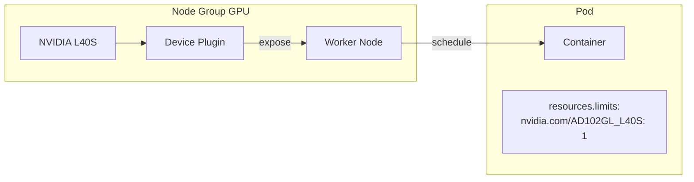

# Concepts — GPU

## Architecture

Hikube permet d'attacher des GPU NVIDIA directement aux machines virtuelles et aux clusters Kubernetes. L'allocation GPU est gérée par le **NVIDIA GPU Operator** côté Kubernetes, et par le **passthrough PCI** côté machines virtuelles (KubeVirt).

---

## Terminologie

| Terme | Beschreibung |
|-------|-------------|
| **GPU Operator** | NVIDIA GPU Operator — gère automatiquement les pilotes, le device plugin et le runtime GPU sur les nœuds Kubernetes. |
| **Device Plugin** | Plugin Kubernetes qui expose les GPU comme ressources planifiables (`nvidia.com/<model>`). |
| **PCI Passthrough** | Technique qui attribue un GPU physique directement à une VM, offrant des performances natives. |
| **CUDA** | Plateforme de calcul parallèle NVIDIA, utilisée pour l'accélération GPU (ML, HPC, rendu). |
| **Instance Type** | Profil de ressources CPU/RAM de la VM. Dimensionné en fonction du nombre de GPU (8-16 vCPU par GPU recommandé). |

---

## Types de GPU disponibles

| GPU | Architecture | Mémoire | Performance (INT8) | Anwendungsfälle |
|-----|-------------|---------|-------------------|-------------|
| **L40S** | Ada Lovelace | 48 GB GDDR6 | 362 TOPS | Inférence, développement, prototypage |
| **A100** | Ampere | 80 GB HBM2e | 312 TOPS | Entraînement ML, fine-tuning |
| **H100** | Hopper | 80 GB HBM3 | 1979 TOPS | LLM, calcul exascale, entraînement distribué |

### Identifiants GPU dans les manifestes

| GPU | Wert `gpus[].name` / `nvidia.com/` |
|-----|---------------------------------------|
| L40S | `nvidia.com/AD102GL_L40S` |
| A100 | `nvidia.com/GA100_A100_PCIE_80GB` |
| H100 | `nvidia.com/H100_94GB` |

---

## GPU sur machines virtuelles

Les GPU sont attachés aux VM via **PCI passthrough** :

- Le GPU physique est dédié à la VM (performances natives)
- Déclaré dans `spec.gpus[]` du manifeste `VMInstance`
- Multi-GPU possible (répéter les entrées dans `gpus[]`)
- Les pilotes NVIDIA doivent être installés dans la VM

:::tip Ratio CPU/GPU recommandé
Prévoyez **8 à 16 vCPU par GPU**. Pour un seul GPU, un `u1.2xlarge` (8 vCPU, 32 GB RAM) est un bon point de départ.
:::

---

## GPU sur Kubernetes

Les GPU sont exposés aux pods via le **NVIDIA Device Plugin** :

- Le GPU Operator doit être aktiviert sur le cluster (`plugins.gpu-operator.enabled: true`)
- Les pods demandent un GPU via `resources.limits` (ex: `nvidia.com/AD102GL_L40S: 1`)
- Le scheduler Kubernetes place le pod sur un nœud disposant du GPU demandé
- Les nœuds GPU sont configurés dans les **node groups** avec le champ `gpus[]`

---

## Comparaison VM vs Kubernetes

| Critère | GPU sur VM | GPU sur Kubernetes |
|---------|-----------|-------------------|
| **Isolation** | GPU dédié (passthrough) | GPU partagé via device plugin |
| **Performance** | Performances natives | Performances natives |
| **Flexibilité** | OS complet, pilotes manuels | Conteneurs, scaling automatique |
| **Multi-GPU** | Via `spec.gpus[]` | Via `resources.limits` |
| **Anwendungsfälle** | Workstations, environnements interactifs | Pipelines ML, inférence à grande échelle |

---

## Limites et quotas

| Paramètre | Wert |
|-----------|--------|
| GPU par VM | Multiples (selon disponibilité) |
| GPU par pod Kubernetes | Multiples (via `resources.limits`) |
| Types de GPU | L40S, A100, H100 |
| Mémoire GPU max | 80 GB (A100/H100) |

---

## Weiterführende Informationen

- [Overview](./overview.md) : présentation du service GPU
- [API-Referenz](./api-reference.md) : configuration GPU détaillée
