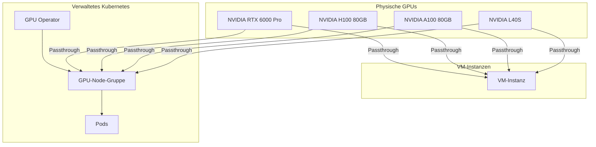
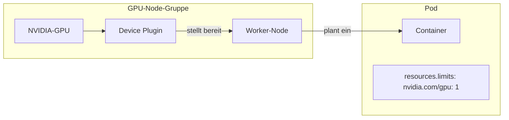

# Konzepte — GPU

## Architektur

Hikube bindet physische NVIDIA-GPUs an virtuelle Maschinen und an die Nodes von Kubernetes-Clustern an. Auf VM-Seite wird die GPU per **PCI-Passthrough** zugewiesen. Auf Kubernetes-Seite erhält der Node die GPU auf dieselbe Weise, anschließend stellt der **NVIDIA GPU Operator** sie den Pods zur Verfügung.

```mermaid
graph TB
    subgraph "Physische GPUs"
        G1[NVIDIA L40S]
        G2[NVIDIA A100 80GB]
        G3[NVIDIA H100 80GB]
        G4[NVIDIA RTX 6000 Pro]
    end

    subgraph "VM-Instanzen"
        VMI[VM-Instanz]
    end

    subgraph "Verwaltetes Kubernetes"
        NG[GPU-Node-Gruppe]
        GO[GPU Operator]
        POD[Pods]
    end

    G1 & G2 & G3 & G4 -->|Passthrough| VMI
    G1 & G2 & G3 & G4 -->|Passthrough| NG
    GO --> NG
    NG --> POD
```

---

## Terminologie

| Begriff | Beschreibung |
|-------|-------------|
| **Hardware Acceleration (GPU)** | Abschnitt des VM-Assistenten, in dem die GPUs der Instanz gewählt werden. |
| **Node-Gruppe** | Gesamtheit der Worker-Nodes eines Kubernetes-Clusters, die einen Instanztyp und gegebenenfalls GPUs teilen. |
| **PCI-Passthrough** | Direkte Zuweisung einer physischen GPU an eine VM oder einen Node, mit nativer Leistung. |
| **GPU Operator** | NVIDIA-Kubernetes-Addon, das die Treiber, das Device Plugin und die GPU-Runtime auf den Nodes installiert. Wird automatisch aktiviert, sobald eine Node-Gruppe GPUs hat. |
| **Device Plugin** | Komponente, die die GPUs den Pods als planbare Ressource `nvidia.com/gpu` zur Verfügung stellt. |
| **HAMi** | Addon zur GPU-Virtualisierung: Teilen derselben GPU zwischen mehreren Pods. Erfordert den GPU Operator. |
| **CUDA** | Plattform von NVIDIA für paralleles Rechnen, verwendet zur Beschleunigung (ML, HPC, Rendering). |

---

## Modelle und Verfügbarkeit

| Modell | Speicher |
|--------|---------|
| **NVIDIA L40S** | 48 GB |
| **NVIDIA A100 80GB** | 80 GB |
| **NVIDIA H100 80GB** | 80 GB |
| **NVIDIA RTX 6000 Pro** | 96 GB |

Die GPU-Auswahl zeigt alle Modelle der Plattform an. Ein Modell ohne freie Einheit ist als **Unavailable** markiert und kann nicht ausgewählt werden. Die Verfügbarkeit ist global: Die Konsole zeigt die Anzahl freier Einheiten nicht an.

:::note Co-Lokalisierung
Eine VM läuft, wie ein Kubernetes-Node, auf einem einzigen physischen Server. Wenn Sie mehrere GPUs für dieselbe VM (oder für jeden Node einer Gruppe) anfordern, müssen alle auf demselben Server verfügbar sein. Andernfalls schlägt die Erstellung mit der Meldung **The following GPUs are not available: …** fehl, selbst wenn jedes Modell als verfügbar erscheint.
:::

---

## GPU auf einer virtuellen Maschine

- Auswahl im Schritt **Configuration** des Assistenten unter **Hardware Acceleration (GPU)**: Klicken Sie auf eine Karte, um eine GPU hinzuzufügen, und verwenden Sie dann **+** und **−**, um die Anzahl zu ändern. Das Badge zeigt die Summe an (zum Beispiel **2 GPUs total**).
- Der Abschnitt erscheint nur, wenn die Plattform GPUs anbietet.
- Die GPUs lassen sich nachträglich unter **Edit** > **Resources (CPU / RAM)** ändern; die VM wird neu gestartet.
- **Stop** einer VM gibt ihre GPUs frei. Wurden sie beim Neustart anderweitig zugewiesen, bietet die Konsole **Select an alternative GPU** an.
- Die NVIDIA-Treiber sind in den Images nicht vorinstalliert.

:::tip CPU/GPU-Verhältnis
Planen Sie **8 bis 16 vCPU pro GPU** ein. Für eine GPU ist ein `u1.2xlarge` (8 vCPU, 32 GB) ein guter Ausgangspunkt.
:::

---

## GPU auf Kubernetes

- Auswahl im Schritt **Nodes** des Cluster-Assistenten, Abschnitt **GPU** jeder Node-Gruppe. Jeder Node der Gruppe erhält die ausgewählten GPUs.
- Sobald eine Gruppe GPUs hat, wird das Addon **GPU Operator** aktiviert und kann nicht mehr deaktiviert werden (**Required when a node group has GPUs**).
- Die Pods fordern eine GPU über `resources.limits` an (`nvidia.com/gpu: 1`).
- Eine **ohne** GPU erstellte Gruppe kann keine erhalten; eine **mit** GPU erstellte Gruppe kann Modell oder Anzahl ändern, muss aber mindestens eine GPU behalten. Um die Kategorie zu wechseln, fügen Sie eine neue Node-Gruppe hinzu.

```mermaid
graph LR
    subgraph "GPU-Node-Gruppe"
        N1[Worker-Node]
        GPU[NVIDIA-GPU]
        DP[Device Plugin]
    end

    subgraph "Pod"
        C[Container]
        RL["resources.limits: nvidia.com/gpu: 1"]
    end

    GPU --> DP
    DP -->|stellt bereit| N1
    N1 -->|plant ein| C
```

---

## Vergleich VM und Kubernetes

| Kriterium | GPU auf VM | GPU auf Kubernetes |
|---------|-----------|-------------------|
| **Zugriff** | GPU der VM fest zugeordnet | GPU vom Scheduler den Pods zugewiesen |
| **Treiber** | Von Ihnen im Betriebssystem installiert | Vom GPU Operator installiert |
| **Multi-GPU** | Mehrere GPUs in der VM | Mehrere GPUs pro Node, `resources.limits` pro Pod |
| **Teilen** | Nein | Ja, mit HAMi |
| **Anwendungsfall** | Workstations, interaktive Umgebungen | ML-Pipelines, Inferenz in großem Maßstab |

---

## Weiterführende Informationen

- [Übersicht](./overview.md)
- [Eine GPU für eine VM bereitstellen](./how-to/provision-gpu-vm.md)
- [Eine GPU auf Kubernetes bereitstellen](./how-to/provision-gpu-kubernetes.md)
