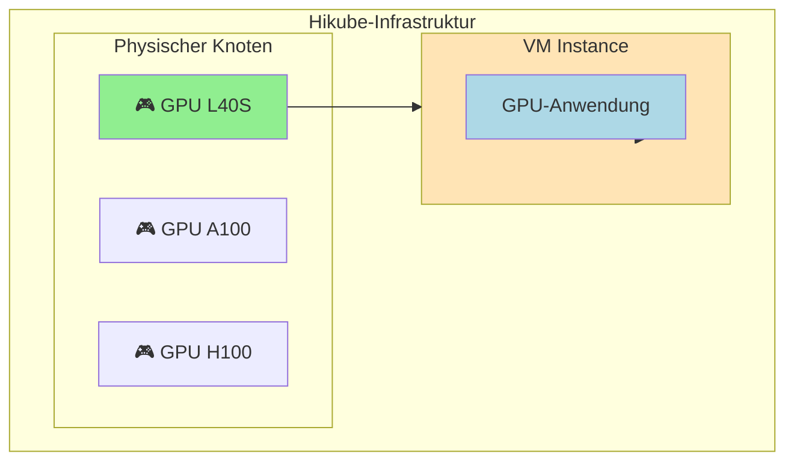
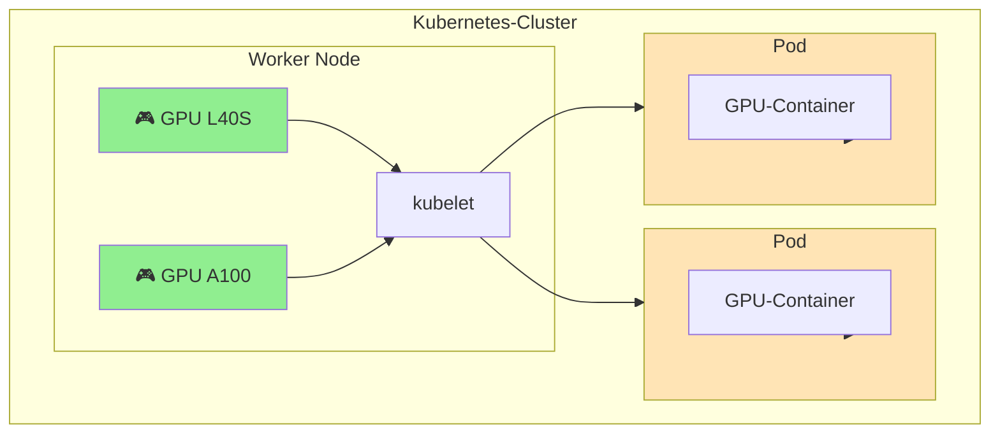

# GPUs auf Hikube

Hikube bietet Zugang zu **NVIDIA**-Beschleunigern über GPU Passthrough, was die Ausführung von Workloads ermöglicht, die Hardware-Beschleunigung benötigen. GPUs sind für zwei Arten von Workloads verfügbar: Virtuelle Maschinen und Kubernetes-Pods.

---

## 🎯 Nutzungsarten

### **GPU mit Virtuellen Maschinen**

GPUs können direkt an virtuelle Maschinen über GPU Passthrough VFIO-PCI angehängt werden und bieten einen vollständigen und exklusiven Zugang zum Beschleuniger.

**Anwendungsfälle:**

- Anwendungen, die vollständige Kontrolle über den GPU erfordern
- Legacy- oder spezialisierte Workloads
- Isolierte Entwicklungsumgebungen
- Grafische Anwendungen (Rendering, CAD)

### **GPU mit Kubernetes**

GPUs können Kubernetes-Workern zugewiesen und dann über Resource Requests/Limits den Pods zugeordnet werden.

**Anwendungsfälle:**

- Containerisierte KI/ML-Workloads
- Automatische Skalierung von GPU-Anwendungen
- GPU-Ressourcenteilung zwischen Anwendungen
- Komplexe Orchestrierung paralleler Jobs

---

## 🖥️ Verfügbare Hardware

Hikube bietet drei Typen von NVIDIA-GPUs:

### **NVIDIA L40S**

- **Architektur**: Ada Lovelace
- **Speicher**: 48 GB GDDR6 mit ECC
- **Leistung**: 362 TOPS (INT8), 91.6 TFLOPs (FP32)
- **Typischer Einsatz**: Generative KI, Inferenz, Echtzeit-Rendering

### **NVIDIA A100**

- **Architektur**: Ampere
- **Speicher**: 80 GB HBM2e mit ECC
- **Leistung**: 312 TOPS (INT8), 624 TFLOPs (Tensor)
- **Typischer Einsatz**: ML-Training, Hochleistungsrechnen

### **NVIDIA H100**

- **Architektur**: Hopper
- **Speicher**: 80 GB HBM3 mit ECC
- **Leistung**: 1979 TOPS (INT8), 989 TFLOPs (Tensor)
- **Typischer Einsatz**: LLM, Transformers, Exascale-Rechnen

---

## 🏗️ Architektur

### **GPU-Zuweisung mit VMs**



### **GPU-Zuweisung mit Kubernetes**



---

## ⚙️ Konfiguration

### **GPU auf VM**

```yaml
apiVersion: apps.cozystack.io/v1alpha1
kind: VirtualMachine
spec:
  instanceType: "u1.xlarge"
  gpus:
    - name: "nvidia.com/AD102GL_L40S"
```

### **GPU auf Kubernetes Worker**

```yaml
apiVersion: apps.cozystack.io/v1alpha1
kind: Kubernetes
spec:
  nodeGroups:
    gpu-workers:
      instanceType: "u1.xlarge"
      gpus:
        - name: "nvidia.com/AD102GL_L40S"
```

### **GPU in Kubernetes-Pod**

```yaml
apiVersion: v1
kind: Pod
spec:
  containers:
  - name: gpu-app
    image: nvidia/cuda:12.0-runtime-ubuntu20.04
    resources:
      limits:
        nvidia.com/gpu: 1
```

---

## 📋 Vergleich der Ansätze

| **Aspekt** | **GPU auf VM** | **GPU auf Kubernetes** |
|------------|----------------|------------------------|
| **Isolation** | Vollständig (1 GPU = 1 VM) | Geteilt (orchestriert) |
| **Leistung** | Nativ (Passthrough) | Nativ (Device Plugin) |
| **Verwaltung** | Manuell | Automatisiert |
| **Skalierung** | Nur vertikal | Horizontal + Vertikal |
| **Teilung** | Nein | Ja (zwischen Pods) |
| **Komplexität** | Einfach | Komplex |

---

## 🚀 Nächste Schritte

### **Für Virtuelle Maschinen**

- [GPU-VM erstellen](./quick-start.md) → Praktische Anleitung
- [API-Referenz](./api-reference.md) → Vollständige Konfiguration

### **Für Kubernetes**

- [GPU-Cluster](../kubernetes/overview.md) → Worker mit GPU
  - [Erweiterte Konfiguration](../kubernetes/api-reference.md) → GPU-NodeGroups
