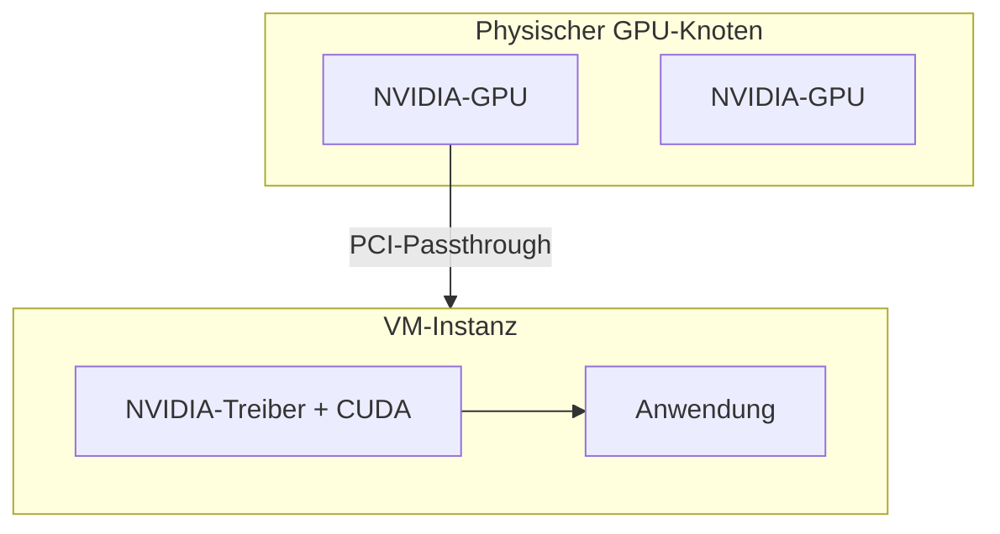
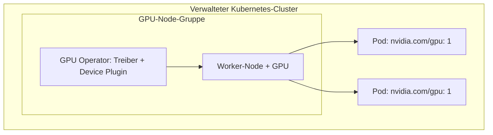

import NavigationFooter from '@site/src/components/NavigationFooter';

# GPUs auf Hikube

Hikube bietet im Passthrough angebundene **NVIDIA**-Beschleuniger für zwei Arten von Workloads: **virtuelle Maschinen** und **Nodes von Kubernetes-Clustern**. Es gibt keine GPU-Seite in der Konsole: Die GPU wird im Assistenten der Ressource gewählt, die sie nutzt.

---

## Nutzungsarten

### GPU auf einer virtuellen Maschine

Die physische GPU wird der VM per PCI-Passthrough zugewiesen: Die VM hat exklusiven Zugriff darauf und native Leistung.

- Auswahl im Assistenten **Create an Instance**, Schritt **Configuration**, Abschnitt **Hardware Acceleration (GPU)**.
- Eine oder mehrere GPUs pro VM, eines oder mehrerer Modelle.
- Die NVIDIA-Treiber werden im Betriebssystem der VM installiert (siehe [CUDA installieren](../compute/how-to/install-cuda-drivers.md)).

**Anwendungsfälle:** CUDA-Entwicklungsumgebungen, Anwendungen, die die vollständige Kontrolle über die GPU benötigen, Grafik-Rendering, spezialisierte Workloads.

### GPU auf Kubernetes

Die GPUs werden an die Nodes einer **Node-Gruppe** des Clusters angebunden und dann über `resources.limits` den Pods zugewiesen.

- Auswahl im Assistenten **Create cluster** (oder **Edit**), Schritt **Nodes**, Abschnitt **GPU** der Node-Gruppe.
- Das Addon **GPU Operator** wird automatisch aktiviert, sobald eine Gruppe GPUs hat; es installiert die Treiber und das Device Plugin.
- Das Addon **HAMi** ermöglicht es, dieselbe GPU zwischen mehreren Pods zu teilen.

**Anwendungsfälle:** Containerisierte KI/ML, skalierte Inferenz, parallele Jobs.

---

## Angebotene Modelle

| Modell (Bezeichnung in der Konsole) | Speicher | Architektur | Typische Verwendung |
|--------------------------------|---------|--------------|---------------|
| **NVIDIA L40S** | 48 GB | Ada Lovelace | Inferenz, generative KI, Echtzeit-Rendering, Prototyping |
| **NVIDIA A100 80GB** | 80 GB | Ampere | ML-Training, Fine-Tuning, wissenschaftliches Rechnen |
| **NVIDIA H100 80GB** | 80 GB | Hopper | Training und Inferenz großer Modelle |
| **NVIDIA RTX 6000 Pro** | 96 GB | Blackwell | LLM, rechenintensive Aufgaben |

Jede Karte der Auswahl zeigt den Namen des Modells und seinen Speicher an (zum Beispiel **48 GB VRAM**). Ein Modell ohne freie Einheit ist ausgegraut und als **Unavailable** markiert.

:::note Verfügbarkeit
Die Konsole zeigt nur an, ob ein Modell verfügbar ist oder nicht, ohne die Anzahl freier Einheiten anzugeben. GPUs sind Ressourcen, die sich die Kunden der Plattform teilen: Eine freigegebene GPU (gestoppte VM, gelöschter Node) kann einem anderen Workload zugewiesen werden. Für einen spezifischen GPU-Kapazitätsbedarf wenden Sie sich an [sales@hidora.io](mailto:sales@hidora.io).
:::

---

## Architektur

### GPU auf VM

```mermaid
flowchart TD
    subgraph NODE["Physischer GPU-Knoten"]
        GPU1["NVIDIA-GPU"]
        GPU2["NVIDIA-GPU"]
    end

    subgraph VM1["VM-Instanz"]
        DRV["NVIDIA-Treiber + CUDA"]
        APP1["Anwendung"]
    end

    GPU1 -->|PCI-Passthrough| VM1
    DRV --> APP1
```

Eine VM läuft auf einem einzigen physischen Knoten: Alle für eine VM angeforderten GPUs müssen **auf demselben Knoten** verfügbar sein.

### GPU auf Kubernetes

```mermaid
flowchart TD
    subgraph CLUSTER["Verwalteter Kubernetes-Cluster"]
        subgraph NG["GPU-Node-Gruppe"]
            W1["Worker-Node + GPU"]
            OP["GPU Operator: Treiber + Device Plugin"]
        end
        POD1["Pod: nvidia.com/gpu: 1"]
        POD2["Pod: nvidia.com/gpu: 1"]
    end

    OP --> W1
    W1 --> POD1
    W1 --> POD2
```

---

## Vergleich

| Aspekt | GPU auf VM | GPU auf Kubernetes |
|--------|-----------|-------------------|
| **Isolation** | GPU der VM fest zugeordnet | GPU vom Scheduler den Pods zugewiesen |
| **Leistung** | Nativ (Passthrough) | Nativ (Device Plugin) |
| **Treiber** | Im Betriebssystem zu installieren | Vom GPU Operator installiert |
| **Skalierung** | Vertikal (VM ändern) | Horizontal (Anzahl der Nodes der Gruppe) |
| **Teilen einer GPU** | Nein | Ja, mit dem Addon HAMi |
| **Änderung** | GPU hinzufügen, entfernen oder wechseln (Neustart) | Eine bestehende Gruppe behält mindestens eine GPU; eine Gruppe ohne GPU kann keine erhalten |

---

## Abrechnung und Quotas

Die in den VM- und Kubernetes-Assistenten angezeigte Kostenschätzung enthält die ausgewählten GPUs. Die GPU einer VM wird freigegeben, wenn die VM gestoppt wird.

---

## Nächste Schritte

- [Schnellstart: eine VM mit GPU](./quick-start.md)
- [Eine GPU auf Kubernetes bereitstellen](./how-to/provision-gpu-kubernetes.md)
- [Konzepte](./concepts.md)

<NavigationFooter
  nextSteps={[
    {label: "Konzepte", href: "../concepts"},
    {label: "Schnellstart", href: "../quick-start"},
  ]}
  seeAlso={[
    {label: "Rechenressourcen", href: "../../compute/"},
  ]}
/>
