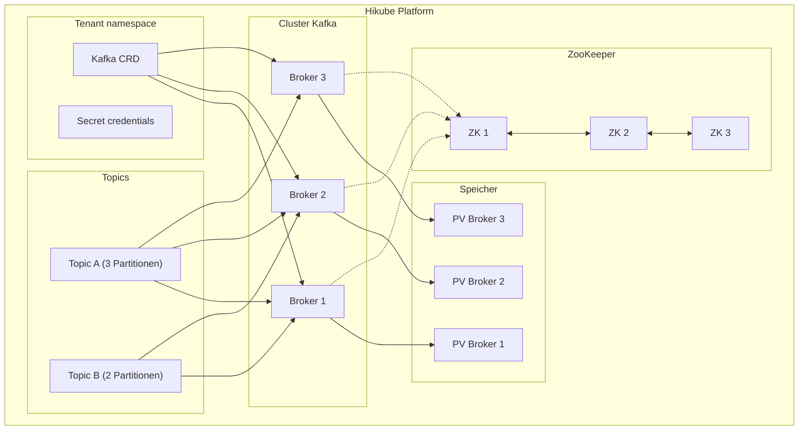
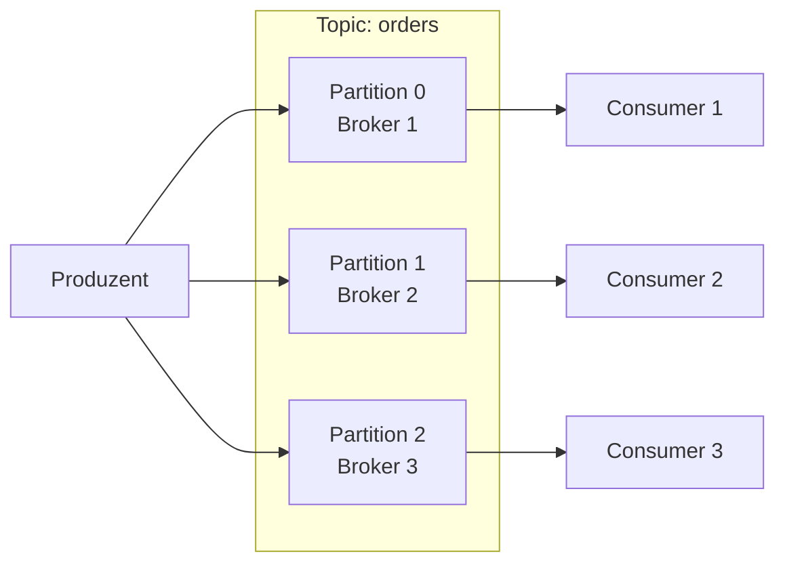

# Konzepte — Kafka

## Architektur

Kafka auf Hikube ist ein verwalteter verteilter Streaming-Dienst. Jede über die Ressource `Kafka` bereitgestellte Instanz erstellt einen Cluster aus **Brokern**, die von **ZooKeeper** koordiniert werden und Millionen von Nachrichten pro Sekunde mit garantierter Persistenz verarbeiten können.

---

## Terminologie

| Begriff | Beschreibung |
|---------|--------------|
| **Kafka** | Kubernetes-Ressource (`apps.cozystack.io/v1alpha1`), die einen verwalteten Kafka-Cluster darstellt. |
| **Broker** | Kafka-Instanz, die Nachrichten speichert und Produzenten/Konsumenten bedient. |
| **ZooKeeper** | Verteilter Koordinierungsdienst, der die Metadaten des Clusters, die Leader-Wahl und die Topic-Konfiguration verwaltet. |
| **Topic** | Benannter Nachrichtenkanal. Produzenten schreiben in ein Topic, Konsumenten lesen aus einem Topic. |
| **Partition** | Unterteilung eines Topics. Jede Partition ist ein geordnetes Nachrichtenlog, das auf einem Broker verteilt ist. |
| **Replication Factor** | Anzahl der Kopien jeder Partition auf verschiedenen Brokern. |
| **Consumer Group** | Gruppe von Konsumenten, die sich die Partitionen eines Topics für die parallele Verarbeitung aufteilen. |
| **Retention** | Maximale Aufbewahrungsdauer oder -größe von Nachrichten in einem Topic. |
| **resourcesPreset** | Vordefiniertes Ressourcenprofil (nano bis 2xlarge). |

---

## Topics und Partitionen

### Funktionsweise

Ein **Topic** wird in **Partitionen** aufgeteilt, die jeweils auf einem anderen Broker verteilt sind:

- Mehr Partitionen = mehr Parallelität
- Jede Partition hat einen **Leader** (einen Broker) und **Follower** (Replikate)
- Der `replicationFactor` bestimmt die Anzahl der Kopien jeder Partition

### Konfiguration der Topics

Die Topics werden direkt im Kafka-Manifest deklariert:

| Parameter | Beschreibung |
|-----------|--------------|
| `topics[name].partitions` | Anzahl der Partitionen des Topics |
| `topics[name].config.replicationFactor` | Anzahl der Replikate pro Partition |
| `topics[name].config.retentionMs` | Aufbewahrungsdauer in ms (z.B. `604800000` = 7 Tage) |
| `topics[name].config.cleanupPolicy` | `delete` (Löschung nach TTL) oder `compact` (Aufbewahrung der letzten Nachricht pro Schlüssel) |

---

## ZooKeeper

ZooKeeper sorgt für die Koordination des Kafka-Clusters:

- **Leader-Wahl** für jede Partition
- **Speicherung der Metadaten** (Topics, Partitionen, Offsets)
- **Ausfallerkennung** der Broker

:::tip
Konfigurieren Sie immer eine ungerade Anzahl von ZooKeeper-Instanzen (`zookeeper.replicas: 3`), um das Quorum zu gewährleisten.
:::

Die ZooKeeper-Ressourcen werden unabhängig von den Brokern über `zookeeper.resources` oder `zookeeper.resourcesPreset` konfiguriert.

---

## Ressourcen-Presets

Die Presets werden getrennt auf die **Kafka-Broker** und den **ZooKeeper** angewendet:

| Preset | CPU | Speicher |
|--------|-----|----------|
| `nano` | 250m | 128Mi |
| `micro` | 500m | 256Mi |
| `small` | 1 | 512Mi |
| `medium` | 1 | 1Gi |
| `large` | 2 | 2Gi |
| `xlarge` | 4 | 4Gi |
| `2xlarge` | 8 | 8Gi |

---

## Grenzen und Kontingente

| Parameter | Wert |
|-----------|------|
| Max. Kafka-Broker | Je nach Tenant-Kontingent |
| ZooKeeper-Instanzen | 3 empfohlen (ungerade) |
| Topics pro Cluster | Unbegrenzt (je nach Ressourcen) |
| Partitionen pro Topic | Konfigurierbar |
| Speichergröße | Variabel (`kafka.size`, `zookeeper.size`) |

---

## Weiterführende Informationen

- [Übersicht](./overview.md): Vorstellung des Dienstes
- [API-Referenz](./api-reference.md): Alle Parameter der Kafka-Ressource
