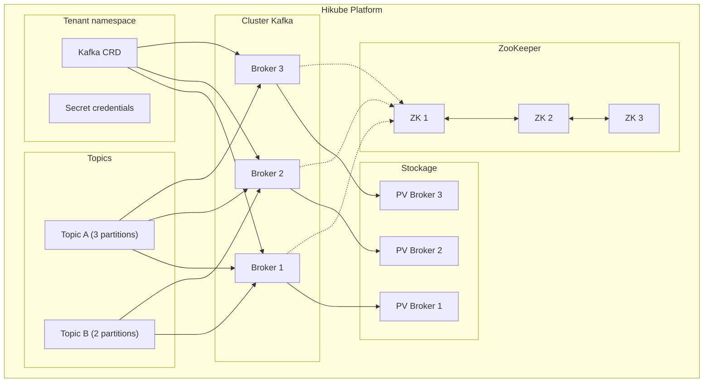
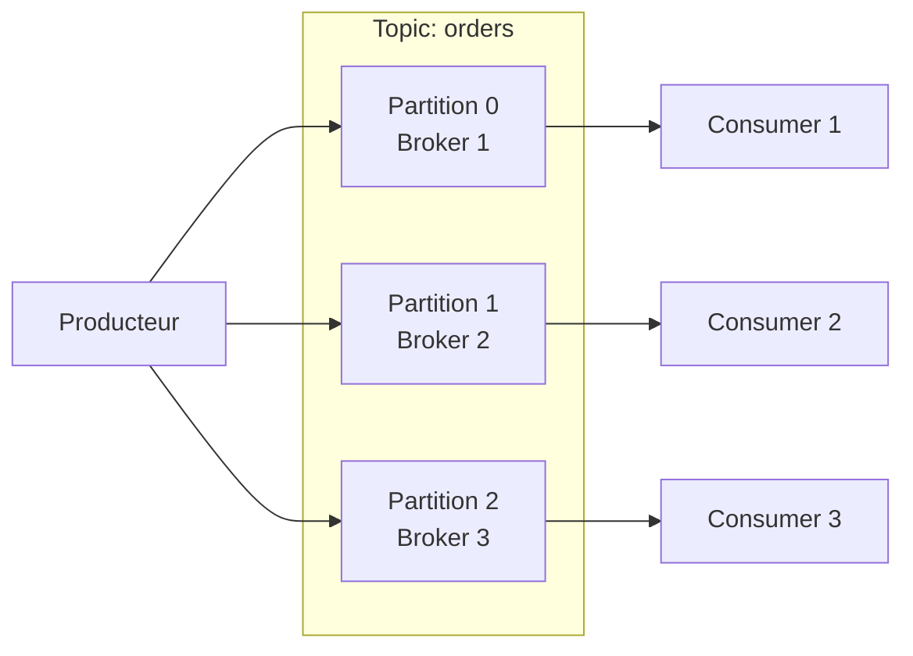

# Concepts — Kafka

## Architecture

Kafka auf Hikube est un service managé de streaming distribué. Chaque instance déployée via la ressource `Kafka` crée un cluster de **brokers** coordonnés par **ZooKeeper**, capable de gérer des millions de messages par seconde avec une persistance garantie.

---

## Terminologie

| Terme | Beschreibung |
|-------|-------------|
| **Kafka** | Ressource Kubernetes (`apps.cozystack.io/v1alpha1`) représentant un cluster Kafka managé. |
| **Broker** | Instance Kafka qui stocke les messages et sert les producteurs/consommateurs. |
| **ZooKeeper** | Service de coordination distribué qui gère les métadonnées du cluster, l'élection du leader et la configuration des topics. |
| **Topic** | Canal de messages nommé. Les producteurs écrivent dans un topic, les consommateurs lisent depuis un topic. |
| **Partition** | Subdivision d'un topic. Chaque partition est un log ordonné de messages, distribué sur un broker. |
| **Replication Factor** | Nombre de copies de chaque partition sur différents brokers. |
| **Consumer Group** | Groupe de consommateurs qui se répartissent les partitions d'un topic pour le traitement parallèle. |
| **Retention** | Durée ou taille maximale de conservation des messages dans un topic. |
| **resourcesPreset** | Profil de ressources prédéfini (nano à 2xlarge). |

---

## Topics et partitions

### Fonctionnement

Un **topic** est divisé en **partitions**, chacune distribuée sur un broker différent :

- Plus de partitions = plus de parallélisme
- Chaque partition a un **leader** (un broker) et des **followers** (réplicas)
- Le `replicationFactor` détermine le nombre de copies de chaque partition

### Konfiguration des topics

Les topics sont déclarés directement dans le manifeste Kafka :

| Paramètre | Beschreibung |
|-----------|-------------|
| `topics[name].partitions` | Nombre de partitions du topic |
| `topics[name].config.replicationFactor` | Nombre de réplicas par partition |
| `topics[name].config.retentionMs` | Durée de rétention en ms (ex: `604800000` = 7 jours) |
| `topics[name].config.cleanupPolicy` | `delete` (suppression par TTL) ou `compact` (conservation du dernier message par clé) |

---

## ZooKeeper

ZooKeeper assure la coordination du cluster Kafka :

- **Élection du leader** pour chaque partition
- **Stockage des métadonnées** (topics, partitions, offsets)
- **Détection des pannes** des brokers

:::tip
Configurez toujours un nombre impair d'instances ZooKeeper (`zookeeper.replicas: 3`) pour garantir le quorum.
:::

Les ressources ZooKeeper sont configurées indépendamment des brokers via `zookeeper.resources` ou `zookeeper.resourcesPreset`.

---

## Presets de ressources

Les presets s'appliquent séparément aux **brokers Kafka** et au **ZooKeeper** :

| Preset | CPU | Mémoire |
|--------|-----|---------|
| `nano` | 250m | 128Mi |
| `micro` | 500m | 256Mi |
| `small` | 1 | 512Mi |
| `medium` | 1 | 1Gi |
| `large` | 2 | 2Gi |
| `xlarge` | 4 | 4Gi |
| `2xlarge` | 8 | 8Gi |

---

## Limites et quotas

| Paramètre | Wert |
|-----------|--------|
| Brokers Kafka max | Selon quota tenant |
| Instances ZooKeeper | 3 recommandé (impair) |
| Topics par cluster | Illimité (selon ressources) |
| Partitions par topic | Configurable |
| Taille stockage | Variable (`kafka.size`, `zookeeper.size`) |

---

## Weiterführende Informationen

- [Overview](./overview.md) : présentation du service
- [API-Referenz](./api-reference.md) : tous les paramètres de la ressource Kafka
