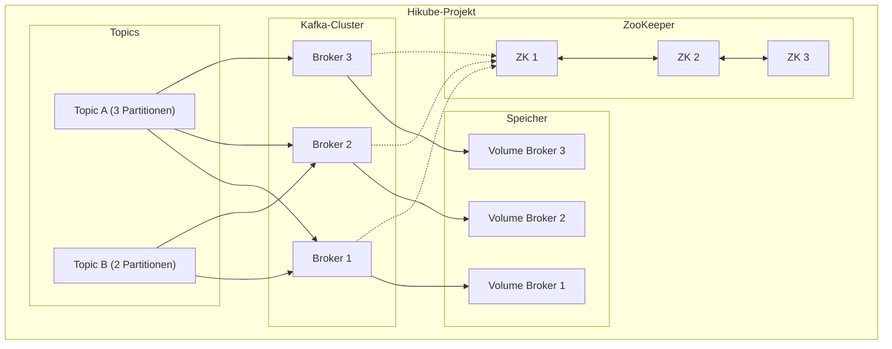
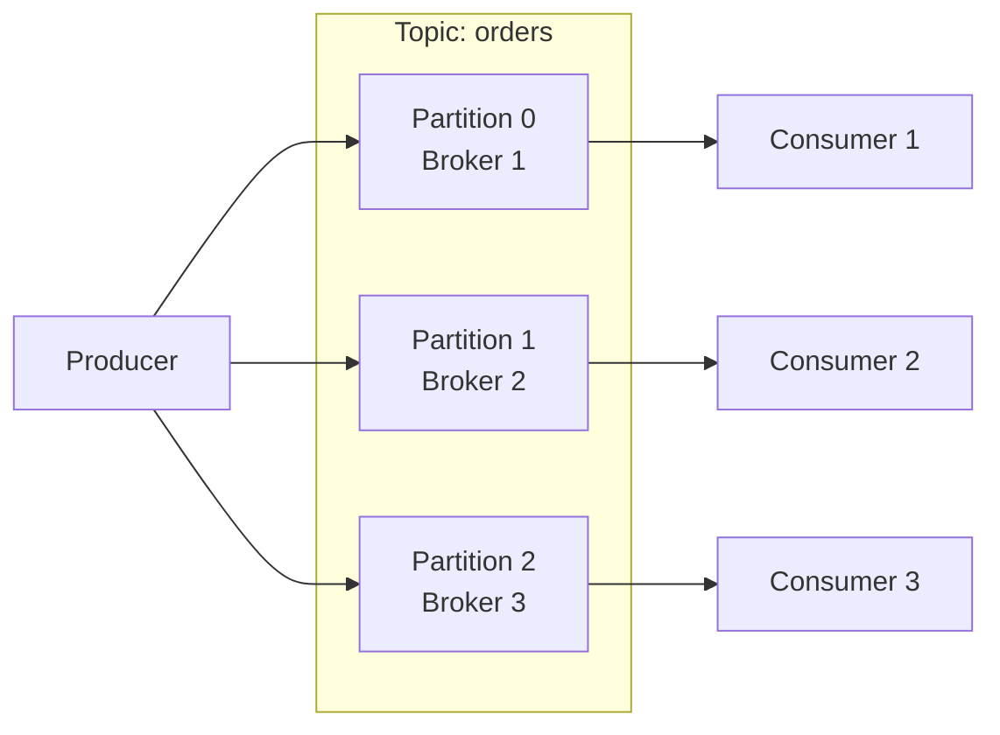

# Konzepte — Kafka

:::info Verfügbarkeit
Kafka ist in der [Hikube-Konsole](https://console.hikube.cloud) noch nicht als Self-Service verfügbar.
Um eine Instanz bereitzustellen oder ihre Konfiguration zu ändern, [wenden Sie sich an den Support](mailto:support@hidora.io).
:::

## Architektur

Kafka auf Hikube ist ein verwalteter Dienst für verteiltes Streaming. Jede Instanz ist ein Cluster aus **Brokern**, die von **ZooKeeper** koordiniert werden. Sie gehört zu einem Hikube-Projekt und verfügt über persistenten Speicher für jeden Broker.

```mermaid
graph TB
    subgraph "Hikube-Projekt"
        subgraph "Kafka-Cluster"
            B1[Broker 1]
            B2[Broker 2]
            B3[Broker 3]
        end

        subgraph "ZooKeeper"
            Z1[ZK 1]
            Z2[ZK 2]
            Z3[ZK 3]
        end

        subgraph "Topics"
            T1["Topic A (3 Partitionen)"]
            T2["Topic B (2 Partitionen)"]
        end

        subgraph "Speicher"
            PV1[Volume Broker 1]
            PV2[Volume Broker 2]
            PV3[Volume Broker 3]
        end
    end

    B1 --> PV1
    B2 --> PV2
    B3 --> PV3
    Z1 <--> Z2
    Z2 <--> Z3
    B1 -.-> Z1
    B2 -.-> Z1
    B3 -.-> Z1
    T1 --> B1
    T1 --> B2
    T1 --> B3
    T2 --> B1
    T2 --> B2
```

---

## Terminologie

| Begriff | Beschreibung |
|-------|-------------|
| **Kafka (Instanz)** | Von Hikube verwalteter Kafka-Cluster, der zu einem Projekt gehört. Seine Konfiguration wird bei der Erstellung festgelegt und auf Anfrage beim Support geändert. |
| **Broker** | Kafka-Instanz, die die Nachrichten speichert und Producer/Consumer bedient. |
| **ZooKeeper** | Verteilter Koordinationsdienst, der die Metadaten des Clusters, die Leader-Wahl und die Konfiguration der Topics verwaltet. |
| **Topic** | Benannter Nachrichtenkanal. Producer schreiben in einen Topic, Consumer lesen aus einem Topic. |
| **Partition** | Unterteilung eines Topics. Jede Partition ist ein geordnetes Log von Nachrichten, das auf einem Broker liegt. |
| **Replication Factor** | Anzahl der Kopien jeder Partition auf verschiedenen Brokern. |
| **Consumer Group** | Gruppe von Consumern, die die Partitionen eines Topics für die parallele Verarbeitung untereinander aufteilen. |
| **Retention** | Maximale Dauer oder Größe, für die Nachrichten in einem Topic aufbewahrt werden. |
| **Ressourcen-Preset** | Vordefiniertes CPU-/Arbeitsspeicherprofil (nano bis 2xlarge), das auf die Broker und auf ZooKeeper angewendet wird. |

---

## Topics und Partitionen

### Funktionsweise

Ein **Topic** ist in **Partitionen** unterteilt, die jeweils auf einem anderen Broker liegen:

```mermaid
graph LR
    subgraph "Topic: orders"
        P0[Partition 0<br/>Broker 1]
        P1[Partition 1<br/>Broker 2]
        P2[Partition 2<br/>Broker 3]
    end

    Prod[Producer] --> P0
    Prod --> P1
    Prod --> P2

    P0 --> C1[Consumer 1]
    P1 --> C2[Consumer 2]
    P2 --> C3[Consumer 3]
```

- Mehr Partitionen = mehr Parallelität
- Jede Partition hat einen **Leader** (einen Broker) und **Follower** (Replicas)
- Der Replikationsfaktor bestimmt die Anzahl der Kopien jeder Partition

### Konfiguration der Topics

Die verwalteten Topics sind Teil der Konfiguration der Instanz. Für jeden Topic können die folgenden Parameter festgelegt werden:

| Parameter | Beschreibung |
|-----------|-------------|
| Partitionen | Anzahl der Partitionen des Topics |
| Replicas | Anzahl der Kopien jeder Partition (darf die Anzahl der Broker nicht übersteigen) |
| `retention.ms` | Aufbewahrungsdauer in ms (z. B. `604800000` = 7 Tage) |
| `cleanup.policy` | `delete` (Löschen nach Ablauf der Aufbewahrung) oder `compact` (Aufbewahrung der letzten Nachricht pro Schlüssel) |
| `min.insync.replicas` | Mindestanzahl synchronisierter Replicas, um einen Schreibvorgang zu bestätigen |

Diese Option wird in der Konsole nicht angeboten; wenden Sie sich an den Support.

---

## ZooKeeper

ZooKeeper übernimmt die Koordination des Kafka-Clusters:

- **Leader-Wahl** für jede Partition
- **Speicherung der Metadaten** (Topics, Partitionen, Offsets)
- **Erkennung von Ausfällen** der Broker

:::tip
Eine ungerade Anzahl von ZooKeeper-Instanzen (in der Regel 3) ist erforderlich, um das Quorum zu gewährleisten. Geben Sie sie bei Ihrer Instanzanfrage an.
:::

Die Ressourcen von ZooKeeper (Anzahl der Instanzen, Preset, Speichergröße) werden unabhängig von denen der Broker festgelegt.

---

## Ressourcen-Presets

Die Presets gelten getrennt für die **Kafka-Broker** und für **ZooKeeper**:

| Preset | CPU | Arbeitsspeicher |
|--------|-----|---------|
| `nano` | 250m | 128Mi |
| `micro` | 500m | 256Mi |
| `small` | 1 | 512Mi |
| `medium` | 1 | 1Gi |
| `large` | 2 | 2Gi |
| `xlarge` | 4 | 4Gi |
| `2xlarge` | 8 | 8Gi |

---

## Limits und Quotas

| Parameter | Wert |
|-----------|--------|
| Max. Kafka-Broker | Abhängig von den Quotas des Projekts |
| ZooKeeper-Instanzen | 3 empfohlen (ungerade) |
| Topics pro Cluster | Unbegrenzt (abhängig von den Ressourcen) |
| Partitionen pro Topic | Konfigurierbar |
| Speichergröße | Getrennt für die Broker und für ZooKeeper festgelegt |

---

## Weiterführende Informationen

- [Übersicht](./overview.md): Vorstellung des Dienstes
- [Schnellstart](./quick-start.md): eine Instanz anfragen und testen
