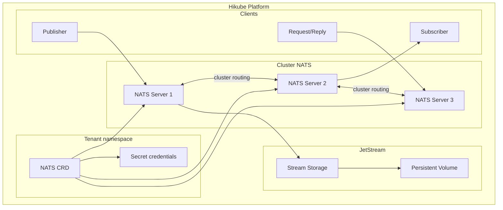
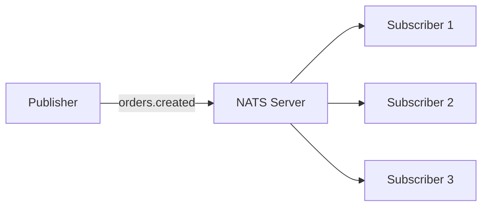
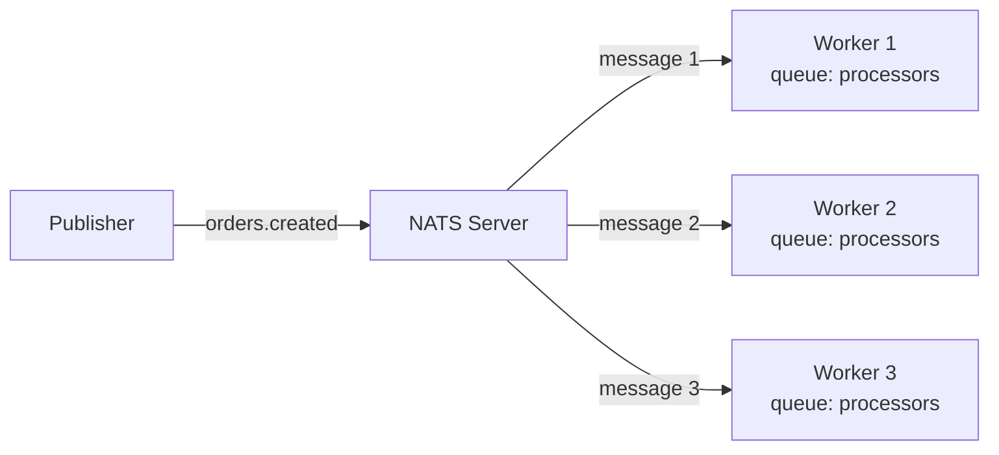
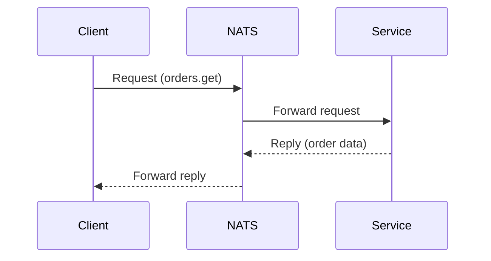

# Konzepte — NATS

## Architektur

NATS auf Hikube ist ein verwalteter Messaging-Dienst, ultraleicht und hochperformant. Jede über die Ressource `NATS` bereitgestellte Instanz erstellt einen Server-Cluster mit optionaler **JetStream**-Unterstützung für die Nachrichtenpersistenz.

---

## Terminologie

| Begriff | Beschreibung |
|---------|--------------|
| **NATS** | Kubernetes-Ressource (`apps.cozystack.io/v1alpha1`), die einen verwalteten NATS-Cluster darstellt. |
| **Subject** | Routing-Adresse für Nachrichten (z.B. `orders.created`). Unterstützt Wildcards (`*`, `>`). |
| **Publish/Subscribe** | Kommunikationsmodell, bei dem Publisher Nachrichten an ein Subject senden und Subscriber sie empfangen. |
| **JetStream** | Persistenzerweiterung von NATS — dauerhafte Nachrichtenspeicherung mit Replay, Acknowledgment und Consumern. |
| **Stream** | Persistente Nachrichtensammlung in JetStream mit konfigurierbarer Aufbewahrungsrichtlinie. |
| **Consumer** | Dauerhaftes Abonnement in JetStream mit Positionsverfolgung (Offset) und Acknowledgment. |
| **Request/Reply** | Synchrones Kommunikationsmodell — ein Client sendet eine Anfrage und wartet auf eine Antwort. |
| **resourcesPreset** | Vordefiniertes Ressourcenprofil (nano bis 2xlarge). |

---

## Kommunikationsmodelle

NATS unterstützt drei Kommunikationsmodelle:

### Publish/Subscribe

Das einfachste Modell — ein Publisher sendet eine Nachricht, alle Subscriber erhalten eine Kopie:

### Queue Groups

Die Subscriber derselben Queue Group teilen sich die Nachrichten (Load Balancing):

### Request/Reply

Synchrone Kommunikation mit erwarteter Antwort:

---

## JetStream

JetStream fügt NATS **Persistenz** hinzu:

- Die Nachrichten werden auf der Festplatte in **Streams** gespeichert
- Die **Consumer** verfolgen ihre Position und können Nachrichten erneut lesen
- Unterstützung von **At-least-once**- und **Exactly-once**-Zustellung
- Konfigurierbare Aufbewahrung nach Dauer, Nachrichtenanzahl oder Größe

:::tip
Aktivieren Sie JetStream nur, wenn Sie Persistenz benötigen. Für ephemeres Pub/Sub ist das Basis-NATS leichtgewichtiger (< 10 MB RAM pro Instanz).
:::

---

## Benutzerverwaltung

Die NATS-Benutzer werden im Manifest mit einem Passwort deklariert. Die Zugangsdaten werden im Secret `<instance>-credentials` gespeichert.

---

## Ressourcen-Presets

| Preset | CPU | Speicher |
|--------|-----|----------|
| `nano` | 250m | 128Mi |
| `micro` | 500m | 256Mi |
| `small` | 1 | 512Mi |
| `medium` | 1 | 1Gi |
| `large` | 2 | 2Gi |
| `xlarge` | 4 | 4Gi |
| `2xlarge` | 8 | 8Gi |

---

## Grenzen und Kontingente

| Parameter | Wert |
|-----------|------|
| Max. Replikate | Je nach Tenant-Kontingent |
| Minimaler Speicherverbrauch | < 10 MB pro Instanz (ohne JetStream) |
| JetStream-Speichergröße | Variabel (in Gi) |
| Typische Latenz | < 1 ms (im selben Datacenter) |

---

## Weiterführende Informationen

- [Übersicht](./overview.md): Vorstellung des Dienstes
- [API-Referenz](./api-reference.md): Alle Parameter der NATS-Ressource
