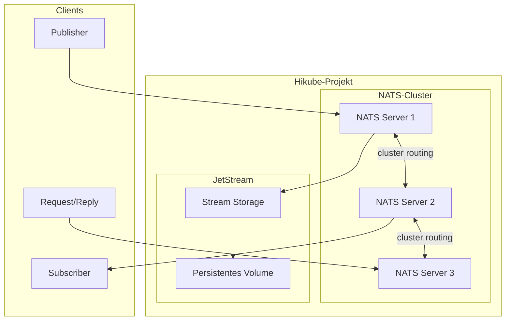
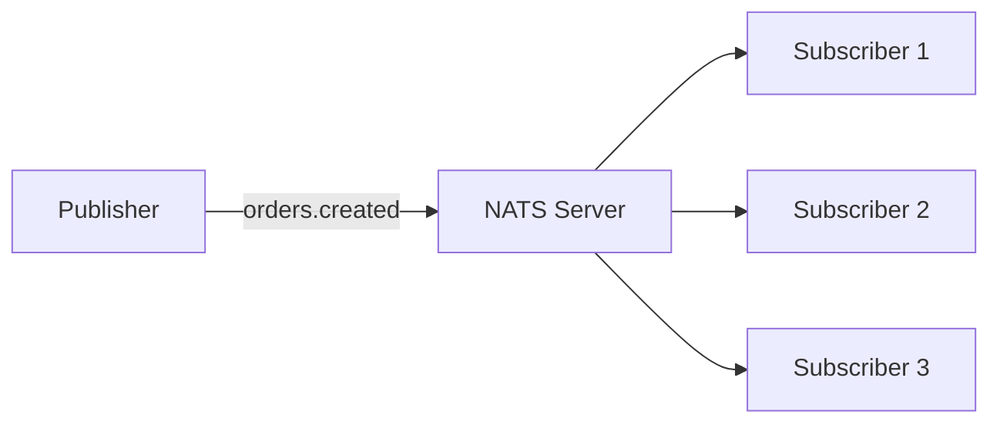
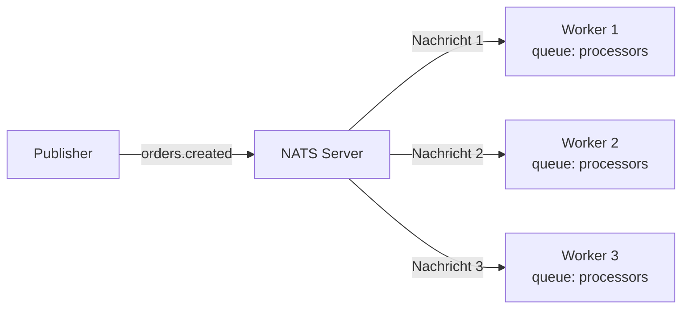
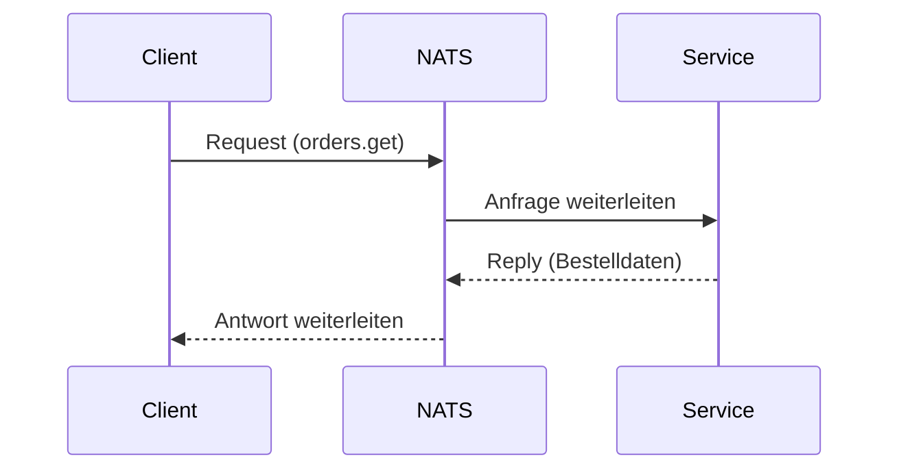

# Konzepte — NATS

:::info Verfügbarkeit
NATS ist in der [Hikube-Konsole](https://console.hikube.cloud) noch nicht im Self-Service verfügbar.
Um eine Instanz bereitzustellen oder ihre Konfiguration zu ändern, [wenden Sie sich an den Support](mailto:support@hidora.io).
:::

## Architektur

NATS auf Hikube ist ein verwalteter, ultraleichter und hochperformanter Messaging-Dienst. Jede Instanz ist ein Cluster aus NATS-Servern, der einem Hikube-Projekt zugeordnet ist, mit optionaler Unterstützung von **JetStream** für die Persistenz von Nachrichten.

```mermaid
graph TB
    subgraph "Hikube-Projekt"
        subgraph "NATS-Cluster"
            N1[NATS Server 1]
            N2[NATS Server 2]
            N3[NATS Server 3]
        end

        subgraph "JetStream"
            JS[Stream Storage]
            PV[Persistentes Volume]
        end
    end

    subgraph "Clients"
        PUB[Publisher]
        SUB[Subscriber]
        REQ[Request/Reply]
    end

    N1 <-->|cluster routing| N2
    N2 <-->|cluster routing| N3
    N1 --> JS
    JS --> PV
    PUB --> N1
    N2 --> SUB
    REQ --> N3
```

---

## Terminologie

| Begriff | Beschreibung |
|-------|-------------|
| **NATS (Instanz)** | Von Hikube verwalteter NATS-Cluster, der einem Projekt zugeordnet ist. Seine Konfiguration wird bei der Erstellung festgelegt und auf Anfrage beim Support geändert. |
| **Subject** | Routing-Adresse der Nachrichten (z. B. `orders.created`). Unterstützt Wildcards (`*`, `>`). |
| **Publish/Subscribe** | Kommunikationsmodell, bei dem Publishers Nachrichten an ein Subject senden und Subscribers sie empfangen. |
| **JetStream** | Persistenzerweiterung von NATS — dauerhafte Speicherung von Nachrichten mit Replay, Acknowledgment und Consumern. |
| **Stream** | Persistente Sammlung von Nachrichten in JetStream mit konfigurierbarer Aufbewahrungsrichtlinie. |
| **Consumer** | Dauerhaftes Abonnement in JetStream mit Positionsverfolgung (Offset) und Acknowledgment. |
| **Request/Reply** | Synchrones Kommunikationsmodell — ein Client sendet eine Anfrage und wartet auf eine Antwort. |
| **Ressourcen-Preset** | Vordefiniertes CPU-/Arbeitsspeicherprofil (nano bis 2xlarge). |

---

## Kommunikationsmodelle

NATS unterstützt drei Kommunikationsmodelle:

### Publish/Subscribe

Das einfachste Modell — ein Publisher sendet eine Nachricht, alle Subscribers erhalten eine Kopie:

```mermaid
graph LR
    PUB[Publisher] -->|"orders.created"| NATS[NATS Server]
    NATS --> SUB1[Subscriber 1]
    NATS --> SUB2[Subscriber 2]
    NATS --> SUB3[Subscriber 3]
```

### Queue Groups

Die Subscribers derselben Queue Group teilen sich die Nachrichten auf (Load Balancing):

```mermaid
graph LR
    PUB[Publisher] -->|"orders.created"| NATS[NATS Server]
    NATS -->|"Nachricht 1"| S1[Worker 1<br/>queue: processors]
    NATS -->|"Nachricht 2"| S2[Worker 2<br/>queue: processors]
    NATS -->|"Nachricht 3"| S3[Worker 3<br/>queue: processors]
```

### Request/Reply

Synchrone Kommunikation mit erwarteter Antwort:

```mermaid
sequenceDiagram
    participant Client
    participant NATS
    participant Service

    Client->>NATS: Request (orders.get)
    NATS->>Service: Anfrage weiterleiten
    Service-->>NATS: Reply (Bestelldaten)
    NATS-->>Client: Antwort weiterleiten
```

---

## JetStream

JetStream ergänzt NATS um **Persistenz**:

- Nachrichten werden auf der Disk in **Streams** gespeichert
- **Consumer** verfolgen ihre Position und können Nachrichten erneut lesen
- Unterstützung von **At-least-once**- und **Exactly-once**-Zustellung
- Aufbewahrung konfigurierbar nach Dauer, Anzahl der Nachrichten oder Größe

Die Aktivierung von JetStream und die Größe seines Volumes sind Teil der Instanzkonfiguration. Streams und Consumer werden anschließend über Ihre Clients erstellt (CLI `nats` oder SDK).

:::tip
JetStream ist nur sinnvoll, wenn Sie Persistenz benötigen. Für flüchtiges Pub/Sub ist das einfache NATS leichtgewichtiger.
:::

---

## Benutzerverwaltung

NATS-Benutzer (Name und Passwort) sind Teil der Instanzkonfiguration. Ihre Erstellung oder Änderung beantragen Sie beim Support, der Ihnen die Zugangsdaten übermittelt.

---

## Ressourcen-Presets

| Preset | CPU | Arbeitsspeicher |
|--------|-----|---------|
| `nano` | 250m | 128Mi |
| `micro` | 500m | 256Mi |
| `small` | 1 | 512Mi |
| `medium` | 1 | 1Gi |
| `large` | 2 | 2Gi |
| `xlarge` | 4 | 4Gi |
| `2xlarge` | 8 | 8Gi |

---

## Limits und Quotas

| Parameter | Wert |
|-----------|--------|
| Max. Replicas | Abhängig von den Quotas des Projekts |
| Minimaler Arbeitsspeicherbedarf | Gering (wenige MB pro Instanz ohne JetStream) |
| JetStream-Speichergröße | Bei der Erstellung der Instanz festgelegt |
| Typische Latenz | < 1 ms (im selben Rechenzentrum) |

---

## Weiterführende Informationen

- [Übersicht](./overview.md): Vorstellung des Dienstes
- [Schnellstart](./quick-start.md): eine Instanz anfordern und testen
