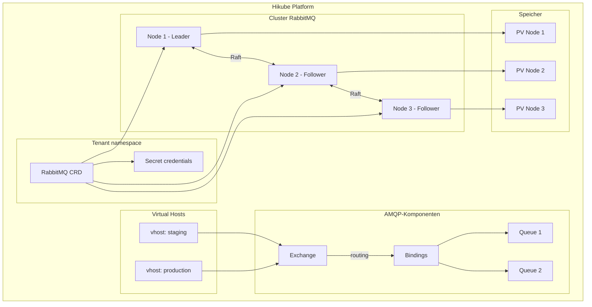
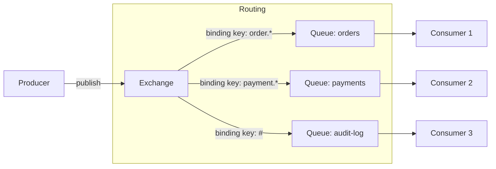
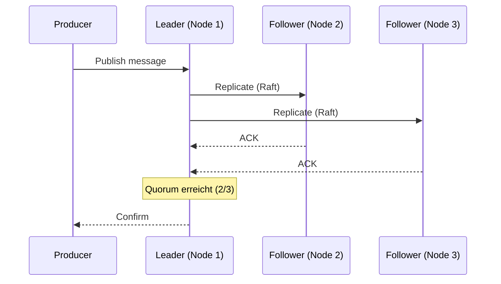

# Konzepte — RabbitMQ

## Architektur

RabbitMQ auf Hikube ist ein verwalteter Messaging-Dienst basierend auf dem **AMQP**-Protokoll. Jede über die Ressource `RabbitMQ` bereitgestellte Instanz erstellt einen Hochverfügbarkeits-Cluster mit **Quorum Queues** (Raft-Protokoll) für die Nachrichtenreplikation.

---

## Terminologie

| Begriff | Beschreibung |
|---------|--------------|
| **RabbitMQ** | Kubernetes-Ressource (`apps.cozystack.io/v1alpha1`), die einen verwalteten RabbitMQ-Cluster darstellt. |
| **AMQP** | Advanced Message Queuing Protocol — Standard-Messaging-Protokoll, das von RabbitMQ unterstützt wird. |
| **Exchange** | Einstiegspunkt für Nachrichten. Routet Nachrichten über Bindings an Queues. |
| **Queue** | Warteschlange, die Nachrichten speichert, bis ein Consumer sie verarbeitet. |
| **Binding** | Routing-Regel zwischen einem Exchange und einer Queue (basierend auf einem Routing Key). |
| **Quorum Queue** | Queue-Typ, der das **Raft**-Protokoll verwendet, um Nachrichten auf mehreren Knoten zu replizieren. |
| **Virtual Host (vhost)** | Logischer Namespace, der Exchanges, Queues und Berechtigungen innerhalb desselben Clusters isoliert. |
| **Consumer** | Anwendung, die Nachrichten aus einer Queue liest und verarbeitet. |
| **resourcesPreset** | Vordefiniertes Ressourcenprofil (nano bis 2xlarge). |

---

## Nachrichtenrouting

RabbitMQ verwendet ein flexibles Routing-Modell basierend auf Exchanges und Bindings:

### Exchange-Typen

| Typ | Routing |
|-----|---------|
| **direct** | Exakter Routing Key |
| **topic** | Pattern Matching mit Wildcards (`*`, `#`) |
| **fanout** | Broadcast an alle gebundenen Queues |
| **headers** | Routing basierend auf den Message-Headers |

---

## Quorum Queues und Hochverfügbarkeit

Die Quorum Queues verwenden das **Raft**-Protokoll zur Nachrichtenreplikation:

1. Ein Knoten wird zum **Leader** für jede Queue gewählt
2. Die Nachrichten werden vor der Bestätigung auf die **Follower** repliziert
3. Bei Ausfall des Leaders wird automatisch ein Follower befördert

:::tip
Konfigurieren Sie mindestens `replicas: 3`, um das Raft-Quorum und die Hochverfügbarkeit der Quorum Queues zu gewährleisten.
:::

---

## Virtual Hosts

Die **Vhosts** isolieren Ressourcen innerhalb desselben Clusters:

- Jeder Vhost hat seine eigenen Exchanges, Queues und Berechtigungen
- Benutzer können pro Vhost unterschiedliche Rollen haben: `admin` oder `readonly`
- Nützlich zur Trennung von Umgebungen (Produktion, Staging) auf demselben Cluster

---

## Benutzerverwaltung

Die Benutzer werden im Manifest deklariert mit:

- **Passwort** für die Authentifizierung
- **Rollen pro Vhost**: `admin` (Lesen/Schreiben/Konfiguration), `readonly` (nur Lesen)

Die Zugangsdaten werden im Secret `<instance>-credentials` gespeichert.

---

## Ressourcen-Presets

| Preset | CPU | Speicher |
|--------|-----|----------|
| `nano` | 250m | 128Mi |
| `micro` | 500m | 256Mi |
| `small` | 1 | 512Mi |
| `medium` | 1 | 1Gi |
| `large` | 2 | 2Gi |
| `xlarge` | 4 | 4Gi |
| `2xlarge` | 8 | 8Gi |

---

## Grenzen und Kontingente

| Parameter | Wert |
|-----------|------|
| Max. Replikate | Je nach Tenant-Kontingent |
| Speichergröße (`size`) | Variabel (in Gi) |
| Vhosts pro Cluster | Unbegrenzt (je nach Ressourcen) |
| Unterstützte Protokolle | AMQP 0-9-1, AMQP 1.0, MQTT, STOMP |

---

## Weiterführende Informationen

- [Übersicht](./overview.md): Vorstellung des Dienstes
- [API-Referenz](./api-reference.md): Alle Parameter der RabbitMQ-Ressource
