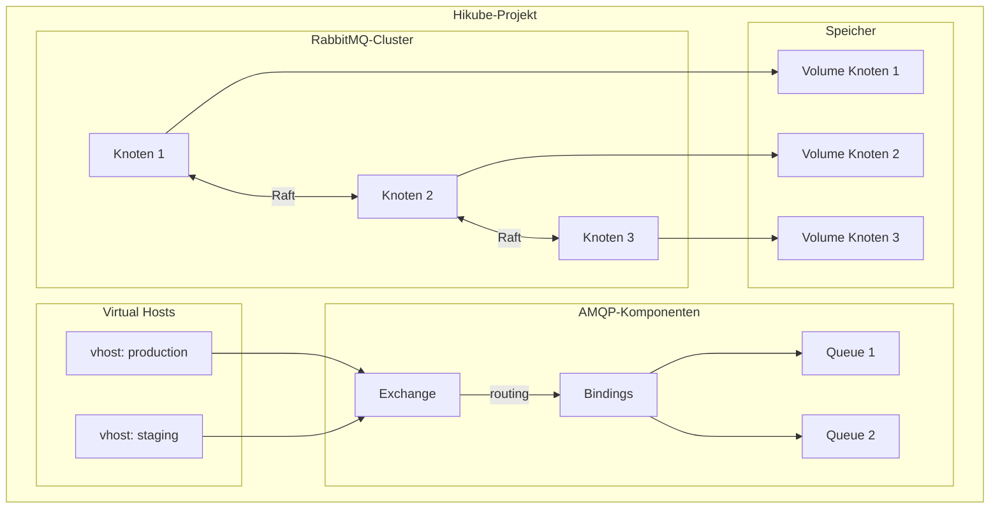
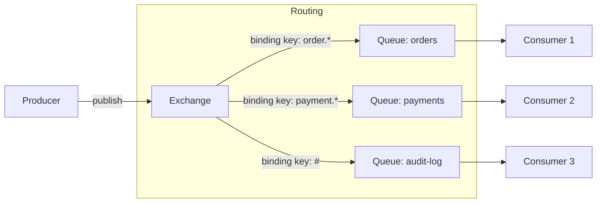
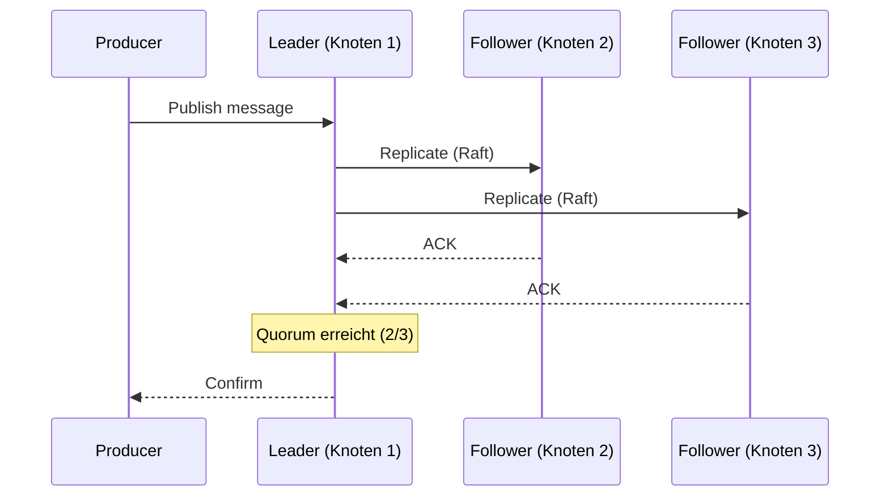

# Konzepte — RabbitMQ

## Architektur

RabbitMQ auf Hikube ist ein verwalteter Messaging-Dienst auf Basis des Protokolls **AMQP**. Jeder in der [Hikube-Konsole](https://console.hikube.cloud) erstellte Cluster gehört zu einem **Projekt** und verbraucht die Quotas dieses Projekts (CPU, Arbeitsspeicher, Speicher).

```mermaid
graph TB
    subgraph "Hikube-Projekt"
        subgraph "RabbitMQ-Cluster"
            N1[Knoten 1]
            N2[Knoten 2]
            N3[Knoten 3]
        end

        subgraph "Virtual Hosts"
            VH1[vhost: production]
            VH2[vhost: staging]
        end

        subgraph "AMQP-Komponenten"
            EX[Exchange]
            Q1[Queue 1]
            Q2[Queue 2]
            B[Bindings]
        end

        subgraph "Speicher"
            PV1[Volume Knoten 1]
            PV2[Volume Knoten 2]
            PV3[Volume Knoten 3]
        end
    end

    N1 <-->|Raft| N2
    N2 <-->|Raft| N3
    N1 --> PV1
    N2 --> PV2
    N3 --> PV3
    VH1 --> EX
    VH2 --> EX
    EX -->|routing| B
    B --> Q1
    B --> Q2
```

---

## Terminologie

| Begriff | Beschreibung |
|-------|-------------|
| **RabbitMQ-Cluster** | Verwaltete RabbitMQ-Instanz, die in der Konsole erstellt und verwaltet wird (Menü **DB & Messaging** → **RabbitMQ**). |
| **AMQP** | Advanced Message Queuing Protocol, von RabbitMQ unterstütztes Standard-Messaging-Protokoll. |
| **Exchange** | Eingangspunkt der Nachrichten. Leitet die Nachrichten über Bindings an die Queues weiter. |
| **Queue** | Warteschlange, die Nachrichten speichert, bis ein Consumer sie verarbeitet. |
| **Binding** | Routing-Regel zwischen einem Exchange und einer Queue (auf Basis eines Routing Keys). |
| **Quorum Queue** | Queue-Typ, der das Protokoll **Raft** verwendet, um Nachrichten auf mehrere Knoten zu replizieren. |
| **Virtual Host (VHost)** | Logischer Namensraum, der Exchanges, Queues und Berechtigungen innerhalb eines Clusters voneinander isoliert. |
| **Consumer** | Anwendung, die Nachrichten aus einer Queue liest und verarbeitet. |
| **Preset** | Vordefiniertes CPU-/Arbeitsspeicherprofil, das bei der Erstellung des Clusters gewählt wird. |
| **Replicas** | Anzahl der RabbitMQ-Knoten des Clusters. Bestimmt den Bereitstellungsmodus. |

---

## Bereitstellungsmodi

Das Feld **Number of replicas** des Assistenten bietet drei Werte an:

| Wert | Bezeichnung in der Konsole | Modus |
|--------|-------------------------|------|
| 1 | **1 (Standalone)** | Ein einzelner Knoten. Das Datenvolume wird auf Ebene des Plattformspeichers repliziert. |
| 3 | **3 (Max High Availability)** | Cluster mit 3 Knoten. Die Replikation der Nachrichten übernimmt RabbitMQ (Quorum Queues). |
| 5 | **5 (Ultra High Availability)** | Cluster mit 5 Knoten, toleriert den Verlust von zwei Knoten. |

:::warning Modus bei der Erstellung festgelegt
Der Modus (Standalone oder Cluster) und die Anzahl der Replicas können nach der Erstellung nicht mehr geändert werden: Die Konsole zeigt „The mode cannot be changed after creation“ an. Um den Modus zu wechseln, erstellen Sie einen neuen Cluster.
:::

---

## Routing von Nachrichten

RabbitMQ verwendet ein flexibles Routing-Modell auf Basis von Exchanges und Bindings:

```mermaid
graph LR
    P[Producer] -->|publish| EX[Exchange]

    subgraph "Routing"
        EX -->|binding key: order.*| Q1[Queue: orders]
        EX -->|binding key: payment.*| Q2[Queue: payments]
        EX -->|binding key: #| Q3[Queue: audit-log]
    end

    Q1 --> C1[Consumer 1]
    Q2 --> C2[Consumer 2]
    Q3 --> C3[Consumer 3]
```

### Exchange-Typen

| Typ | Routing |
|------|---------|
| **direct** | Exakter Routing Key |
| **topic** | Musterabgleich mit Wildcards (`*`, `#`) |
| **fanout** | Broadcast an alle gebundenen Queues |
| **headers** | Routing auf Basis der Header der Nachricht |

Exchanges, Queues und Bindings werden von Ihren Anwendungen mit einem AMQP-Client erstellt, der mit dem gewünschten VHost verbunden ist. Die Konsole verwaltet den Cluster, die VHosts und die Benutzer, nicht die AMQP-Objekte selbst.

---

## Quorum Queues und Hochverfügbarkeit

Quorum Queues verwenden das Protokoll **Raft**, um Nachrichten zu replizieren:

1. Für jede Queue wird ein Knoten zum **Leader** gewählt
2. Nachrichten werden vor der Bestätigung auf die **Follower** repliziert
3. Fällt der Leader aus, wird automatisch ein Follower befördert

```mermaid
sequenceDiagram
    participant P as Producer
    participant L as Leader (Knoten 1)
    participant F1 as Follower (Knoten 2)
    participant F2 as Follower (Knoten 3)

    P->>L: Publish message
    L->>F1: Replicate (Raft)
    L->>F2: Replicate (Raft)
    F1-->>L: ACK
    F2-->>L: ACK
    Note over L: Quorum erreicht (2/3)
    L-->>P: Confirm
```

:::tip
Wählen Sie **3 (Max High Availability)** oder **5 (Ultra High Availability)** Replicas, um das Raft-Quorum zu gewährleisten, und deklarieren Sie Ihre kritischen Queues als Quorum Queues (Argument `x-queue-type: quorum` auf Client-Seite).
:::

---

## Virtual Hosts

**VHosts** isolieren Ressourcen innerhalb eines Clusters:

- Jeder VHost hat eigene Exchanges, Queues und Berechtigungen
- Ein Benutzer kann auf jedem VHost ein anderes Recht haben
- Nützlich, um Umgebungen (Produktion, Staging) oder Anwendungen auf demselben Cluster zu trennen

Der Erstellungsassistent verlangt mindestens einen VHost. Weitere VHosts können anschließend auf der Seite des Clusters hinzugefügt werden (Schaltfläche **Add a VHost**).

---

## Benutzer und Rechte

Jeder RabbitMQ-Benutzer erhält ein **von der Plattform generiertes Passwort**, das bei der Erstellung (oder nach einer Rotation) **nur einmal** angezeigt wird. Seine Rechte werden **pro VHost** festgelegt:

| Recht in der Konsole | Wirkung |
|-----------------------|-------|
| **Administrator** | Lesen, Schreiben und Konfigurieren auf dem VHost |
| **Read-only** | Nur Lesen auf dem VHost |
| **No access** | Der Benutzer hat keinen Zugriff auf den VHost |

Ein Benutzer kann pro VHost nur ein Recht haben. Die Rechte lassen sich jederzeit über die Aktion **Manage Access** ändern.

---

## Ressourcen-Presets

Das **Preset** legt die CPU- und Arbeitsspeicherressourcen jedes Knotens fest. Die Konsole zeigt die Werte jedes Presets in der Auswahlliste an.

| Preset | CPU | Arbeitsspeicher |
|--------|-----|---------|
| **Micro** | 0,5 | 256 Mi |
| **Small** | 1 | 512 Mi |
| **Medium** | 1 | 1 Gi |
| **Large** | 2 | 2 Gi |
| **X-Large** | 4 | 4 Gi |
| **2X-Large** | 8 | 8 Gi |

Das Preset **Small** ist standardmäßig ausgewählt. Es **kann nach der Erstellung nicht mehr geändert werden**.

---

## Limits

| Parameter | Wert |
|-----------|--------|
| Name des Clusters | 3 bis 16 Zeichen: Kleinbuchstaben, Ziffern und Bindestriche; beginnt mit einem Buchstaben, endet mit einem Buchstaben oder einer Ziffer |
| Angebotene Versionen | 4.2, 4.1, 4.0, 3.13 |
| Replicas | 1, 3 oder 5 (bei der Erstellung festgelegt) |
| Disk-Größe | 1 bis 4096 GB pro Knoten, im Rahmen der Speicher-Quota des Projekts; nur Vergrößerung möglich |
| Externer Zugriff | Bei der Erstellung oder später aktivierbar |
| AMQP-Port | 5672, ohne TLS |

---

## Weiterführende Informationen

- [Übersicht](./overview.md): Vorstellung des Dienstes
- [Schnellstart](./quick-start.md): Ihren ersten Cluster erstellen
- [VHosts und Benutzer verwalten](./how-to/manage-vhosts-users.md)
