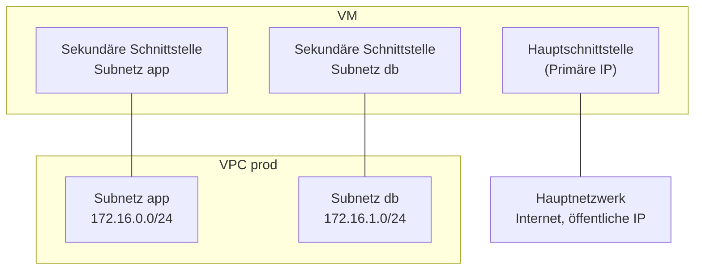

# Konzepte — Netzwerk

## Architektur

Jede Hikube-VM verfügt über ein **Hauptnetzwerk**, das von der Plattform verwaltet wird: Darüber laufen der Internetzugang und, falls aktiviert, die öffentliche IP. Die **VPCs** fügen **sekundäre** private Netzwerke hinzu: Jedes Subnetz, mit dem eine VM verbunden ist, bringt ihr eine zusätzliche Netzwerkschnittstelle.

Die VPCs beruhen auf einem softwaredefinierten Netzwerk: Jedes VPC ist ein isolierter virtueller Router, jedes Subnetz ein virtueller Switch.

---

## Terminologie

| Begriff | Beschreibung |
|-------|-------------|
| **VPC** | Isoliertes privates Netzwerk des Projekts. Es hat keinen eigenen Adressbereich: Diesen tragen seine Subnetze. |
| **Subnetz** | Privater IPv4-Adressbereich (CIDR-Block) innerhalb eines VPC. Eine VM wird mit einem oder mehreren Subnetzen verbunden. |
| **CIDR-Block** | Schreibweise für einen Adressbereich, zum Beispiel `172.16.0.0/24` (256 Adressen, von `172.16.0.0` bis `172.16.0.255`). |
| **Hauptnetzwerk** | Standardnetzwerk jeder VM, mit dem Standard-Gateway und der eventuellen öffentlichen IP. Auf der Detailseite der VM als **Primary**-Adresse angezeigt. |
| **Sekundäre Schnittstelle** | Netzwerkschnittstelle, die der VM für jedes verbundene Subnetz hinzugefügt wird. Ihre Adressen erscheinen als **Secondary**. |

---

## Benennungsregeln

| Element | Regel |
|---------|-------|
| **VPC Name** | 3 bis 16 Zeichen: Kleinbuchstaben, Ziffern und Bindestriche; muss mit einem Buchstaben beginnen und mit einem Buchstaben oder einer Ziffer enden. Eindeutig im Projekt. |
| **Subnet Name** | 1 bis 63 Zeichen: Kleinbuchstaben, Ziffern und Bindestriche. Eindeutig im VPC. |

---

## Adressbereiche

Ein Subnetz muss einen **privaten IPv4**-Bereich (RFC 1918) verwenden:

| Erlaubter Bereich | Beispiel-Subnetz |
|-----------------|------------------------|
| `10.0.0.0/8` | `10.10.0.0/24` |
| `172.16.0.0/12` | `172.16.0.0/24` (standardmäßig vorgeschlagener Wert) |
| `192.168.0.0/16` | `192.168.10.0/24` |

Bei der Erstellung geprüfte Einschränkungen:

- zwei Subnetze **desselben** VPC dürfen sich nicht überschneiden;
- ein Subnetz darf sich nicht mit den von der Plattform reservierten Bereichen `10.244.0.0/16` und `10.96.0.0/12` überschneiden;
- zwei **verschiedene** VPCs können dieselben Bereiche verwenden, da sie isoliert sind.

:::tip Empfehlung
Verwenden Sie Teilbereiche von `172.16.0.0/12`, zum Beispiel ein `/24` pro Subnetz (`172.16.0.0/24`, `172.16.1.0/24`…). So vermeiden Sie die reservierten Bereiche unter `10.x`.
:::

---

## Isolation

- Ein VPC gehört zu einem Projekt; es ist nur in diesem Projekt sichtbar.
- Zwei VPCs sind voneinander isoliert. Um Datenströme zwischen zwei VPCs zu leiten, verbinden Sie eine VM mit beiden und konfigurieren Sie dort das Routing im Betriebssystem.
- Ein VPC hat keinen eigenen Internetzugang: Der Internetverkehr der VM läuft über ihr Hauptnetzwerk.

---

## Lebenszyklus

| Aktion | Verhalten |
|--------|--------------|
| **Create VPC** | Assistent in drei Schritten: **General** (Name), **Subnets** (mindestens eines, bis zu zehn), **Review**. |
| Ein Subnetz hinzufügen | **View Subnets** > **Create Subnet** oder über den VM-Assistenten. |
| Ein Subnetz löschen | Abgelehnt, solange eine VM damit verbunden ist (**Cannot delete**, mit der Liste der VMs). |
| Ein VPC löschen | Löscht auch alle seine Subnetze. Abgelehnt, solange eine VM damit verbunden ist. |
| Ein VPC oder ein Subnetz ändern | Nicht angeboten: Erstellen Sie ein neues. |

Status eines VPC in der Liste: **Provisioning** während der Einrichtung, dann **Ready**, sobald es nutzbar ist.

---

## Weiterführende Informationen

- [Übersicht](./overview.md)
- [Schnellstart](./quick-start.md)
- [Konzepte der virtuellen Maschinen](../compute/concepts.md)
