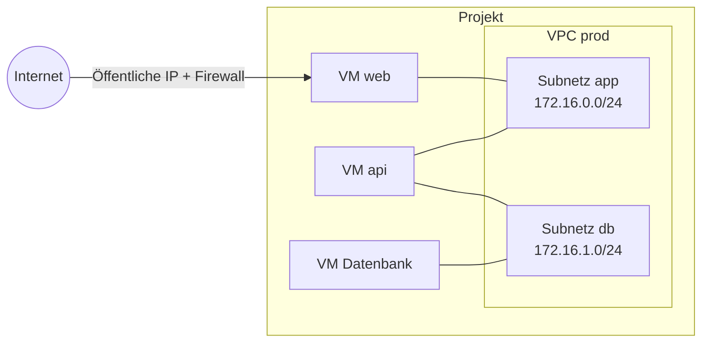

import NavigationFooter from '@site/src/components/NavigationFooter';

# Private Netzwerke auf Hikube

Ein **VPC** (*Virtual Private Cloud*) ist ein isoliertes virtuelles Netzwerk, das zu Ihrem Projekt gehört. Es besteht aus einem oder mehreren **Subnetzen**, von denen jedes einen privaten IPv4-Adressbereich trägt. Eine mit einem Subnetz verbundene VM erhält eine zusätzliche Netzwerkschnittstelle und eine Adresse in diesem Bereich: Sie kann dann die anderen VMs desselben Subnetzes privat erreichen.

In der [Hikube-Konsole](https://console.hikube.cloud) werden VPCs über das Menü **Infrastructure** > **Networking** verwaltet (Seite **Virtual Private Clouds**).

---

## Was Sie in der Konsole tun können

| Anforderung | Wo |
|--------|-------------|
| Ein VPC und seine ersten Subnetze erstellen | **Networking** > **Create VPC** |
| Subnetze ansehen und hinzufügen | Menü **Actions** eines VPC > **View Subnets** > **Create Subnet** |
| Eine VM mit einem VPC verbinden | VM-Assistent, Schritt **Network**, Abschnitt **VPC Networks (Secondary)**; oder **Edit** bei einer bestehenden VM |
| Ein VPC oder ein Subnetz erstellen, ohne den VM-Assistenten zu verlassen | Schaltflächen **+ VPC** und **Add subnet** im Abschnitt **VPC Networks (Secondary)** |
| Ein Subnetz oder ein VPC löschen | Menü **Actions** > **Delete** (abgelehnt, solange VMs es nutzen) |

---

## Wie es zusammenspielt

- Jede VM behält ihr **Hauptnetzwerk** (das der öffentlichen IP und des Internetzugangs). Die VPC-Subnetze kommen als **sekundäre** Schnittstellen hinzu.
- Eine VM kann mit mehreren Subnetzen verbunden werden, auch aus verschiedenen VPCs.
- Ein VPC ist nicht aus dem Internet erreichbar: Eingehender Zugriff von außen erfolgt über die **öffentliche IP** und die **Firewall** der VM (siehe [Das Netzwerk einer VM konfigurieren](../compute/how-to/configure-network.md)).

---

## Anwendungsfälle

- **Mehrschichtige Architektur**: Nur die Frontend-VM hat eine öffentliche IP; die Anwendungs- und Datenbank-VMs kommunizieren nur privat.
- **Bastion**: Eine per SSH erreichbare Administrations-VM, über die Sie zu VMs ohne öffentliche IP weiterspringen.
- **Segmentierung**: Datenströme nach Umgebung oder Funktion trennen, mit einem Subnetz pro Rolle.

---

## Einschränkungen

- VPCs betreffen **VM-Instanzen**. Kubernetes-Cluster und verwaltete Datenbanken werden in der Konsole nicht damit verbunden.
- Ein VPC lässt sich weder umbenennen noch ändern: Sie fügen Subnetze hinzu oder löschen sie.
- Die Verbindung zweier VPCs (*Peering*) und statische Routen werden in der Konsole nicht angeboten; wenden Sie sich an den [Support](mailto:support@hidora.io).

---

## Nächste Schritte

- [Konzepte](./concepts.md)
- [Schnellstart](./quick-start.md)
- [Eine bestehende VM mit einem VPC verbinden](./how-to/attach-vm-to-vpc.md)

<NavigationFooter
  nextSteps={[
    {label: "Konzepte", href: "../concepts"},
    {label: "Schnellstart", href: "../quick-start"},
  ]}
  seeAlso={[
    {label: "Rechenressourcen", href: "../../compute/"},
  ]}
/>
