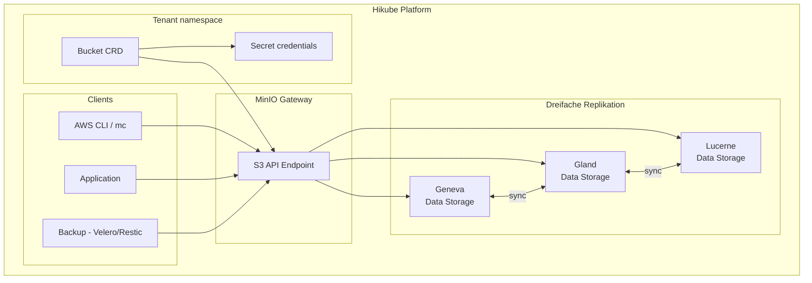

# Konzepte — S3 Buckets

## Architektur

Der Object-Storage-Dienst von Hikube basiert auf **MinIO**, einer S3-kompatiblen Objektspeicherlösung. Die Daten werden **dreifach repliziert** automatisch auf 3 geografisch getrennte Rechenzentren, was Hochverfügbarkeit auch bei vollständigem Ausfall eines Rechenzentrums gewährleistet.



---

## Terminologie

| Begriff | Beschreibung |
|---------|--------------|
| **Bucket** | Kubernetes-Ressource (`apps.cozystack.io/v1alpha1`), die einen S3-Bucket darstellt. Einziges erforderliches Feld: der `name`. |
| **Object Storage** | Unstrukturierter Speicher basierend auf Objekten (Dateien), die durch einen eindeutigen Schlüssel identifiziert werden. |
| **S3-kompatibel** | API kompatibel mit dem Amazon-S3-Protokoll, unterstützt von der Mehrheit der Tools und SDKs. |
| **MinIO** | Open-Source-Objektspeicherserver, S3-kompatibel, wird als Backend von Hikube verwendet. |
| **Access Key / Secret Key** | Paar von Zugangsdaten für die S3-Authentifizierung, automatisch in einem Kubernetes Secret generiert. |
| **BucketInfo** | JSON-Feld im Secret, das den S3-Endpunkt, das Protokoll und den Port enthält. |
| **Endpoint** | URL des Hikube S3-Dienstes: `https://prod.s3.hikube.cloud` |

---

## Funktionsweise

### Erstellung

Die Erstellung eines Buckets ist die einfachste aller Hikube-Ressourcen:

```yaml title="bucket.yaml"
apiVersion: apps.cozystack.io/v1alpha1
kind: Bucket
metadata:
  name: my-data
spec: {}
```

Der Operator erstellt automatisch:
1. Den **Bucket** in MinIO
2. Ein **Kubernetes Secret** mit den Zugangsdaten

### Automatische Zugangsdaten

Das Secret `<bucket-name>-credentials` enthält:

| Schlüssel | Beschreibung |
|-----------|--------------|
| `accessKeyID` | S3-Zugriffsschlüssel |
| `accessSecretKey` | S3-Geheimschlüssel |
| `bucketInfo` | JSON mit Endpunkt, Protokoll und Port |

---

## Dreifache Multi-Datacenter-Replikation

Die Daten werden automatisch auf **3 Rechenzentren** repliziert:

| Rechenzentrum | Standort |
|---------------|----------|
| Region 1 | Geneva (Genf) |
| Region 2 | Gland |
| Region 3 | Lucerne (Luzern) |

Diese Architektur gewährleistet:
- **Null Datenverlust** bei Ausfall eines Rechenzentrums
- **Dienstkontinuität** mit automatischem Failover
- **Optimierte Latenz** aus der Schweiz und Europa

:::tip
Die dreifache Replikation ist transparent — Sie müssen nichts konfigurieren. Alle Daten werden automatisch repliziert.
:::

---

## Kompatible Tools

Der Dienst ist mit allen Tools kompatibel, die das S3-Protokoll unterstützen:

| Tool | Anwendungsfall |
|------|---------------|
| **AWS CLI** | Dateiverwaltung über die Kommandozeile |
| **MinIO Client (mc)** | Nativer MinIO-Client |
| **rclone** | Datensynchronisation und -migration |
| **s3cmd** | Alternative S3-Verwaltung |
| **Velero** | Kubernetes-Cluster-Sicherung |
| **Restic** | Datenbanksicherung (PostgreSQL, MySQL, ClickHouse) |
| **SDKs** | boto3 (Python), AWS SDK (Go, Java, Node.js) |

---

## Anwendungsfälle

| Anwendungsfall | Beschreibung |
|----------------|--------------|
| **Asset-Speicherung** | Bilder, Videos, statische Dateien für Webanwendungen |
| **Sicherung** | Ziel für Datenbank- und K8s-Cluster-Backups |
| **Data Lake** | Speicherung von Rohdaten für die Analyse |
| **Archivierung** | Langfristige Aufbewahrung von Dokumenten und Logs |

---

## Grenzen und Kontingente

| Parameter | Wert |
|-----------|------|
| Max. Größe pro Objekt | Je nach MinIO-Konfiguration |
| Anzahl der Buckets | Je nach Tenant-Kontingent |
| Replikation | Dreifach (3 DC), automatisch |
| Endpunkt | `https://prod.s3.hikube.cloud` |

---

## Weiterführende Informationen

- [Übersicht](./overview.md): Detaillierte Vorstellung des Dienstes
- [API-Referenz](./api-reference.md): Parameter der Bucket-Ressource
