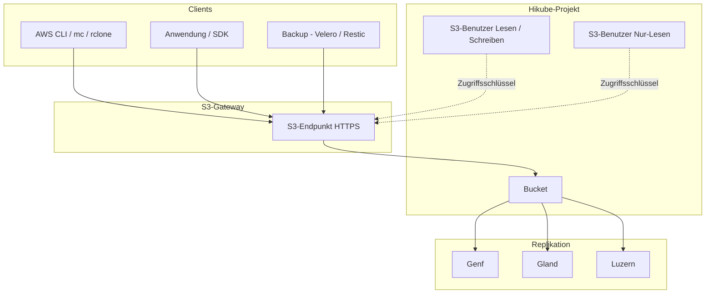

# Konzepte — S3-Buckets

## Architektur

Der Object-Storage-Dienst von Hikube ist S3-kompatibel. Die Daten werden automatisch über 3 geografisch getrennte Rechenzentren **repliziert**, wodurch die Verfügbarkeit selbst beim vollständigen Verlust eines Rechenzentrums erhalten bleibt.

```mermaid
graph TB
    subgraph "Hikube-Projekt"
        BK[Bucket]
        U1[S3-Benutzer Lesen / Schreiben]
        U2[S3-Benutzer Nur-Lesen]
    end

    subgraph "S3-Gateway"
        GW[S3-Endpunkt HTTPS]
    end

    subgraph "Replikation"
        DC1[Genf]
        DC2[Gland]
        DC3[Luzern]
    end

    subgraph "Clients"
        CLI[AWS CLI / mc / rclone]
        APP[Anwendung / SDK]
        BKP[Backup - Velero / Restic]
    end

    U1 -.->|Zugriffsschlüssel| GW
    U2 -.->|Zugriffsschlüssel| GW
    CLI --> GW
    APP --> GW
    BKP --> GW
    GW --> BK
    BK --> DC1
    BK --> DC2
    BK --> DC3
```

---

## Terminologie

| Begriff | Beschreibung |
|-------|-------------|
| **Bucket** | In der Konsole erstellter Objektspeicherbereich (Menü **Infrastructure** → **S3 Buckets**). |
| **Name des Buckets (Konsole)** | Bei der Erstellung gewählter Name. Er identifiziert den Bucket in der Konsole und kann nicht geändert werden. |
| **S3 Bucket Name** | Tatsächlicher Name des Buckets auf S3-Seite, von der Plattform generiert. **Diesen Namen** müssen Ihre S3-Clients verwenden. Er wird auf der Seite des Buckets angezeigt. |
| **S3 Endpoint** | Adresse des S3-Dienstes (zum Beispiel `prod.s3.hikube.cloud`), auf der Seite des Buckets angezeigt. |
| **S3-Benutzer** | Einem Bucket zugeordnete Identität, mit dem Recht **Read-only** oder **Read / Write**. Ein Bucket kann mehrere Benutzer haben. |
| **Access Key ID / Secret Access Key** | S3-Authentifizierungsschlüsselpaar eines Benutzers, bei seiner Erstellung generiert. Der geheime Schlüssel wird nur ein einziges Mal angezeigt. |
| **Locking (WORM)** | Object Lock: verhindert das Löschen oder Ändern der Objekte während 365 Tagen, im Modus `COMPLIANCE` (*Write Once, Read Many*). |
| **Encryption at rest (LUKS)** | Verschlüsselung der auf der Disk gespeicherten Daten. |

---

## Funktionsweise

### Erstellung

Ein Bucket wird mit dem Assistenten **Create a bucket** erstellt. Nur der Name ist Pflicht; zwei Optionen können bei der Erstellung aktiviert werden:

- **Enable Object Lock (WORM)**
- **Enable encryption at rest (LUKS)**

Der Assistent verlangt außerdem, **mindestens einen S3-Benutzer** zu erstellen. Am Ende zeigt die Konsole für jeden Benutzer den **S3 Bucket Name**, den **Access Key**, den **Secret Key** und den **API Endpoint (S3)** an.

:::warning Bei der Erstellung festgelegte Optionen
Name, Sperre und Verschlüsselung werden bei der Erstellung gewählt. Die Konsole erlaubt nicht, sie danach zu ändern.
:::

### Benutzer und Rechte

| Recht | Bezeichnung in der Konsole | Wirkung |
|-------|------------------------|-------|
| Lesen / Schreiben | **Read / Write** | Objekte des Buckets auflisten, lesen, schreiben und löschen |
| Nur-Lesen | **Read-only** | Nur Objekte auflisten und lesen |

Das Recht eines Benutzers lässt sich jederzeit mit **Edit access** ändern. Die Schlüssel eines Benutzers können nicht erneut angezeigt werden: Um neue Schlüssel zu erhalten, erstellen Sie einen neuen Benutzer und löschen dann den alten.

### Reichweite der Schlüssel

Die Schlüssel eines Benutzers gewähren Zugriff **nur auf den Bucket, dem er zugeordnet ist**. Sie erlauben nicht, alle Buckets des Endpunkts aufzulisten: Die Befehle müssen immer auf den Bucket zielen (`s3://<s3-bucket-name>/`).

---

## Multi-Rechenzentrums-Replikation

| Rechenzentrum | Standort |
|-----------|-------------|
| Region 1 | Genf |
| Region 2 | Gland |
| Region 3 | Luzern |

:::tip
Die Replikation ist transparent: Sie müssen nichts konfigurieren.
:::

---

## Preisgestaltung

Der Assistent zeigt **Estimated Cost** pro GB und Monat (sowie pro Stunde) an. Der Tarif hängt von der Verschlüsselung ab: Ein verschlüsselter Bucket verwendet einen anderen Tarif als ein Standard-Bucket.

---

## Kompatible Tools

| Tool | Anwendungsfall |
|-------|-------------|
| **AWS CLI** | Dateiverwaltung über die Kommandozeile |
| **MinIO Client (mc)** | Kompatibler S3-Client |
| **rclone** | Synchronisation und Migration von Daten |
| **s3cmd** | Alternative S3-Verwaltung |
| **Velero** | Backup von Kubernetes-Clustern |
| **Restic** | Backup von Dateien und Datenbanken |
| **SDK** | boto3 (Python), AWS SDK (Go, Java, Node.js) |

---

## Einschränkungen

| Parameter | Wert |
|-----------|--------|
| Name des Buckets | 3 bis 16 Zeichen: Kleinbuchstaben, Ziffern und Bindestriche; beginnt mit einem Buchstaben, endet mit einem Buchstaben oder einer Ziffer |
| Name des S3-Benutzers | 3 bis 16 Zeichen, gleiche Regeln; bestimmte Namen sind reserviert |
| Benutzer pro Bucket | Mindestens einer bei der Erstellung |
| Replikation | 3 Rechenzentren, automatisch |

---

## Weiterführende Informationen

- [Übersicht](./overview.md): Vorstellung des Dienstes
- [Schnellstart](./quick-start.md): Ihren ersten Bucket erstellen
- [Benutzer und Zugriffsschlüssel verwalten](./how-to/configure-access.md)
