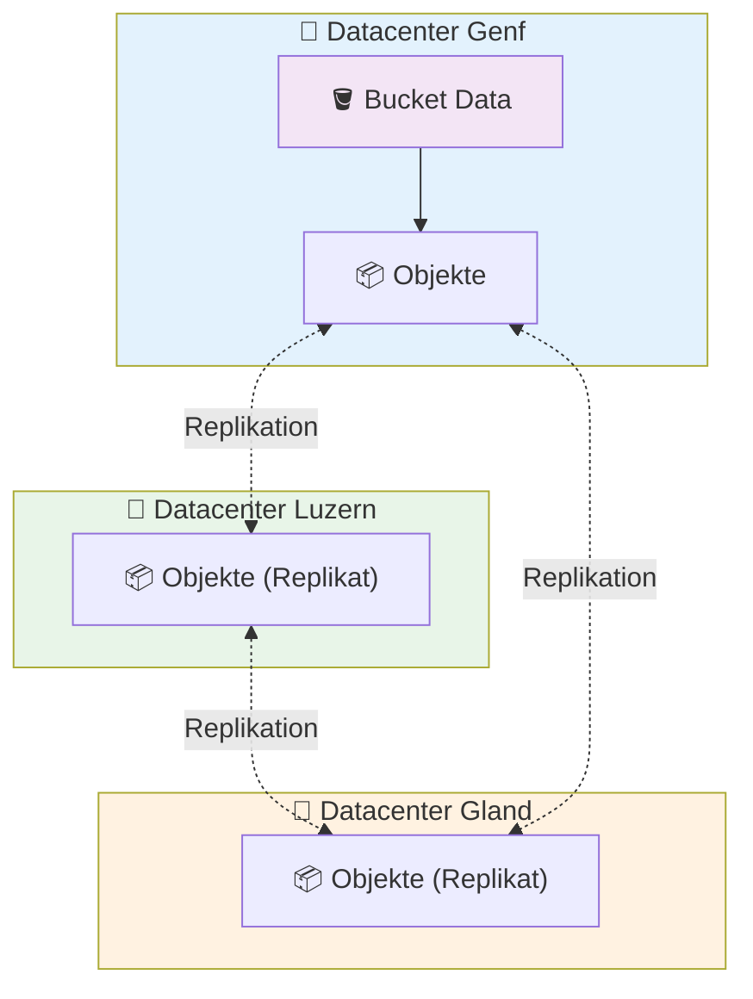

# S3 Buckets auf Hikube

Die **S3 Buckets** von Hikube bieten eine **hochverfügbare**, **replizierte** und **S3-kompatible** Objektspeicherlösung für Ihre Cloud-native-Anwendungen, Backups, CI/CD-Artefakte oder analytische Daten.
Die Plattform bietet eine souveräne und leistungsstarke Alternative zu Amazon S3 mit nativer Kubernetes-Integration.

---

## 🏗️ Architektur und Funktionsweise

### **Verteilter Objektspeicher**

Die Hikube-Buckets basieren auf einer **100 % verteilten und replizierten** S3-Architektur über mehrere Rechenzentren.
Im Gegensatz zu Block-Volumes, die für VMs verwendet werden, ist der Objektspeicher nicht an eine Maschine gebunden: Er ist über **standardisierte S3-APIs** von jeder autorisierten Anwendung oder jedem autorisierten Dienst aus zugänglich.

#### 📦 Speicherschicht

- Jeder Bucket wird auf einer **Multi-Knoten-Infrastruktur** gehostet, die über mehrere Schweizer Rechenzentren verteilt ist
- Die Objekte werden **automatisch** auf 3 physisch getrennte Zonen repliziert, um maximale Haltbarkeit zu gewährleisten
- Das System ist darauf ausgelegt, den Ausfall eines kompletten Rechenzentrums ohne Datenverlust oder Nichtverfügbarkeit zu tolerieren

#### 🌐 Zugriffsschicht

- Die Buckets sind über einen **einzigen HTTPS-Endpunkt** zugänglich, der mit der S3 v4-Signatur kompatibel ist
- Der Zugriff wird durch **S3 Access Keys** authentifiziert, die bei der Bucket-Erstellung automatisch generiert werden
- Jeder Bucket ist in seinem Kubernetes-Tenant isoliert und verfügt über eigene Zugangsdaten

---

### **Multi-Datacenter-Architektur**



Diese Architektur gewährleistet die **Verfügbarkeit und Haltbarkeit** der Daten und wird vollständig in der Schweiz betrieben 🇨🇭.

---

## ⚙️ Typische Anwendungsfälle

Die Hikube-Buckets sind für eine Vielzahl von Cloud-Speicherszenarien konzipiert:

| **Anwendungsfall** | **Beschreibung** |
| ------------------ | ---------------- |
| **Backups** | Automatisierte Sicherungen von Anwendungen oder persistenten Volumes |
| **CI/CD-Artefakte** | Speicherung von Images, Binaries und GitOps-Pipelines |
| **Statische Inhalte** | Hosting öffentlicher Dateien (Web-Assets, PDF, Bilder) |
| **Analytische Daten** | Zentralisierung von CSV/Parquet/JSON-Dateien für ETL und BI-Tools |
| **Logs und Archive** | Langfristige Speicherung von Anwendungs- und Audit-Logs |
| **VM-Snapshots und Exporte** | Speicherung von KubeVirt-Snapshots, RAW- oder QCOW2-Exporten |
| **S3-kompatible Anwendungen** | Direkte Nutzung durch Drittanbieter-Apps über SDK oder AWS CLI |

---

## 🔒 Isolation und Sicherheit

### **Trennung nach Tenant**

Jeder Bucket wird **in einem spezifischen Kubernetes-Namespace** bereitgestellt, was eine strikte Isolierung gewährleistet:

- Die Zugangsdaten sind pro Bucket eindeutig und werden in einem automatisch generierten Kubernetes Secret gespeichert
- Keine Daten oder Zugriffsschlüssel werden zwischen Tenants geteilt

### **Verschlüsselung und sicherer Zugriff**

- Alle Zugriffe erfolgen über **HTTPS/TLS** mit S3-Schlüssel-Authentifizierung
- Der Endpunkt erlaubt keinen anonymen Zugriff: Ein gültiger Schlüssel ist immer erforderlich

---

## 🌐 Konnektivität und Integration

### **Einziger S3-Endpunkt**

Alle Buckets sind über den einzigen Endpunkt zugänglich:

```url
https://prod.s3.hikube.cloud
```

### **Vollständige Kompatibilität**

Hikube ist mit den Standard-AWS-S3-Tools und -SDKs kompatibel:

- **AWS CLI**: `aws s3 --endpoint-url https://prod.s3.hikube.cloud ...`
- **MinIO Client (`mc`)**: Einfache Konfiguration eines Alias mit Access Key / Secret Key
- **Rclone / S3cmd / Velero / Restic**: Nativer Support über die v4-Signatur

Dies ermöglicht eine nahtlose Integration in CI/CD-Pipelines, Backup-Tools und bestehende analytische Anwendungen ohne spezifische Anpassung.

---

## 📦 Verwaltung und Portabilität

### **Einfacher Lebenszyklus**

- Die Erstellung und Löschung von Buckets erfolgt über ein einfaches Kubernetes-Manifest
- Die Zugangsdaten werden automatisch generiert und in einem Secret im JSON-Format (`BucketInfo`) gespeichert
- Keine manuelle Konfiguration erforderlich

### **Standardmäßige Interoperabilität**

Dank der S3-Kompatibilität bleiben Ihre Daten **interoperabel** mit:

- Bestehenden Cloud-Tools (AWS CLI, Velero...)
- Standard-S3-Migrationspipelines (rclone sync, s3cmd mirror...)
- Externen Analysediensten (Spark, DuckDB usw.)

---

## 🚀 Nächste Schritte

Nachdem Sie die Architektur der Hikube-Buckets verstanden haben:

**🏃‍♂️ Sofortiger Einstieg**
→ [Ihren ersten Bucket erstellen](./quick-start.md)

**📖 Erweiterte Konfiguration**
→ [Vollständige API-Referenz](./api-reference.md)

:::tip Produktionsempfehlung
Verwenden Sie einen dedizierten Bucket pro Anwendung oder Umgebung.
:::
