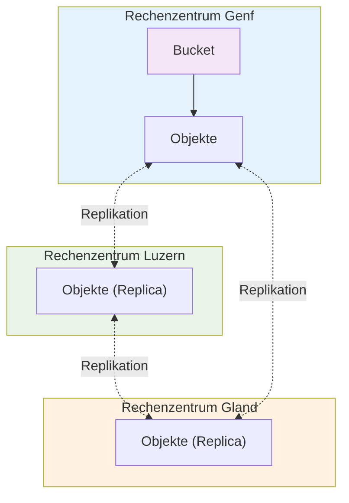

import NavigationFooter from '@site/src/components/NavigationFooter';

# S3-Buckets auf Hikube

Die **S3-Buckets** von Hikube bieten eine **hochverfügbare**, **replizierte** und **S3-kompatible** Objektspeicherlösung für Ihre Cloud-native-Anwendungen, Backups, CI/CD-Artefakte oder Analysedaten.
Die Plattform stellt eine souveräne Alternative zu Amazon S3 bereit, betrieben in der Schweiz.

Sie erstellen und verwalten Ihre Buckets im Self-Service in der [Hikube-Konsole](https://console.hikube.cloud), im Menü **Infrastructure** → **S3 Buckets** Ihres Projekts.

---

## Was Sie in der Konsole tun können

- **Einen Bucket erstellen**, optional mit **Objektsperre (Object Lock / WORM)** und **Verschlüsselung im Ruhezustand (LUKS)**;
- **S3-Benutzer** für jeden Bucket **erstellen**, mit **Nur-Lese-** oder **Lese-/Schreibzugriff**, samt ihrem Zugriffsschlüsselpaar;
- **Den tatsächlichen S3-Namen und den Endpunkt (Endpoint)** des Buckets **einsehen**, mit kopierfertigen Beispielbefehlen;
- **Die Rechte** eines Benutzers **ändern** und einen Benutzer oder einen Bucket **löschen**.

---

## Architektur und Funktionsweise

### Verteilter Objektspeicher

Die Hikube-Buckets beruhen auf einer S3-Architektur, die **über mehrere Rechenzentren verteilt und repliziert** ist.
Im Gegensatz zu den [Disks](../disks/overview.md), die von virtuellen Maschinen genutzt werden, ist der Objektspeicher an keine Maschine angebunden: Er ist über die **Standard-S3-API** von jeder berechtigten Anwendung oder jedem berechtigten Dienst aus erreichbar.

#### Speicherschicht

- Jeder Bucket wird auf einer **Multi-Knoten-Infrastruktur** gehostet, die auf mehrere Schweizer Rechenzentren verteilt ist
- Die Objekte werden **automatisch** auf 3 getrennte physische Standorte **repliziert**
- Das System ist darauf ausgelegt, den Ausfall eines kompletten Rechenzentrums ohne Datenverlust zu überstehen

#### Zugriffsschicht

- Die Buckets sind über einen **HTTPS-Endpunkt** erreichbar, der mit der S3-Signatur v4 kompatibel ist
- Der Zugriff wird über **S3-Zugriffsschlüssel** (Access Key ID / Secret Access Key) authentifiziert, die jedem Benutzer des Buckets eigen sind
- Jeder Bucket gehört zu einem **Projekt**, und seine Benutzer haben nur Zugriff auf diesen Bucket

---

### Multi-Rechenzentrums-Architektur

```mermaid
flowchart TD
    subgraph DC1["Rechenzentrum Genf"]
        B1["Bucket"]
        S1["Objekte"]
    end

    subgraph DC2["Rechenzentrum Luzern"]
        S2["Objekte (Replica)"]
    end

    subgraph DC3["Rechenzentrum Gland"]
        S3["Objekte (Replica)"]
    end

    B1 --> S1
    S1 <-.->|"Replikation"| S2
    S2 <-.->|"Replikation"| S3
    S1 <-.->|"Replikation"| S3

    style DC1 fill:#e3f2fd
    style DC2 fill:#e8f5e8
    style DC3 fill:#fff2e1
    style B1 fill:#f3e5f5
```

Diese Architektur gewährleistet die **Verfügbarkeit und Dauerhaftigkeit** der Daten und wird dabei vollständig in der Schweiz betrieben.

---

## Typische Anwendungsfälle

| **Anwendungsfall**              | **Beschreibung**                                                  |
| ------------------------------- | ----------------------------------------------------------------- |
| **Backups**                     | Automatisierte Backups von Anwendungen oder persistenten Volumes  |
| **CI/CD-Artefakte**             | Speicherung von Images, Binärdateien und GitOps-Pipelines         |
| **Statische Inhalte**           | Von Ihren Anwendungen ausgelieferte Dateien (Web-Assets, PDF, Bilder) |
| **Analysedaten**                | Zentralisierung von CSV-/Parquet-/JSON-Dateien für ETL und BI-Tools |
| **Logs und Archive**            | Langzeitspeicherung von Anwendungs- und Audit-Protokollen         |
| **Regulatorische Archivierung** | Unveränderliche Aufbewahrung mit der WORM-Sperre                  |
| **S3-kompatible Anwendungen**   | Direkte Nutzung durch Anwendungen über SDK oder AWS CLI           |

---

## Isolation und Sicherheit

- Jeder S3-Benutzer verfügt über **eigene Schlüssel** und hat nur Zugriff auf den Bucket, dem er zugeordnet ist
- Das Recht **Nur-Lesen** ermöglicht es, einen Lesezugriff ohne Änderungsrisiko zu vergeben
- Alle Zugriffe laufen über **HTTPS** mit Authentifizierung per S3-Schlüssel; anonymer Zugriff ist nicht möglich
- Die **Verschlüsselung im Ruhezustand (LUKS)** schützt die auf der Disk gespeicherten Daten
- Die **Sperre (WORM)** verhindert das Löschen oder Ändern der Objekte während 365 Tagen

---

## Konnektivität und Integration

### S3-Endpunkt

Der S3-Endpunkt und der tatsächliche Name des Buckets werden auf der Seite des Buckets in der Karte **Access & Configuration** angezeigt (zum Beispiel `prod.s3.hikube.cloud`).

### Kompatibilität

Die Hikube-Buckets sind mit den Standard-S3-Tools und -SDKs kompatibel:

- **AWS CLI**: `aws --endpoint-url https://<endpoint> s3 ...`
- **MinIO Client (`mc`)**: Alias, konfiguriert mit Zugriffsschlüssel und geheimem Schlüssel
- **rclone, s3cmd, Velero, Restic**: native Unterstützung der Signatur v4
- **SDK**: boto3 (Python), AWS SDK (Go, Java, Node.js…)

---

## Nächste Schritte

- [Ihren ersten Bucket erstellen](./quick-start.md)
- [Benutzer und Zugriffsschlüssel verwalten](./how-to/configure-access.md)

:::tip Empfehlung für die Produktion
Verwenden Sie einen eigenen Bucket pro Anwendung oder pro Umgebung und einen separaten S3-Benutzer pro Anwendung.
:::

<NavigationFooter
  nextSteps={[
    {label: "Konzepte", href: "../concepts"},
    {label: "Schnellstart", href: "../quick-start"},
  ]}
/>
