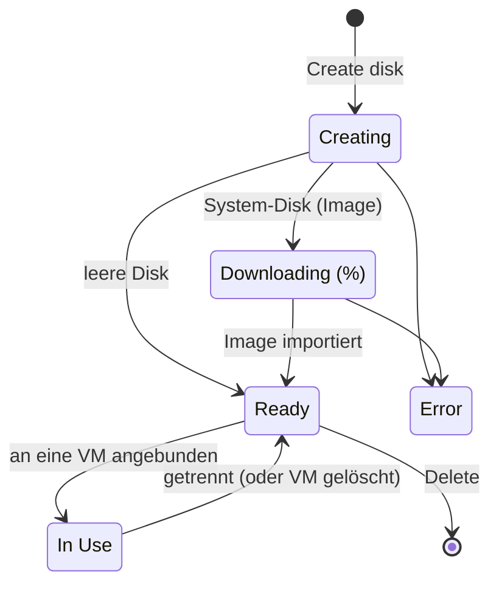

# Konzepte — Disks

## Architektur

Eine Hikube-Disk ist ein **persistentes Block-Volume**, das zu einem **Projekt** gehört. Sie verbraucht das **Speicher**-Quota des Projekts und kann an eine virtuelle Maschine desselben Projekts angebunden werden.

---

## Terminologie

| Begriff | Beschreibung |
|-------|-------------|
| **Disk** | Persistentes Blockspeicher-Volume, verwaltet über das Menü **Infrastructure** → **Disks**. |
| **Empty Disk** | Rohe Daten-Disk, die in der VM formatiert und eingehängt wird (in der Liste als **Data Disk** angezeigt). |
| **System Disk** | Aus einem System-Image erstellte Disk, als Boot-Disk einer VM verwendbar. |
| **Cloud-Image** | Betriebssystem-Image aus dem Hikube-Katalog, nach Betriebssystem und Version gewählt. |
| **Custom image** | ISO- oder QCOW2-Image, importiert von einer HTTPS-URL, die Sie angeben. |
| **Replikation** | Kopie der Daten der Disk auf mehrere Knoten, im synchronen oder asynchronen Modus. |
| **Encryption (LUKS)** | Verschlüsselung der Daten im Ruhezustand auf der Disk. |
| **Attached to** | VM, die die Disk aktuell nutzt. |

---

## Status

| Status | Bedeutung |
|--------|---------------|
| **Creating** | Die Disk wird bereitgestellt |
| **Downloading** | Das Image einer System-Disk wird importiert; der Fortschritt wird in Prozent angezeigt |
| **Ready** | Die Disk ist bereitgestellt und an keine VM angebunden |
| **In Use** | Die Disk ist an eine VM angebunden |
| **Error** | Das Herunterladen des Images oder die Bereitstellung ist fehlgeschlagen |
| **Unknown** | Der Zustand der Disk konnte noch nicht ermittelt werden |

---

## Quelle der Disk

Der Schritt **Source** des Assistenten bietet zwei Möglichkeiten:

- **Empty Disk**: „Raw storage space that can be formatted and mounted on a virtual machine.“
- **System Disk**: „A disk containing a pre-installed operating system.“ Sie wählen dann ein Image unter **OS Image / Source**:
  - ein **Cloud-Image** aus dem Katalog (Betriebssystem, dann **Version**);
  - oder **Custom Image**: eine **Image URL (ISO/QCOW2)**. Die URL muss HTTPS verwenden; private oder lokale IP-Adressen werden abgelehnt.

:::note Windows
Eine Windows-System-Disk muss mindestens **50 GB** groß sein. Ihre geschätzten Kosten enthalten die Windows-Lizenz.
:::

---

## Replikation

| Modus | Bezeichnung | Verhalten | RTO | RPO |
|------|---------|--------------|-----|-----|
| Asynchron | **Asynchronous Replication** (Recommended) | Verzögerte Replikation: Bei einem gleichzeitigen Ausfall mehrerer Knoten kann eine geringe Menge kürzlich geschriebener Daten verloren gehen | < 5 min | < 5 min |
| Synchron | **Synchronous Replication** | Echtzeit-Replikation über mehrere Knoten: minimaler Datenverlust bei einem Ausfall | < 5 min | < 1 min |

Die **Asynchronous Replication** ist standardmäßig ausgewählt.

---

## Verschlüsselung

Der Schalter **Disk Encryption** aktiviert die **LUKS**-Verschlüsselung der Daten im Ruhezustand. Eine verschlüsselte Disk ist in der Liste mit dem Badge **Encrypted** gekennzeichnet und verwendet einen eigenen Tarif.

:::warning Bei der Erstellung festgelegte Optionen
Quelle, Replikation und Verschlüsselung werden bei der Erstellung gewählt. Danach kann nur noch die **Größe** einer Disk geändert werden, und zwar nur nach oben.
:::

---

## Größe und Quota

- Mindestgröße: **20 GB** (50 GB für eine Windows-System-Disk).
- Die Größe ist durch das **Speicher-Quota** des Projekts begrenzt; der Assistent zeigt die Anzeige **Estimated project usage** an.
- Eine Disk kann **vergrößert**, niemals verkleinert werden (siehe [Die Größe einer Disk ändern](./how-to/resize.md)).

---

## Preisgestaltung

Der Assistent zeigt **Estimated Cost** an: den Tarif pro GB und Monat und die monatlichen Kosten der Disk. Der Tarif hängt von der Verschlüsselung ab; eine Windows-System-Disk fügt die Kosten der Lizenz hinzu.

---

## Einschränkungen

| Parameter | Wert |
|-----------|--------|
| Name der Disk | 3 bis 16 Zeichen: Kleinbuchstaben, Ziffern und Bindestriche; beginnt mit einem Buchstaben, endet mit einem Buchstaben oder einer Ziffer |
| Größe | Ab 20 GB, im Rahmen des Speicher-Quotas des Projekts |
| Anbindung | Jeweils nur eine VM |
| Verkleinerung | Nicht unterstützt |

---

## Weiterführende Informationen

- [Schnellstart](./quick-start.md): eine Disk erstellen und in einer VM verwenden
- [Eine Disk an eine VM anbinden](./how-to/attach-to-vm.md)
- [System-Disk aus einem Image erstellen](./how-to/create-from-image.md)
