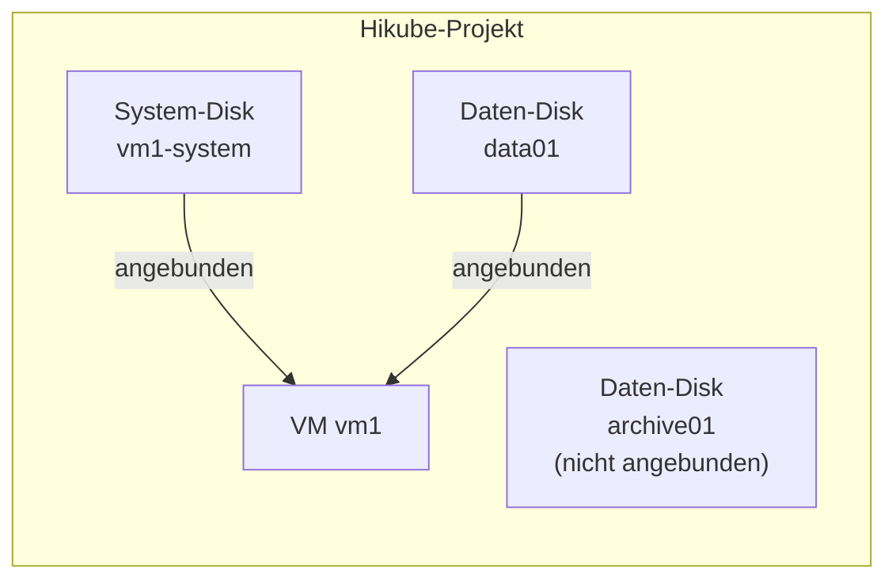

import NavigationFooter from '@site/src/components/NavigationFooter';

# Disks auf Hikube

Die **Disks** von Hikube sind replizierte **persistente Blockspeicher-Volumes**, die Sie an Ihre [virtuellen Maschinen](../../compute/overview.md) anbinden. Eine Disk existiert unabhängig von der VM, die sie nutzt: Sie können sie im Voraus erstellen, anbinden, trennen, vergrößern oder an eine andere VM anbinden, ohne ihre Daten zu verlieren.

Sie verwalten Ihre Disks im Self-Service in der [Hikube-Konsole](https://console.hikube.cloud), im Menü **Infrastructure** → **Disks** Ihres Projekts.

---

## Was Sie in der Konsole tun können

- **Eine leere Disk erstellen** (Daten-Disk) oder eine **System-Disk** aus einem Image (Cloud-Image aus dem Katalog oder eigenes ISO/QCOW2-Image);
- **Die Replikation wählen** (**Asynchronous Replication** oder **Synchronous Replication**) und die **Verschlüsselung (LUKS)** aktivieren;
- **Den Zustand** jeder Disk **verfolgen**, einschließlich des Fortschritts beim Herunterladen eines Images;
- **Sehen, an welche VM** eine Disk angebunden ist;
- Eine Disk **vergrößern**;
- Eine Disk **löschen**, die an keine VM angebunden ist.

Das Anbinden einer Disk an eine VM erfolgt im Erstellungsassistenten oder auf der Bearbeitungsseite der VM (siehe [Eine Disk an eine VM anbinden](./how-to/attach-to-vm.md)).

---

## Disk-Typen

| Typ | Bezeichnung in der Konsole | Verwendung |
|------|------------------------|-------|
| Daten-Disk | **Empty Disk** / **Data Disk** | Roher Speicherplatz, der in einer VM formatiert und eingehängt wird |
| System-Disk | **System Disk** | Disk mit vorinstalliertem Betriebssystem, als Boot-Disk einer VM verwendet |

---

## Disks und VMs

- Eine Disk ist jeweils an **eine einzige VM** angebunden.
- Die Liste **Storage Disks** zeigt für jede Disk unter **Attached to** die VM an, an die sie angebunden ist.
- Beim Löschen einer VM werden ihre Disks **getrennt**, aber nicht gelöscht: Sie bleiben in der Liste und können wiederverwendet werden.

---

## Replikation und Sicherheit

- **Asynchronous Replication** (empfohlen): verzögerte Replikation, RTO < 5 min, RPO < 5 min.
- **Synchronous Replication**: Echtzeit-Replikation über mehrere Knoten, RTO < 5 min, RPO < 1 min.
- **Disk Encryption**: LUKS-Verschlüsselung der Daten im Ruhezustand.

Die Einzelheiten finden Sie in den [Konzepten](./concepts.md).

---

## Typische Anwendungsfälle

| Anwendungsfall | Beschreibung |
|-------------|-------------|
| **Anwendungsdaten** | Eigenes Volume für eine Datenbank oder Dateien, getrennt von der System-Disk |
| **Vorbereitung einer VM** | System-Disk, im Voraus aus einem Image erstellt und dann an eine neue VM angebunden |
| **Migration zwischen VMs** | Eine Disk von einer VM trennen und an eine andere anbinden |
| **Sensible Daten** | Verschlüsselte Disk (LUKS) mit synchroner Replikation |

:::tip
Für Dateispeicher, auf den mehrere Anwendungen per API zugreifen, verwenden Sie besser die [S3-Buckets](../buckets/overview.md).
:::

<NavigationFooter
  nextSteps={[
    {label: "Konzepte", href: "../concepts"},
    {label: "Schnellstart", href: "../quick-start"},
  ]}
  seeAlso={[
    {label: "Virtuelle Maschinen", href: "../../../compute/overview"},
  ]}
/>
