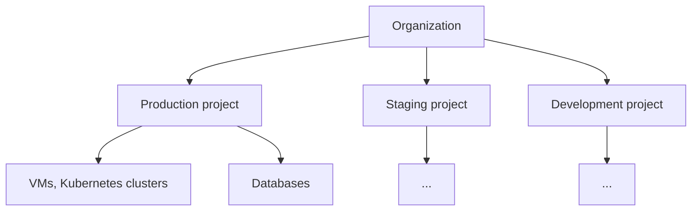

# Hikube key concepts

This page presents what you need to know to use Hikube: how your resources are organized, how you manage them, and what the platform handles for you.

---

## The Hikube console

All day-to-day operations take place in the **web console**: [https://console.hikube.cloud](https://console.hikube.cloud). You sign in with your Hikube account (single sign-on). From the console, you create, modify and delete your resources, check their status and estimated cost, and retrieve connection details.

A project's side menu groups the services:

| Section | Services |
|---------|----------|
| **Dashboard** | Project overview, quotas, costs, recent resources |
| **Infrastructure** | **VM Instances**, **Disks**, **S3 Buckets**, **Kubernetes**, **Networking** |
| **DB & Messaging** | **PostgreSQL**, **MariaDB**, **MongoDB**, **Redis**, **RabbitMQ** |

---

## Organization and projects

### Organization

The **organization** represents your company. Hidora creates it when your account is opened; it groups your users and your projects. If you have access to several organizations, you switch between them from the profile menu (**Change organization**).

### Project

A **project** is an isolated space within the organization. Each resource (VM, disk, cluster, database…) belongs to a single project. A project provides:

- **isolation**: a project's resources cannot see those of other projects;
- **quotas**: CPU, memory and storage limits that cap the project's consumption;
- **cost tracking**: the project dashboard estimates the monthly cost of its resources.

A common practice is to create one project per environment (production, staging, development) or per team.

:::note Former terminology
In previous versions of the documentation, a project was called a **tenant**.
:::

### Quotas

A project's quotas are set when it is created (**Quotas** step of the wizard) and can then be changed in the project settings. The creation wizards show the impact of each new resource on the quota before creating it. A quota cannot be lowered below what the project already consumes: free up resources first.

### Deleting a project

Deleting a project (project settings → **Danger Zone** → **Delete this project**) permanently destroys all of its resources: VMs, Kubernetes clusters, databases, disks, S3 buckets and networks. This action is restricted to project or organization administrators.

---

## Managed services

Hikube operates the underlying infrastructure of each service for you: high availability, storage replication across datacenters, platform updates. You choose the size and configuration; the platform provisions and maintains.

| Family | Services |
|---------|----------|
| Compute | [Virtual machines](../services/compute/overview.md), [GPU](../services/gpu/overview.md) |
| Containers | [Managed Kubernetes](../services/kubernetes/overview.md) |
| Storage | [Disks](../services/storage/disks/overview.md), [S3 buckets](../services/storage/buckets/overview.md) |
| Networking | [VPCs and subnets](../services/networking/overview.md) |
| Databases | [PostgreSQL](../services/databases/postgresql/overview.md), [MariaDB](../services/databases/mariadb/overview.md), [MongoDB](../services/databases/mongodb/overview.md), [Redis](../services/databases/redis/overview.md) |
| Messaging | [RabbitMQ](../services/messaging/rabbitmq/overview.md) |

Some services (ClickHouse, Kafka, NATS) are not yet offered as self-service in the console: they are provisioned on request by support.

---

## Sovereignty and availability

- **Data in Switzerland**: all data remains hosted on Swiss territory.
- **Three datacenters**: replicated storage is spread across three geographically separate datacenters.
- **Network isolation**: each project has its own network perimeter.

---

## Next steps

- **[Quick start](./quick-start.md)**: create your first project and your first cluster
- **[Virtual machines](../services/compute/overview.md)**: deploy a Linux or Windows VM
- **[FAQ](../resources/faq.md)**: frequently asked questions
