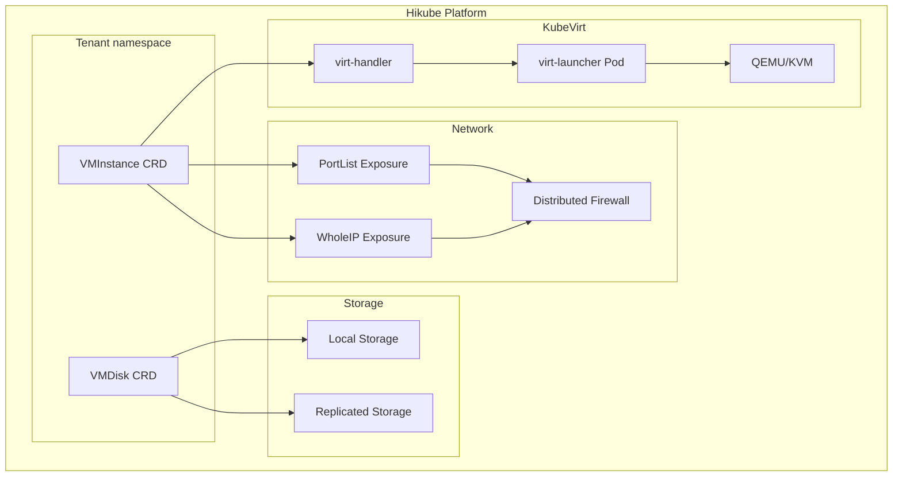
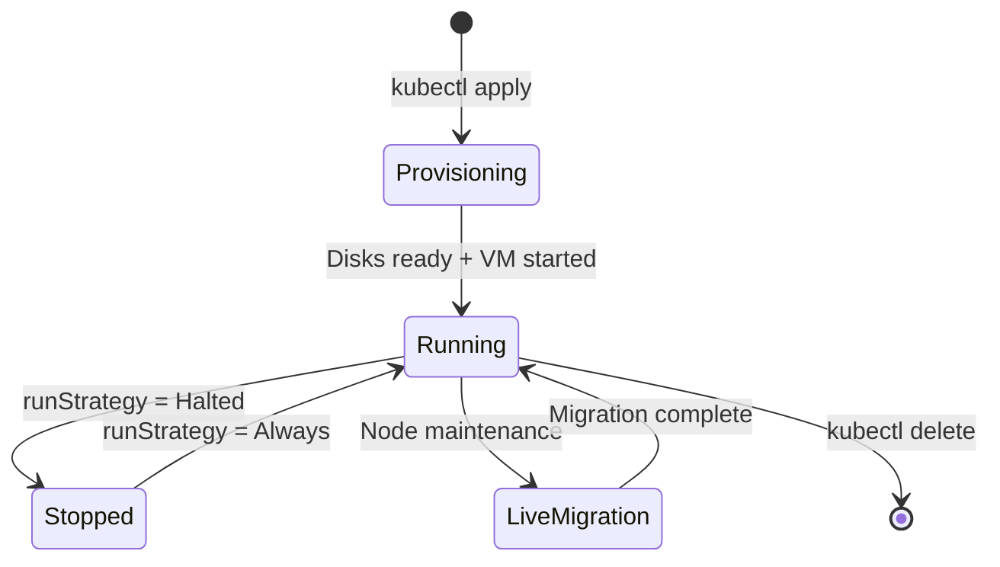

# Concepts — Virtual Machines

## Architecture

Hikube provides virtual machines (VMs) through **KubeVirt**, a technology that runs VMs directly within the Kubernetes infrastructure. Each VM is managed as a native Kubernetes resource, offering seamless integration with the cloud-native ecosystem.

---

## Terminology

| Term | Description |
|------|-------------|
| **VMInstance** | Kubernetes resource (`apps.cozystack.io/v1alpha1`) representing a virtual machine. Manages the lifecycle, disks, network, and cloud-init. |
| **VMDisk** | Kubernetes resource representing a virtual disk. Can be created from a Golden Image, an HTTP source, or empty. |
| **Golden Image** | Pre-configured and optimized OS image for KubeVirt (AlmaLinux, Rocky, Debian, Ubuntu, etc.). |
| **Instance Type** | CPU/RAM resource profile defined by a series (S, U, M) and a size. |
| **cloud-init** | Automatic VM initialization mechanism at first boot (users, packages, scripts). |
| **PortList** | Network exposure method that exposes specific ports with automatic firewalling on the dedicated IP (recommended). |
| **WholeIP** | Network exposure method that assigns a dedicated public IP to the VM. |

---

## Instance types

Hikube offers three instance series with different CPU/RAM ratios:

| Series | CPU:RAM ratio | Use case |
|--------|---------------|----------|
| **S (Standard)** | 1:2 | General workloads, shared CPU, burstable |
| **U (Universal)** | 1:4 | Balanced workloads, more memory |
| **M (Memory)** | 1:8 | Memory-intensive applications (caches, databases) |

Each series ranges from `small` (1-2 vCPU) to `8xlarge` (32-64 vCPU).

---

## Storage

Two storage classes are available for VM disks:

| Class | Characteristics | Use case |
|-------|-----------------|----------|
| **local** | Storage on the physical node, maximum performance | Ephemeral data, caches, testing |
| **replicated** | Replication across multiple nodes/regions | Production data, high availability |

:::tip
Use `storageClass: replicated` for system disks in production. `local` storage offers better I/O performance but does not survive a node failure.
:::

---

## Network and exposure

### PortList (recommended)

The **PortList** mode exposes only the specified ports via a dedicated IP for the VM with automatic firewalling on the Service. This is the recommended method because it:
- Limits the attack surface
- Assigns a dedicated IP to the VM
- Supports standard TCP ports (22, 80, 443, etc.)

### WholeIP

The **WholeIP** mode assigns a dedicated public IP with all ports open. Useful when:
- The VM needs to be accessible on dynamic ports
- A protocol requires a dedicated IP (VPN, SIP, etc.)
- The VM serves as a gateway or VPN

---

## VM lifecycle

Hikube VMs support:
- **Start/stop** via the `spec.runStrategy` field
- **Live migration** seamlessly during maintenance
- **Auto-restart** in case of host node failure
- **Snapshots** for point-in-time backup

---

## Isolation and security

Each VM benefits from multi-level isolation:

- **Kernel isolation**: KubeVirt runs each VM in its own QEMU/KVM process
- **Network isolation**: distributed firewall between tenants
- **Storage isolation**: each disk is a dedicated volume

---

## Limits and quotas

| Parameter | Limit |
|-----------|-------|
| vCPU per VM | Up to 64 (S series `s1.8xlarge`) |
| RAM per VM | Up to 256 GB (M series `m1.8xlarge`) |
| Disks per VM | Multiple (system + data) |
| Disk size | Variable, depending on tenant quota |

---

## Further reading

- [Overview](./overview.md): detailed service presentation
- [API Reference](./api-reference.md): complete list of VMInstance and VMDisk parameters
