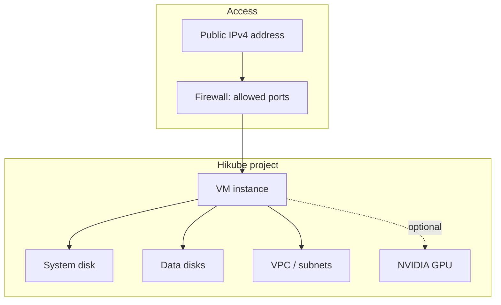
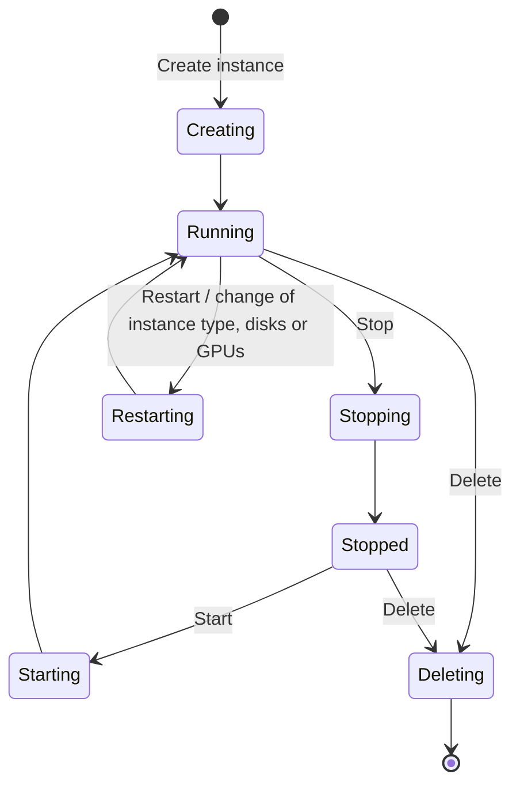

# Concepts — Virtual machines

## Architecture

A Hikube **VM instance** combines a compute template (vCPU and RAM), one or more disks, a network configuration and, optionally, GPUs. You manage them from the console.

```mermaid
graph TB
    subgraph "Hikube project"
        VM[VM instance]
        SYS[System disk]
        DATA[Data disks]
        VPC[VPC / subnets]
        GPU[NVIDIA GPU]
    end

    subgraph "Access"
        PUB[Public IPv4 address]
        FW[Firewall: allowed ports]
    end

    VM --> SYS
    VM --> DATA
    VM --> VPC
    VM -.optional.-> GPU
    PUB --> FW --> VM
```

---

## Terminology

| Term | Description |
|-------|-------------|
| **Project** | Isolated space that groups your resources and carries quotas (CPU, Memory, Storage). Formerly called *tenant*. |
| **VM instance** | Virtual machine. Its name (3 to 16 characters, lowercase letters, digits and hyphens, starting with a letter) cannot be changed after creation. |
| **Instance type** | CPU/RAM template, defined by a series (S, U, M) and a size (for example `u1.xlarge`). |
| **System image** | Operating system installed on the system disk (Ubuntu, Debian, Rocky Linux, Windows Server…). |
| **System disk** | First disk of the VM, the one it boots from. By default it is named after the VM. |
| **Data disk** | Additional disk, empty at creation. It appears in the OS as an additional block device (`/dev/vdb`, `/dev/vdc`…). |
| **Replication** | How a disk's data is copied across several nodes: **Asynchronous** or **Synchronous**. |
| **Firewall** | Filtering of inbound traffic on the public IP: only the allowed ports are open. |
| **VPC** | Private network of the project, divided into subnets, to which a VM can be connected. See [Networking](../networking/concepts.md). |
| **cloud-init (User Data)** | Initialization script run when the VM boots (packages, users, commands). Not available for Windows. |

---

## Instance types

| Series | Label in the console | vCPU:RAM ratio | Sizes |
|-------|-------------------------|----------------|---------|
| `s1` | **Standard (S)** | 1:2 | `small` (1 vCPU) to `8xlarge` (64 vCPU) |
| `u1` | **Universal (U)** | 1:4 | `medium` (1 vCPU) to `8xlarge` (32 vCPU) |
| `m1` | **Memory (M)** | 1:8 | `large` (2 vCPU) to `8xlarge` (32 vCPU) |

The full list of sizes is in the [overview](./overview.md#instance-types).

---

## Storage

Each disk created with the VM is configured in the **Storage** step of the wizard:

| Parameter | Values | Notes |
|-----------|---------|-----------|
| **Volume Name** | Generated from the VM name (`ma-vm`, `ma-vm-2`…) | Editable |
| **Size (GB)** | 20 GB minimum, 4096 GB maximum | 50 GB minimum for Windows, 40 GB for Oracle Linux |
| **Replication Type** | **Asynchronous Replication** (Recommended) or **Synchronous Replication** | See below |
| **Disk Encryption** | Enabled / disabled | LUKS encryption of data at rest |

| Mode | RTO | RPO | Use |
|------|-----|-----|-------|
| **Asynchronous Replication** | < 5 min | < 5 min | Default choice, suitable for most uses |
| **Synchronous Replication** | < 5 min | < 1 min | Data for which the maximum tolerated loss must be minimal |

A disk can also be **Existing**: it is then chosen among the project's disks that are not attached to any VM. The system disk can only be a disk containing an image; data disks can only be disks without an image.

Disks are resources in their own right, managed in the **Disks** menu: see [Disks](../storage/disks/concepts.md).

---

## Network

| Wizard option | Default | Effect |
|-----------------------|--------|-------|
| **Public IPv4 Address** | Enabled | The VM gets a public IP reachable from the Internet. |
| **Enable Firewall** | Enabled | Only the **Allowed Ports** are open for inbound traffic (SSH 22 checked by default; HTTP 80, HTTPS 443 and custom ports optionally). |
| Firewall disabled | — | All ports of the public IP are open. In that case, protect the VM with a firewall in the OS. |
| **VPC Networks (Secondary)** | None | Each selected subnet adds a private network interface to the VM. |

---

## Lifecycle

```mermaid
stateDiagram-v2
    state "Creating" as EnCreation
    state "Running" as Actif
    state "Stopping" as ArretEnCours
    state "Stopped" as Arrete
    state "Starting" as DemarrageEnCours
    state "Restarting" as RedemarrageEnCours
    state "Deleting" as SuppressionEnCours
    [*] --> EnCreation: Create instance
    EnCreation --> Actif
    Actif --> ArretEnCours: Stop
    ArretEnCours --> Arrete
    Arrete --> DemarrageEnCours: Start
    DemarrageEnCours --> Actif
    Actif --> RedemarrageEnCours: Restart / change of instance type, disks or GPUs
    RedemarrageEnCours --> Actif
    Actif --> SuppressionEnCours: Delete
    Arrete --> SuppressionEnCours: Delete
    SuppressionEnCours --> [*]
```

Statuses shown in the console: **Creating**, **Running**, **Starting**, **Stopping**, **Stopped**, **Restarting**, **Deleting**, **Error**, **Failed**, **Unknown**.

The **Automatic Restart** option (**Configuration** step of the wizard, or **Advanced Configuration** when editing) makes the VM restart automatically after an unexpected crash. It is disabled by default.

---

## What can be changed after creation

| Item | Editable | Effect |
|---------|-----------|-------|
| Name, system image | No | — |
| Instance type | Yes | VM restart |
| Disks (add, detach) | Yes | VM restart |
| GPU | Yes | VM restart |
| Public IP, firewall, ports, VPC | Yes | Applied without restart |
| SSH keys | Yes | Offer to reload the user-data, applied at the next restart |
| cloud-init script, automatic restart | Yes | Script replayed after **Reload UserData** and a restart |

---

## Quotas

Each project has **CPU**, **Memory** and **Storage** quotas. The wizard shows the current usage, the planned addition and the total; the **Next** button stays disabled as long as the new VM exceeds a quota. The same check applies to the **Save** button when editing.

The wizard also shows an estimate of the VM cost: instance type, new disks, GPUs, Windows license if applicable, and public IP.

---

## Further reading

- [Overview](./overview.md)
- [Quick start](./quick-start.md)
- [Disks](../storage/disks/overview.md)
- [Networking: VPCs and subnets](../networking/overview.md)
