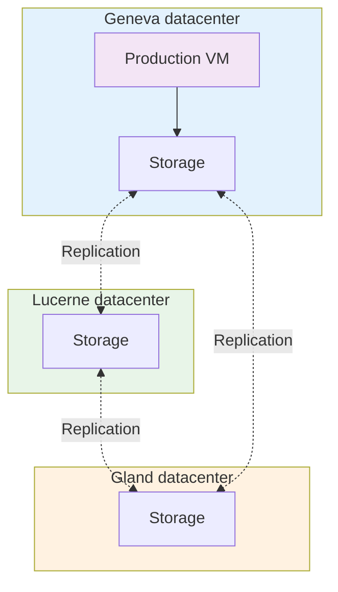

import NavigationFooter from '@site/src/components/NavigationFooter';

# Virtual machines on Hikube

Hikube **virtual machines (VMs)** provide full virtualization of the hardware infrastructure, to run heterogeneous operating systems and business applications in isolated environments.

In the [Hikube console](https://console.hikube.cloud), VMs are managed from the **Infrastructure** > **VM Instances** menu: guided creation, start and stop, changes to resources, disks and network, deletion.

---

## What you can do from the console

| Need | Where to do it |
|--------|-------------|
| Create a VM (image, instance type, disks, network, SSH keys, cloud-init, GPU) | **VM Instances** > **Create an Instance** |
| Start, stop, restart | **Actions** menu in the list, or **Actions** section of the detail page |
| Change the instance type, add a disk or a GPU, change the open ports | Detail page > **Edit** |
| Replay the cloud-init script | **Reload UserData**, then **Restart** |
| Get the ready-to-copy SSH command | Detail page, **Network & Security** section > **SSH Connection** |
| Connect the VM to a private network | **Network** step of the wizard, or **Networking** menu (see [VPCs and subnets](../networking/overview.md)) |

---

## Architecture and operation

### Separation of compute and storage

Hikube decouples compute and storage:

**Compute layer**

- The VM runs on physical servers spread across 3 datacenters.
- If the node hosting it fails, the VM is restarted on another node.
- Downtime is limited to the restart time.

**Storage layer**

- VM disks are **replicated** across several physical nodes, in synchronous or asynchronous mode (chosen disk by disk in the wizard).
- Disks survive hardware failures and remain attachable to the relocated VM.
- They exist independently of the VM: deleting a VM detaches its disks without deleting them. They remain visible in the **Disks** menu (see [Disks](../storage/disks/overview.md)).

### Multi-datacenter architecture

```mermaid
flowchart TD
    subgraph DC1["Geneva datacenter"]
        VM1["Production VM"]
        STORAGE1["Storage"]
    end

    subgraph DC2["Lucerne datacenter"]
        STORAGE2["Storage"]
    end

    subgraph DC3["Gland datacenter"]
        STORAGE3["Storage"]
    end

    VM1 --> STORAGE1

    STORAGE1 <-.->|"Replication"| STORAGE2
    STORAGE2 <-.->|"Replication"| STORAGE3
    STORAGE1 <-.->|"Replication"| STORAGE3

    style DC1 fill:#e3f2fd
    style DC2 fill:#e8f5e8
    style DC3 fill:#fff2e1
    style VM1 fill:#f3e5f5
```

---

## Instance types

At the **Configuration** step of the wizard, the console offers three series. Choose the series first, then the instance size.

### Standard (S) series — 1:2 ratio

*Economical use, for development and testing.*

| Instance | vCPU | RAM |
|----------|------|-----|
| `s1.small` | 1 | 2 GB |
| `s1.medium` | 2 | 4 GB |
| `s1.large` | 4 | 8 GB |
| `s1.xlarge` | 8 | 16 GB |
| `s1.3large` | 12 | 24 GB |
| `s1.2xlarge` | 16 | 32 GB |
| `s1.3xlarge` | 24 | 48 GB |
| `s1.4xlarge` | 32 | 64 GB |
| `s1.8xlarge` | 64 | 128 GB |

### Universal (U) series — 1:4 ratio

*General use: web servers, applications.*

| Instance | vCPU | RAM |
|----------|------|-----|
| `u1.medium` | 1 | 4 GB |
| `u1.large` | 2 | 8 GB |
| `u1.xlarge` | 4 | 16 GB |
| `u1.2xlarge` | 8 | 32 GB |
| `u1.4xlarge` | 16 | 64 GB |
| `u1.8xlarge` | 32 | 128 GB |

### Memory (M) series — 1:8 ratio

*Memory-optimized: databases, caches.*

| Instance | vCPU | RAM |
|----------|------|-----|
| `m1.large` | 2 | 16 GB |
| `m1.xlarge` | 4 | 32 GB |
| `m1.2xlarge` | 8 | 64 GB |
| `m1.3xlarge` | 12 | 96 GB |
| `m1.4xlarge` | 16 | 128 GB |
| `m1.8xlarge` | 32 | 256 GB |

:::tip Selection guide
- **Development, testing, lightweight services**: **S** series.
- **Web and business applications**: **U** series.
- **Databases, caches, analytics**: **M** series.

The instance type can be changed afterwards from **Edit**; the VM restarts to apply the change.
:::

---

## Operating systems

The system disk is created from an image provided by Hikube. The wizard shows the available images as cards, with a version selector:

| Image | Versions |
|-------|----------|
| AlmaLinux | 8, 9 |
| CentOS Stream | 9, 10 |
| CloudLinux | 8, 9 |
| Debian | 12, 13 |
| openSUSE | 15.6, 16.0 |
| Oracle Linux | 8, 9, 10 |
| Rocky Linux | 8, 9, 10 |
| Ubuntu | 22.04, 24.04 |
| Windows Server | 2022, 2025 |

The list shown in the console is authoritative: it changes with the supported versions.

:::note Custom image
Importing a custom image (ISO or QCOW2 from an HTTPS URL) is done by creating a disk in the **Disks** menu. That disk can then be chosen as the system disk of a new VM (**Existing** option). See [Create a system disk from an image](../storage/disks/how-to/create-from-image.md).
:::

---

## Connectivity and access

- **Public IP**: **Public IPv4 Address** option, enabled by default. The VM is then reachable from the Internet.
- **Firewall**: **Enable Firewall** option, enabled by default. Only the checked ports (22 by default; 80, 443 or any custom port optionally) are open for inbound traffic. Without the firewall, all ports of the public IP are open.
- **Private networks**: the VM can be connected to one or more [VPCs](../networking/overview.md) to communicate privately with other VMs in the project.
- **SSH**: the detail page shows the ready-to-copy `ssh <user>@<ip>` command. Access uses the public SSH keys entered in the wizard.
- **Windows**: an administrator password is generated at creation and shown only once. Access is over RDP.

:::note Serial console and VNC
Serial console or VNC access is not offered in the console; contact [support](mailto:support@hidora.io) if you need it for diagnostics.
:::

---

## Isolation and security

- Each **project** is an isolated space: the VMs of one project cannot see those of another.
- Each VM runs in its own virtualization process, isolated at the kernel level.
- Disks can be **encrypted at rest** (LUKS), with the **Disk Encryption** option at creation.

---

## Next steps

- [Create your first VM](./quick-start.md)
- [Understand the concepts](./concepts.md)
- [Configure the network and firewall](./how-to/configure-network.md)

<NavigationFooter
  nextSteps={[
    {label: "Concepts", href: "../concepts"},
    {label: "Quick start", href: "../quick-start"},
  ]}
/>
