# Virtual Machines on Hikube

Hikube **Virtual Machines (VMs)** offer complete hardware infrastructure virtualization, ensuring the execution of heterogeneous operating systems and business applications in isolated environments that meet enterprise security requirements.

---

## 🏗️ Architecture and Operation

### **Compute and Storage Separation**

Hikube uses a **decoupled** architecture between compute and storage that ensures optimal resilience:

**💻 Compute Layer**

- The VM runs on **physical servers** in one of the 3 datacenters
- If a node fails, the VM is **automatically restarted** on another node
- If a datacenter fails, the VM is **automatically restarted** on another node in one of the 2 remaining datacenters
- Downtime is limited to restart time (generally < 2 minutes)

**💾 Storage Layer (Persistent)**

- VM disks are **automatically replicated** across multiple physical nodes with "replicated" storage
- **No data loss** even in case of multiple hardware failures
- Disks survive failures and remain attachable to the relocated VM

This separation ensures that **your data is always safe**, even if the physical server hosting your VM becomes unavailable or if a datacenter becomes unavailable.
We guarantee the resources!

### **Multi-Datacenter Architecture**

```mermaid
flowchart TD
    subgraph DC1["🏢 Geneva Datacenter"]
        VM1["🖥️ VM-Production"]
        STORAGE1["💾 Storage"]
    end
    
    subgraph DC2["🏢 Lucerne Datacenter"]
        STORAGE2["💾 Storage"]
    end
    
    subgraph DC3["🏢 Gland Datacenter"]
        STORAGE3["💾 Storage"]
    end
    
    %% VM uses local storage
    VM1 --> STORAGE1
    
    %% Storage replication between the 3 DCs
    STORAGE1 <-.->|"Replication"| STORAGE2
    STORAGE2 <-.->|"Replication"| STORAGE3
    STORAGE1 <-.->|"Replication"| STORAGE3
    
    %% Styles
    style DC1 fill:#e3f2fd
    style DC2 fill:#e8f5e8
    style DC3 fill:#fff2e1
    style VM1 fill:#f3e5f5
```

---

## ⚙️ Instance Types

### **Complete Range for All Needs**

Hikube offers three instance series optimized for different usage profiles, ensuring performance adapted to each workload:

### **S Series - Standard (Ratio 1:2)**

**Compute-oriented** instances with a CPU/memory ratio of 1:2, ideal for CPU-intensive workloads.

| **Instance** | **vCPU** | **RAM** | **Typical Use Cases** |
|--------------|----------|---------|---------------------------|
| `s1.small`   | 1        | 2 GB    | Light services, proxies |
| `s1.medium`  | 2        | 4 GB    | Workers, batch processing |
| `s1.large`   | 4        | 8 GB    | Scientific computing |
| `s1.xlarge`  | 8        | 16 GB   | Rendering, compilation |
| `s1.3large`  | 12       | 24 GB   | Intensive applications |
| `s1.2xlarge` | 16       | 32 GB   | HPC, simulations |
| `s1.3xlarge` | 24       | 48 GB   | Distributed computing |
| `s1.4xlarge` | 32       | 64 GB   | Massive computing |
| `s1.8xlarge` | 64       | 128 GB  | Exascale computing |

### **U Series - Universal (Ratio 1:4)**

**Versatile** instances offering optimal balance between CPU and memory for most enterprise applications.

| **Instance** | **vCPU** | **RAM** | **Typical Use Cases** |
|--------------|----------|---------|---------------------------|
| `u1.medium`  | 1        | 4 GB    | Dev, tests, micro-services |
| `u1.large`   | 2        | 8 GB    | Web applications, APIs |
| `u1.xlarge`  | 4        | 16 GB   | Business applications |
| `u1.2xlarge` | 8        | 32 GB   | Intensive workloads |
| `u1.4xlarge` | 16       | 64 GB   | Critical applications |
| `u1.8xlarge` | 32       | 128 GB  | Enterprise applications |

### **M Series - Memory (Ratio 1:8)**

**High memory** instances with a CPU/memory ratio of 1:8 for memory-hungry applications.

| **Instance** | **vCPU** | **RAM** | **Typical Use Cases** |
|--------------|----------|---------|---------------------------|
| `m1.large`   | 2        | 16 GB   | Redis caches, Memcached |
| `m1.xlarge`  | 4        | 32 GB   | In-memory databases |
| `m1.2xlarge` | 8        | 64 GB   | Analytics, Big Data |
| `m1.4xlarge` | 16       | 128 GB  | SAP HANA, Oracle |
| `m1.8xlarge` | 32       | 256 GB  | Data warehouses |

:::tip **Selection Guide**

- **Intensive computing, CI/CD** → **S** Series (ratio 1:2, CPU optimized)
- **Classic web applications** → **U** Series (ratio 1:4, balanced)  
- **Databases, Analytics** → **M** Series (ratio 1:8, memory optimized)
:::

---

## 🔒 Isolation and Security

### **Multi-Tenant by Design**

Each VM benefits from **complete isolation** thanks to a secure architecture that strictly partitions resources between different tenants. This isolation relies on several complementary protection layers:

- **Tenant** : Logical separation of resources at the application level, each tenant having its own execution space
- **Kernel isolation** : Network and process isolation at the Linux kernel level, ensuring no VM can access another's resources
- **Storage classes** : Automatic encryption and data isolation, with cryptographic separation of volumes by tenant

---

## 🌐 Connectivity and Access

### **Native Access Methods**

Access to Hikube virtual machines is done via native mechanisms integrated into the platform, eliminating the need for complex network infrastructure. The **serial console** provides direct low-level access independent of the network, ideal for debugging and system maintenance. For graphical environments, **VNC** allows connection to the VM's user interface via secure tunnels. Traditional **SSH** access remains available either via `virtctl ssh` which automatically manages connectivity, or directly via the assigned external IP. Application services can be selectively exposed via **controlled port lists** that intelligently filter traffic without compromising tenant security.

### **Software-Defined Network**

Hikube's network architecture is based on a Software-Defined approach that completely virtualizes the network layer. Each VM automatically receives a **private IP** in a network segment isolated by tenant, ensuring isolation while allowing internal communication. The system can optionally assign a **public IPv4 IP** for external exposure, with automatic routing that maintains secure segmentation. The **distributed firewall** applies granular security policies directly at each VM level, with restrictive default rules that dynamically adapt to application needs.

---

## 📦 Migration and Portability

### **Import of Existing Workloads**

The Hikube platform facilitates migration of existing infrastructures thanks to universal import mechanisms that preserve workload integrity. **Standardized cloud images** (Ubuntu Cloud Images, CentOS Cloud) integrate natively for immediate deployment with cloud-native optimizations. For custom installations, importing **ISO images** allows recreating custom environments while preserving all specific configurations. **VMware snapshots** are automatically converted from VMDK to RAW format, ensuring seamless transition from traditional virtualization infrastructures. Compatibility with **Proxmox and OpenStack formats** (QCOW2) guarantees interoperability with most existing cloud solutions.

### **Lifecycle Management**

The lifecycle management system integrates automated mechanisms that ensure operational continuity of virtual machines. **Snapshots** instantly capture the complete state of the VM, including memory and storage, to enable precise rollbacks during maintenance or incidents. **Automatic backup** orchestrates scheduled disk backups with configurable retention, automatically replicated across the three datacenters to guarantee recovery in case of disaster. **Live migration** moves VMs between physical nodes without service interruption, facilitating hardware maintenance and load optimization without impact on critical applications.

---

## 🚀 Next Steps

Now that you understand Hikube VM architecture:

**🏃‍♂️ Immediate Start**  
→ [Create your first VM in 5 minutes](./quick-start.md)

**📖 Advanced Configuration**  
→ [Complete API Reference](./api-reference.md)

:::tip Recommended Architecture
For production, always use the `replicated` storage class and size your VMs with at least 2 vCPU to benefit from better performance.
:::

