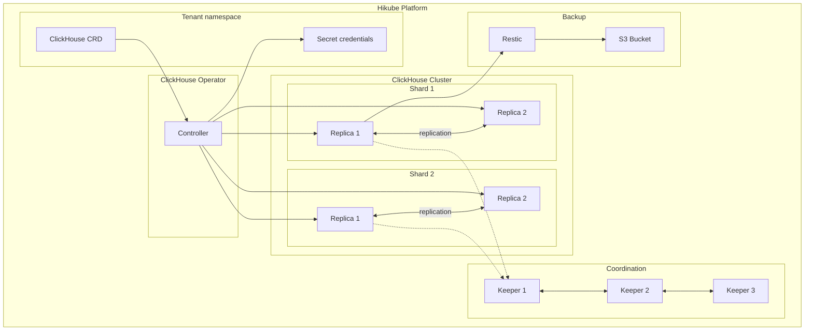
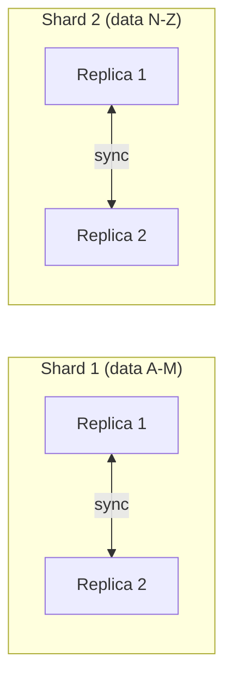

# Concepts — ClickHouse

## Architecture

ClickHouse on Hikube is a managed service based on the **ClickHouse Operator**. It is a column-oriented SQL database optimized for data analytics (OLAP). The architecture relies on **shards** (horizontal partitioning) and **replicas** (high availability), coordinated by **ClickHouse Keeper**.

---

## Terminology

| Term | Description |
|------|-------------|
| **ClickHouse** | Kubernetes resource (`apps.cozystack.io/v1alpha1`) representing a managed ClickHouse cluster. |
| **Shard** | Horizontal data partition. Each shard contains a subset of the total data. |
| **Replica** | Copy of a shard. Provides redundancy and enables parallel reads. |
| **ClickHouse Keeper** | Distributed coordination service (alternative to ZooKeeper) that manages replication and consensus between nodes. |
| **Restic** | Backup tool for creating encrypted snapshots to S3 storage. |
| **OLAP** | Online Analytical Processing — data access model optimized for analytical queries (aggregations, column scans). |
| **resourcesPreset** | Predefined resource profile (nano to 2xlarge). |

---

## Sharding and replication

### Sharding

Sharding distributes data horizontally across multiple nodes:

- Each **shard** contains a portion of the data
- `SELECT` queries are executed in parallel across all shards
- The `shards` parameter in the manifest determines the number of partitions

### Replication

Each shard can have multiple replicas:

- Replicas of the same shard contain **identical data**
- Coordination is handled by **ClickHouse Keeper**
- In case of a replica failure, reads are redirected to the others

:::tip
For small data volumes, a single shard with 2 replicas is sufficient. Add shards when the volume exceeds the capacity of a single node.
:::

---

## ClickHouse Keeper

ClickHouse Keeper replaces ZooKeeper for cluster coordination:

- Manages **consensus** between replicas (Raft protocol)
- Stores cluster **metadata** (distributed tables, replication)
- Requires an **odd** number of instances (3 recommended) for quorum

| Keeper parameter | Description |
|------------------|-------------|
| `keeper.replicas` | Number of Keeper instances (3 recommended) |
| `keeper.resources` / `keeper.resourcesPreset` | Resources allocated to Keeper |
| `keeper.size` | Keeper storage size |

---

## Backup

ClickHouse on Hikube uses **Restic** for backups, following the same model as MySQL:

- **Encrypted** snapshots stored in an S3 bucket
- Scheduling via cron (`backup.schedule`)
- Configurable retention strategy (`backup.cleanupStrategy`)

---

## User management

Users are declared in the manifest with:

- **Password** for authentication
- **Readonly flag**: `true` for read-only access, `false` for full access

An `admin` user is automatically created with full privileges.

---

## Resource presets

| Preset | CPU | Memory |
|--------|-----|--------|
| `nano` | 250m | 128Mi |
| `micro` | 500m | 256Mi |
| `small` | 1 | 512Mi |
| `medium` | 1 | 1Gi |
| `large` | 2 | 2Gi |
| `xlarge` | 4 | 4Gi |
| `2xlarge` | 8 | 8Gi |

---

## Limits and quotas

| Parameter | Value |
|-----------|-------|
| Max shards | Depending on tenant quota |
| Replicas per shard | Depending on tenant quota |
| Storage size (`size`) | Variable (in Gi) |
| Keeper instances | 3 recommended (odd number) |

---

## Further reading

- [Overview](./overview.md): service presentation
- [API Reference](./api-reference.md): all parameters of the ClickHouse resource
