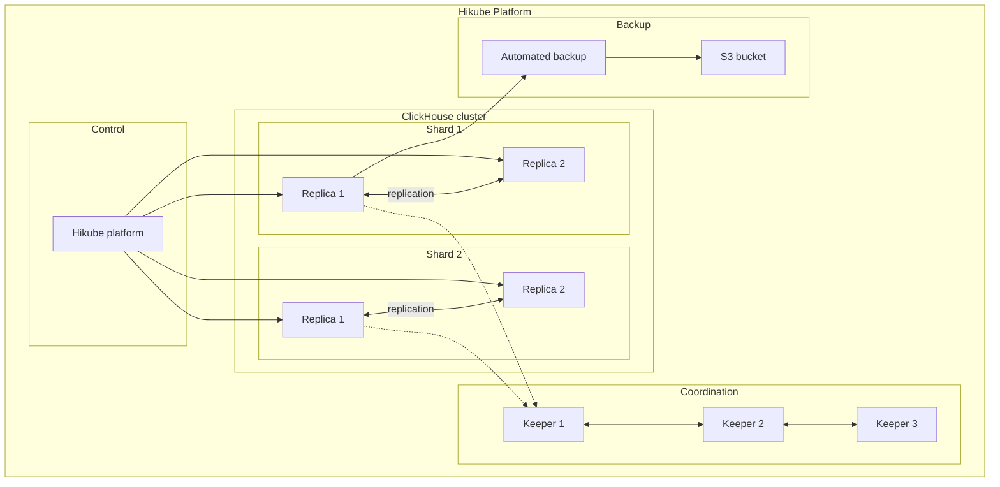
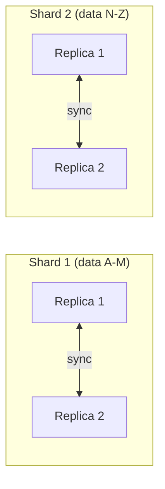

# Concepts — ClickHouse

:::info Availability
ClickHouse is not yet available as self-service in the [Hikube console](https://console.hikube.cloud).
To provision an instance or change its configuration, [contact support](mailto:support@hidora.io).
:::

## Architecture

ClickHouse on Hikube is a managed service. It is a column-oriented SQL database optimized for data analysis (OLAP). The architecture relies on **shards** (horizontal partitioning) and **replicas** (high availability), coordinated by **ClickHouse Keeper**.

```mermaid
graph TB
    subgraph "Hikube Platform"
        subgraph "Control"
            OP[Hikube platform]
        end

        subgraph "ClickHouse cluster"
            subgraph "Shard 1"
                S1R1[Replica 1]
                S1R2[Replica 2]
            end
            subgraph "Shard 2"
                S2R1[Replica 1]
                S2R2[Replica 2]
            end
        end

        subgraph "Coordination"
            K1[Keeper 1]
            K2[Keeper 2]
            K3[Keeper 3]
        end

        subgraph "Backup"
            S3[S3 bucket]
            RES[Automated backup]
        end
    end

    OP --> S1R1
    OP --> S1R2
    OP --> S2R1
    OP --> S2R2
    S1R1 <-->|replication| S1R2
    S2R1 <-->|replication| S2R2
    K1 <--> K2
    K2 <--> K3
    S1R1 -.-> K1
    S2R1 -.-> K1
    S1R1 --> RES
    RES --> S3
```

---

## Terminology

| Term | Description |
|------|-------------|
| **ClickHouse cluster** | Managed ClickHouse instance, provisioned on request in your project. |
| **Shard** | Horizontal partition of the data. Each shard contains a subset of the total data. |
| **Replica** | Copy of a shard. Provides redundancy and enables parallel reads. |
| **ClickHouse Keeper** | Distributed coordination service (alternative to ZooKeeper) that manages replication and consensus between nodes. |
| **OLAP** | Online Analytical Processing — data access model optimized for analytical queries (aggregations, column scans). |
| **Preset** | Predefined resource profile (nano to 2xlarge) allocated to each replica. |

---

## Sharding and replication

### Sharding

Sharding distributes data horizontally across several nodes:

- Each **shard** contains part of the data
- `SELECT` queries run in parallel on all shards
- The number of shards is set at provisioning time

### Replication

Each shard can have several replicas:

- Replicas of the same shard contain **identical data**
- Coordination is handled by **ClickHouse Keeper**
- If a replica fails, reads are redirected to the others

```mermaid
graph LR
    subgraph "Shard 1 (data A-M)"
        R1A[Replica 1]
        R1B[Replica 2]
    end
    subgraph "Shard 2 (data N-Z)"
        R2A[Replica 1]
        R2B[Replica 2]
    end

    R1A <-->|sync| R1B
    R2A <-->|sync| R2B
```

:::tip
For small data volumes, a single shard with 2 replicas is enough. Add shards when the volume exceeds the capacity of a single node.
:::

---

## ClickHouse Keeper

ClickHouse Keeper replaces ZooKeeper for cluster coordination:

- Manages **consensus** between replicas (Raft protocol)
- Stores cluster **metadata** (distributed tables, replication)
- Requires an **odd** number of instances (3 recommended) for quorum

The number of Keeper instances, their resources and their storage are defined at provisioning time.

---

## Backup

ClickHouse backups on Hikube provide:

- **Encrypted** snapshots stored in an S3 bucket
- Regular scheduling
- Configurable retention strategy

Backups are set up on request to support.

---

## User management

Users are defined at provisioning time, with:

- A **password** for authentication
- **Read-only** or **full access**

An `admin` user is created automatically with full rights.

---

## Resource presets

| Preset | CPU | Memory |
|--------|-----|--------|
| `nano` | 250m | 128Mi |
| `micro` | 500m | 256Mi |
| `small` | 1 | 512Mi |
| `medium` | 1 | 1Gi |
| `large` | 2 | 2Gi |
| `xlarge` | 4 | 4Gi |
| `2xlarge` | 8 | 8Gi |

---

## Limits and quotas

| Parameter | Value |
|-----------|-------|
| Max shards | Depends on project quotas |
| Replicas per shard | Depends on project quotas |
| Storage size | Variable (in GB) |
| Keeper instances | 3 recommended (odd) |

---

## Further reading

- [Overview](./overview.md): service presentation
- [FAQ](./faq.md): frequently asked questions
