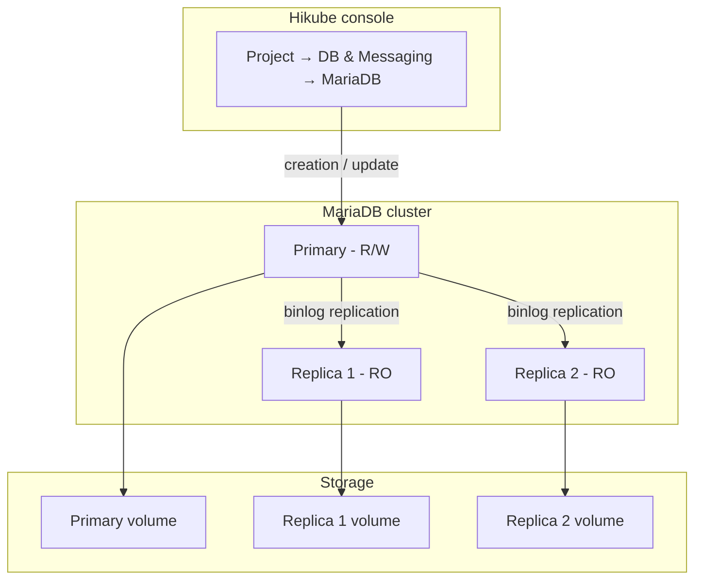
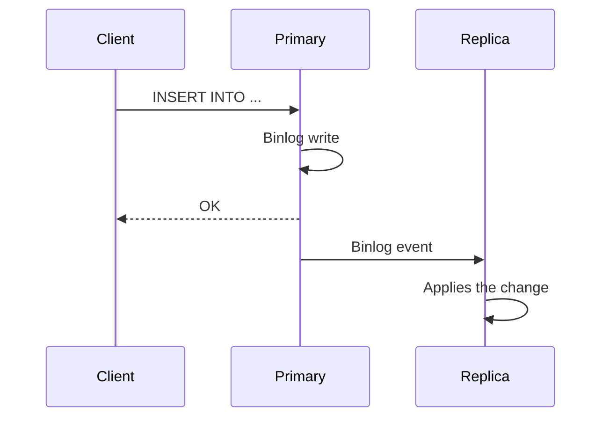

# Concepts — MariaDB

## Architecture

MariaDB on Hikube is a managed service. MariaDB is a fork of MySQL, compatible with its clients and protocol. Each cluster created from the console is a replicated set made up of a primary and optional replicas. It belongs to a **project** and consumes that project's quotas.

---

## Terminology

| Term | Description |
|-------|-------------|
| **MariaDB Cluster** | Managed instance created from the console, made up of a primary and optional replicas. |
| **Project** | Isolated space that groups your resources and carries the quotas. |
| **Primary** | Main node that accepts reads and writes. |
| **Replica** | Read-only node, synchronized from the primary through binlog replication. |
| **Preset** | Resource template (CPU, memory) allocated to each node of the cluster. |
| **External access** | Option that exposes the cluster on the Internet through a public IP address. |
| **Role** | A user's right on a database: **Administrator** or **Read-only**. |

---

## Replication and high availability

The cluster uses MariaDB **binlog replication**:

1. **The primary** writes all changes to the binary log
2. **The replicas** consume the binlog and apply the changes
3. **If the primary fails**, the platform automatically promotes a replica

The **Number of replicas** is chosen at creation:

| Offered value | Use |
|-----------------|-------|
| **1 (Standalone)** | Development, testing |
| **3 (Max High Availability)** | Production |
| **5 (Ultra High Availability)** | Critical production |

:::warning
The number of replicas and the preset cannot be changed after creation. To change them, [contact support](mailto:support@hidora.io).
:::

Manual primary switchover is not offered in the console; contact support.

---

## Users, databases and roles

A MariaDB cluster page has a **Users** section; there is no tab dedicated to databases. Rights are managed per user:

- **Global Role (Optional)**: **No global role**, **Administrator** or **Read-only (global)**. A global role is currently rejected on save (message `invalid database_name`): leave **No global role** and use specific access instead;
- **Specific Access (Databases)**: a list of **Database name** / **Rights** pairs (**Administrator (Admin)** or **Read-only**). Granting access to a database that does not exist yet creates it.

Users declared in the cluster creation wizard are granted the chosen **Role** on the `mysql` system database, visible in the **Databases** column of the user list: **Administrator** grants all privileges there (`ALL`, with grant option), **Read-only** grants `SELECT`. Then give them access to your application databases via **Manage Access**.

:::warning
The `mysql` database contains the server's accounts and privileges. **Administrator** access to this database makes it possible to change every user's rights, and **Read-only** access makes it possible to read password hashes. Reserve these accesses for an administration account and remove them from application accounts via **Manage Access**.
:::

A user's password is generated by the platform and displayed **only once**. If it is lost, generate a new one with **Change Password**.

### Naming rules

| Item | Rule |
|---------|-------|
| Cluster name | 3 to 16 characters: lowercase letters, digits and hyphens; starts with a letter, ends with a letter or a digit |
| Username | Lowercase letters, digits and hyphens; starts with a letter, ends with a letter or a digit (3 to 16 characters in the cluster creation wizard) |
| Database name | 1 to 63 characters: lowercase letters, digits and hyphens; starts with a letter, ends with a letter or a digit |

:::note
Underscores (`_`) are not accepted in database names or usernames.
:::

---

## Presets

The **Preset** defines the capacity allocated to **each node** of the cluster. The list displayed by the wizard is authoritative; for reference:

| Preset | CPU | Memory |
|--------|-----|---------|
| `nano` | 250m | 128Mi |
| `micro` | 500m | 256Mi |
| `small` | 1 | 512Mi |
| `medium` | 1 | 1Gi |
| `large` | 2 | 2Gi |
| `xlarge` | 4 | 4Gi |
| `2xlarge` | 8 | 8Gi |

Defining custom CPU/memory resources is not offered in the console; contact support.

---

## Network access

- **External access disabled** (default): the cluster is not exposed on the Internet. The **Host** field of the **Connection and network** card shows **Not defined**.
- **External access enabled**: the platform assigns a public IP address, shown in the **Host** field. The port is the standard MySQL port, `3306`.

---

## Backup and restore

Backup configuration and restore are not offered in the console; contact support. See [Configure backups](./how-to/configure-backups.md).

---

## Quotas and cost

The wizard displays the **Estimated Cost** and the cluster's impact on the project quotas. If the cluster exceeds the available quotas, the **Next** button stays disabled.

| Parameter | Value |
|-----------|--------|
| Versions | 10.6, 10.11, 11.4, 11.8 |
| Replicas | 1, 3 or 5 |
| Disk size | 1 to 4,096 GB, within the project's storage quota |

---

## Going further

- [Overview](./overview.md): service presentation
- [Quick start](./quick-start.md): create your first cluster
