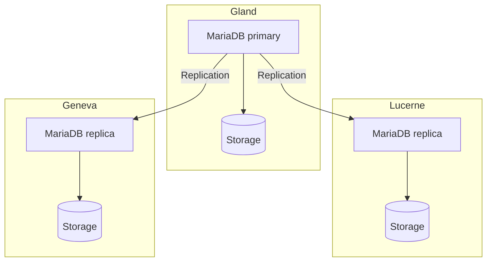

import NavigationFooter from '@site/src/components/NavigationFooter';

# MariaDB on Hikube

Hikube offers a **managed MariaDB** service. MariaDB is compatible with the MySQL protocol and clients: your existing MySQL applications and tools (`mysql`, `mysqldump`, JDBC connectors, PDO, etc.) work without modification.

The service deploys a replicated, self-healing cluster, which you create and manage from the [Hikube console](https://console.hikube.cloud) (**DB & Messaging** → **MariaDB** menu).

:::note
This service was previously presented in this documentation under the name "MySQL". The engine, MariaDB, is unchanged.
:::

---

## Architecture and operation

The platform automates the database lifecycle: deployment, updates, replication and incident recovery.

The architecture relies on a **replicated cluster**:

- A **primary node** handles all write operations and ensures data consistency.
- One or more **replicas** continuously receive transactions through replication.
- An **auto-failover** mechanism automatically promotes a replica to new primary in the event of a failure.

This approach provides:

- **Resilience** in the event of hardware or software failure
- **Read scalability** by distributing queries across replicas
- **Ease of management**, as the platform handles cluster coordination and maintenance

---

## What you manage from the console

| Feature | Available |
|----------|------------|
| Cluster creation (version 10.6, 10.11, 11.4 or 11.8, preset, disk size, 1, 3 or 5 replicas, external access) | Yes |
| Users, global role and per-database access (admin / read-only), password rotation | Yes |
| Changing the version, disk size and external access | Yes |
| Changing the preset or the number of replicas after creation | No, [contact support](mailto:support@hidora.io) |
| Backups and restore | No, [contact support](mailto:support@hidora.io) |

---

## Use cases

- **Transactional web applications (OLTP)**: e-commerce, ERP, CRM, where transaction reliability and speed are essential.
- **CMS and PHP applications**: WordPress, Drupal, Magento and, more generally, any application designed for MySQL.
- **Multi-customer SaaS applications**: one isolated database per customer, with the platform's high availability.
- **Read-heavy workloads**: replicas make it possible to distribute queries.

<NavigationFooter
  nextSteps={[
    {label: "Concepts", href: "../concepts"},
    {label: "Quick start", href: "../quick-start"},
  ]}
  seeAlso={[
    {label: "All databases", href: "../../"},
  ]}
/>
