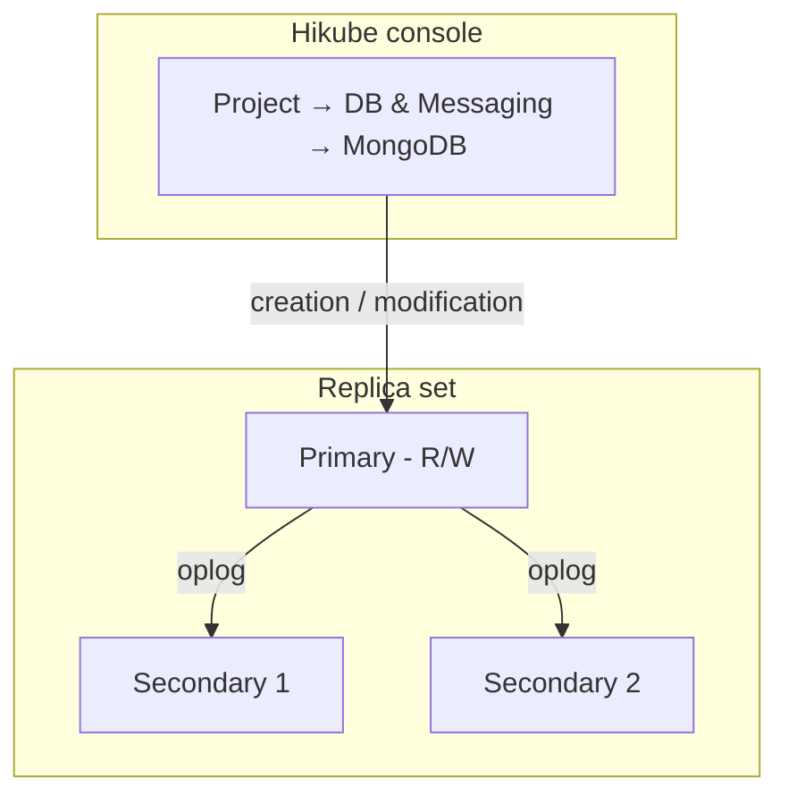

# Concepts — MongoDB

## Architecture

MongoDB on Hikube is a managed service. Each cluster created from the console is, by default, a **replica set**: a group of members holding the same data, only one of which accepts writes. The cluster belongs to a **project** and consumes that project's quotas.

---

## Terminology

| Term | Description |
|------|-------------|
| **MongoDB Cluster** | Managed instance created from the console. |
| **Project** | Isolated space that groups your resources and carries the quotas. |
| **Replica set** | Group of MongoDB members that replicate the same data. |
| **Primary** | Member that accepts writes. |
| **Secondary** | Member that replicates the primary and can be elected in its place if it fails. |
| **Oplog** | The primary's operation log, replayed by the secondaries. |
| **Shard** | Subset of the data, carried by its own replica set (sharded topology). |
| **Configuration servers** | Members that store the metadata of the sharded topology. |
| **Mongos** | Router that receives client requests and directs them to the right shards. |
| **Preset** | Resource template (CPU, memory) allocated to each node. |

---

## Replication and high availability

The secondaries continuously replay the primary's oplog. If the primary becomes unavailable, the remaining members elect a new primary; a majority of members must be available for the election to succeed.

The **Number of replicas** is chosen at creation:

| Offered value | Usage |
|---------------|-------|
| **1 (Standalone)** | Development, testing |
| **3 (Max High Availability)** | Production: tolerates the loss of one member |
| **5 (Ultra High Availability)** | Critical production: tolerates the loss of two members |

:::warning
The number of replicas, the preset and sharding cannot be changed after creation. To change them, [contact support](mailto:support@hidora.io).
:::

---

## Sharding

The wizard's **Sharding (Distributed Topology)** option "automatically deploys configuration servers and Mongos routers, and configures replica sets as shards". The console then creates:

- **2 shards**, each made up of the chosen number of replicas and a disk of the chosen size;
- **configuration servers**, with the same number of replicas and the same disk size;
- **Mongos routers**, with the same number of replicas.

Resource consumption and the estimated cost take this into account. See [Configure sharding](./how-to/configure-sharding.md).

---

## Users, databases and roles

The page of a MongoDB cluster has a **Users** section; there is no dedicated databases tab. Permissions are managed per user:

- **Global Role (Optional)**: **No global role**, **Administrator** or **Read-only (global)**;
- **Specific Access (Databases)**: a list of **Database name** / **Rights** pairs (**Administrator (Admin)** or **Read-only**).

A user must have at least one role: with neither a global role nor specific access, the console displays "Please assign at least one role (global or specific) to the user." and refuses to save.

Users declared in the cluster creation wizard receive the chosen **Role** on the `admin` database, visible in the **Databases** column of the user list: **Administrator** corresponds to the MongoDB roles `readWrite` and `dbAdmin` on that database, **Read-only** to the `read` role. These roles give no access to any other database: then grant access to your application databases via **Manage Access**. All users are created in the `admin` database, which serves as the authentication database (`authSource=admin`).

A user's password is generated by the platform and displayed **only once**. If it is lost, generate a new one with **Change Password**.

### Naming rules

| Item | Rule |
|------|------|
| Cluster name | 3 to 16 characters: lowercase letters, digits and hyphens; starts with a letter, ends with a letter or a digit |
| Username | Lowercase letters, digits and hyphens; starts with a letter, ends with a letter or a digit (3 to 16 characters in the cluster creation wizard) |
| Database name | 1 to 63 characters: lowercase letters, digits and hyphens; starts with a letter, ends with a letter or a digit |

:::note
Underscores (`_`) and uppercase letters are not accepted in database names or usernames.
:::

---

## Presets

The **Preset** defines the capacity allocated to **each node**. The list displayed by the wizard is authoritative; for reference:

| Preset | CPU | Memory |
|--------|-----|--------|
| `nano` | 250m | 128Mi |
| `micro` | 500m | 256Mi |
| `small` | 1 | 512Mi |
| `medium` | 1 | 1Gi |
| `large` | 2 | 2Gi |
| `xlarge` | 4 | 4Gi |
| `2xlarge` | 8 | 8Gi |

---

## Network access

- **External access disabled** (default): the cluster is not exposed on the Internet. The **Host** field of the **Network and Connection** card shows **Not defined**.
- **External access enabled**: the platform assigns a public address, displayed in the **Host** field for a sharded cluster. Without sharding, each member receives its own public address and the field remains on **Not defined**: request the address from [support](mailto:support@hidora.io). The port is the standard MongoDB port, `27017`. The wizard provides a connection string of the form `mongodb://<user>:<password>@<host>`.

---

## Backup and restore

Backup configuration and restore are not offered in the console; [contact support](mailto:support@hidora.io).

---

## Quotas and cost

The wizard displays the **Estimated cost** and the cluster's impact on the project quotas. If the cluster exceeds the available quotas, the **Next** button stays disabled.

| Parameter | Value |
|-----------|-------|
| Versions | 6.0, 7.0, 8.0 |
| Replicas | 1, 3 or 5 |
| Disk size | 1 to 4,096 GB, within the project's storage quota |

---

## Further reading

- [Overview](./overview.md): service presentation
- [Quick start](./quick-start.md): create your first cluster
