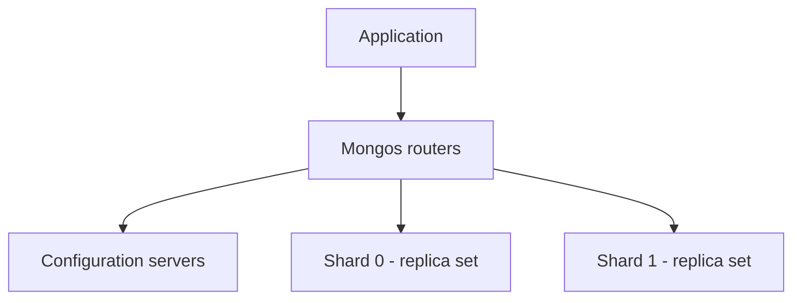

# How to configure MongoDB sharding

This guide explains how to create a sharded MongoDB cluster from the [Hikube console](https://console.hikube.cloud) and how to distribute your collections across the shards.

## Prerequisites

- A Hikube **project** with sufficient quotas: a sharded topology consumes significantly more resources than a replica set (see below)
- The **`mongosh`** shell and a user with the **Administrator** right on the database concerned

:::warning
Sharding is decided **at creation**: it cannot be enabled or disabled afterwards. To convert an existing cluster, [contact support](mailto:support@hidora.io).
:::

## Understanding the deployed topology

When the **Sharding (Distributed Topology)** option is enabled, the console deploys:

| Component | Count | Resources |
|-----------|-------|-----------|
| Shards | 2 | Each with the chosen **Number of replicas** and **Disk size (GB)** |
| Configuration servers | 1 group | Same number of replicas and same disk size |
| Mongos routers | 1 group | Same number of replicas |

Your applications connect to the **Mongos** routers, which direct each request to the shard or shards concerned.



## Steps

### 1. Create the sharded cluster

1. Open **DB & Messaging** → **MongoDB**, then click **Create a cluster**.
2. **General** step: enter the **Cluster Name**.
3. **Configuration** step: choose the **MongoDB Version**, the **Preset**, the **Disk size (GB)** and the **Number of replicas** (`3` recommended), then enable **Sharding (Distributed Topology)**.
4. Check the **Estimated cost** and the impact on the quotas, which take the additional components into account.
5. **Users** step: add at least one user with the **Role** **Administrator**.
6. **Summary** step: check that the **Sharding** line shows **Enabled**, then click **Create cluster**.

### 2. Check the topology

Once the cluster is in **Ready** status, the **Network and Connection** card of its page shows **Sharding**: **Enabled**.

### 3. Enable sharding on a collection

:::warning Required permissions
The **Administrator** right assigned from the console corresponds to the MongoDB roles `readWrite` and `dbAdmin` on a database. It does not grant the cluster privileges required by `sh.status()` and `sh.shardCollection()` (actions `listShards` and `enableSharding`). To shard a collection, [contact support](mailto:support@hidora.io), stating the collection and the desired sharding key.
:::

Sharding is configured collection by collection, by choosing a **sharding key**. Examples of the commands run by an account with these privileges:

```javascript
// Hashed key: even distribution of writes
sh.shardCollection("myapp.events", { deviceId: "hashed" })

// Range key: efficient for range queries
sh.shardCollection("myapp.orders", { customerId: 1, createdAt: 1 })
```

:::tip
Choose a high-cardinality key that appears in most of your queries. A monotonic key (creation date alone, incremental identifier) concentrates writes on a single shard.
:::

## Verification

```javascript
db.events.getShardDistribution()
```

**Expected result:** the documents and chunks are distributed across the two shards.

## Further reading

- [MongoDB concepts](../concepts.md): replica set and sharding
- [MongoDB documentation on sharding](https://www.mongodb.com/docs/manual/sharding/)
