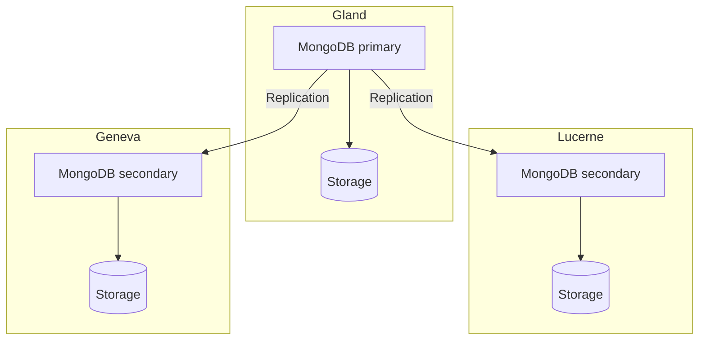

import NavigationFooter from '@site/src/components/NavigationFooter';

# MongoDB on Hikube

Hikube offers a **managed MongoDB** service. MongoDB is a document-oriented database: data is stored as JSON (BSON) documents, with no enforced schema, which makes it well suited to evolving data models.

The service deploys a replicated, self-healing **replica set**, with an optional **sharded** topology to spread data across several groups of nodes. You create and manage your clusters from the [Hikube console](https://console.hikube.cloud) (**DB & Messaging** → **MongoDB** menu).

---

## Architecture and operation

### Replica set (default)

- A **primary member** receives all writes.
- **Secondary members** continuously replicate the primary's operations and can serve reads.
- If the primary fails, the remaining members automatically **elect** a new primary.

### Sharded topology (optional)

When the **Sharding (Distributed Topology)** option is enabled at creation, the platform automatically deploys the **configuration servers** and the **Mongos routers**, and configures the replicas as **shards**. See [Configure sharding](./how-to/configure-sharding.md).

---

## What you manage from the console

| Feature | Available |
|---------|-----------|
| Cluster creation (version 6.0, 7.0 or 8.0, preset, disk size, 1, 3 or 5 replicas, external access, sharding) | Yes |
| Users, global role and per-database access (admin / read-only), password rotation | Yes |
| Changing the version, disk size and external access | Yes |
| Changing the preset, number of replicas or sharding after creation | No, [contact support](mailto:support@hidora.io) |
| Backups and restore | No, [contact support](mailto:support@hidora.io) |

---

## Use cases

- **Product and content catalogs** whose structure varies from one item to the next
- **Web and mobile applications** that handle JSON natively
- **User profiles, preferences, shopping carts** and enriched session data
- **Event collection and IoT**, with the sharded topology for large volumes
- **Rapid prototyping**, without a schema migration at every change

<NavigationFooter
  nextSteps={[
    {label: "Concepts", href: "../concepts"},
    {label: "Quick start", href: "../quick-start"},
  ]}
  seeAlso={[
    {label: "All databases", href: "../../"},
  ]}
/>
