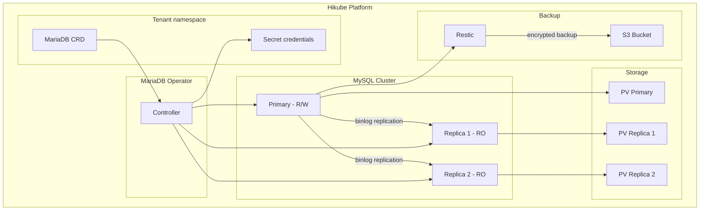
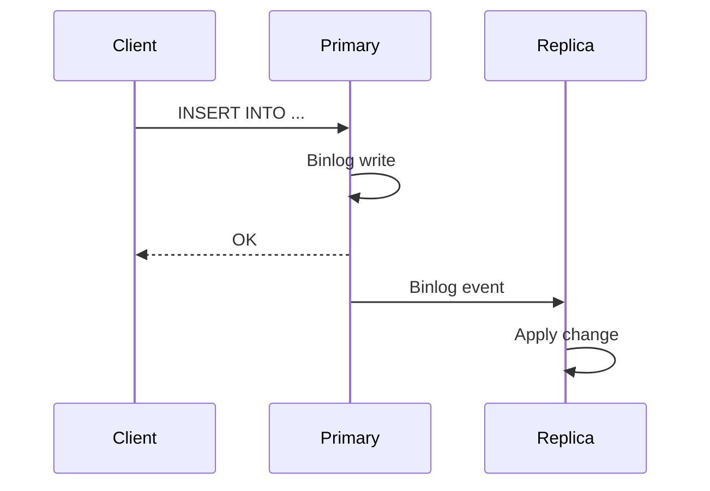

# Concepts — MySQL

## Architecture

MySQL on Hikube is a managed service based on the **MariaDB-Operator**. Although the operator uses MariaDB (a compatible fork of MySQL), the service is fully compatible with MySQL clients and protocols. Each instance deployed via the `MariaDB` resource creates a replicated cluster with a primary and replicas for high availability.



---

## Terminology

| Term | Description |
|------|-------------|
| **MariaDB** | Kubernetes resource (`apps.cozystack.io/v1alpha1`) representing a managed MySQL cluster. The CRD is named `MariaDB` because the service relies on MariaDB-Operator. |
| **Primary** | Main node that accepts reads and writes. |
| **Replica** | Read-only node, synchronized from the primary via binlog replication. |
| **MariaDB-Operator** | Kubernetes operator that manages deployment, replication, failover, and backups. |
| **Restic** | Backup tool used to create encrypted snapshots to S3 storage. |
| **Switchover** | Planned switch of the primary role to another node in the cluster. |
| **resourcesPreset** | Predefined resource profile (nano to 2xlarge). |

---

## Replication and high availability

The MySQL cluster uses MariaDB's **binlog replication**:

1. **The primary** writes all changes to the binary log
2. **The replicas** consume the binlog and apply the changes
3. **In case of failure** of the primary, the operator automatically promotes a replica



### Manual switchover

You can switch the primary to another node for maintenance:

```bash
kubectl edit mariadb <instance-name>
# Modify spec.replication.primary.podIndex
```

:::warning
Switching the primary causes a brief write interruption. Reads remain available through replicas.
:::

---

## Backup

MySQL on Hikube uses **Restic** for backups:

- Snapshots are **encrypted** with a Restic password
- Stored in an **S3-compatible bucket** (Hikube Object Storage, AWS S3, MinIO)
- The **retention strategy** (`cleanupStrategy`) controls the retention duration

| Parameter | Description |
|-----------|-------------|
| `backup.schedule` | Cron schedule (e.g., `0 2 * * *`) |
| `backup.cleanupStrategy` | Restic retention options (e.g., `--keep-last=3 --keep-daily=7`) |
| `backup.resticPassword` | Backup encryption password |
| `backup.s3*` | S3 credentials and bucket |

:::tip
Regularly test the restore procedure. An untested backup does not guarantee a successful restore.
:::

---

## User and database management

The manifest allows declaring:

- **Users**: name, password, connection limit (`maxUserConnections`)
- **Databases**: name and role assignment
- **Roles**: `admin` (full read/write), `readonly` (SELECT only)

A `root` password is automatically generated by the operator and stored in the Secret `<instance>-credentials`.

---

## Resource presets

| Preset | CPU | Memory |
|--------|-----|--------|
| `nano` | 250m | 128Mi |
| `micro` | 500m | 256Mi |
| `small` | 1 | 512Mi |
| `medium` | 1 | 1Gi |
| `large` | 2 | 2Gi |
| `xlarge` | 4 | 4Gi |
| `2xlarge` | 8 | 8Gi |

:::warning
If the `resources` field (explicit CPU/memory) is set, `resourcesPreset` is ignored.
:::

---

## Limits and quotas

| Parameter | Value |
|-----------|-------|
| Max replicas | Depending on tenant quota |
| Storage size (`size`) | Variable (in Gi) |
| `maxUserConnections` | Configurable per user (0 = unlimited) |

---

## Further reading

- [Overview](./overview.md): service presentation
- [API Reference](./api-reference.md): all parameters of the MariaDB resource
