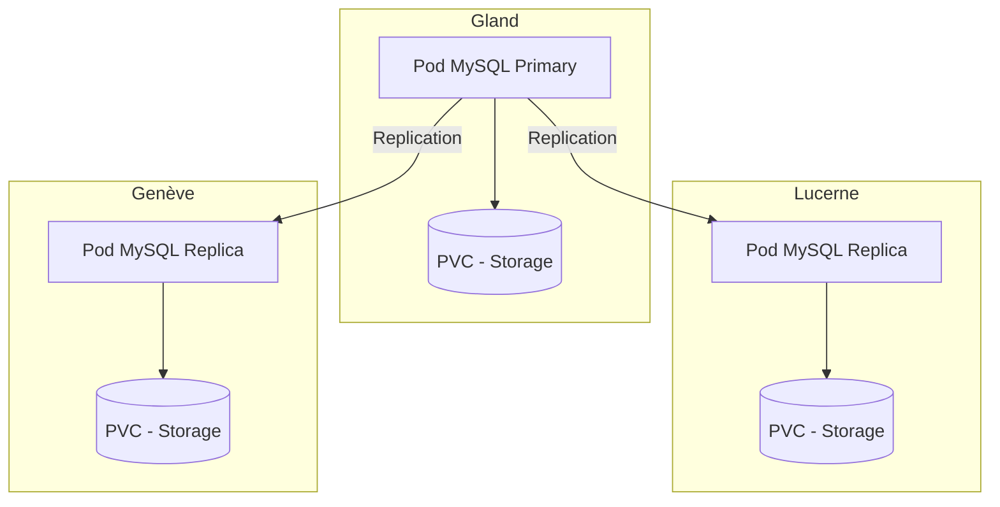

# MySQL on Hikube

Hikube offers a **managed MySQL service**, based on the **MariaDB-Operator**.  
It ensures the deployment of a replicated and self-healing cluster, guaranteeing **high availability**, **simplicity of management**, and **reliable performance**, without user effort.

---

## 🏗️ Architecture and Operation

The **managed MySQL service** on Hikube is based on the **MariaDB-Operator**, which automates the complete lifecycle management of the database: deployment, update, replication, and disaster recovery.  

The architecture is based on a **replicated cluster**:  

- A **primary node** handles all write operations and ensures data consistency.  
- One or more **replicas** (standby) receive transactions in real-time via asynchronous or semi-synchronous replication.  
- An **auto-failover** mechanism automatically promotes a replica as the new primary in case of failure, guaranteeing **high availability**.  

This approach offers:  

- **Resilience** in case of hardware or software failure  
- **Read scalability** through query distribution across replicas  
- **Simplicity of management**, as the platform handles cluster coordination and maintenance  

---

## 💡 Use Cases

The **managed MySQL service on Hikube** is particularly suitable for:  

- **Transactional web applications (OLTP)** : e-commerce, ERP, CRM, where transaction reliability and speed are essential.  
- **Multi-tenant SaaS applications** : each client can have their own isolated database while benefiting from high availability.  
- **High read-load workloads** : the presence of replicas allows query distribution and improves overall performance.  
- **Disaster recovery scenarios** : thanks to the auto-failover mechanism and integrated S3 backups.  

