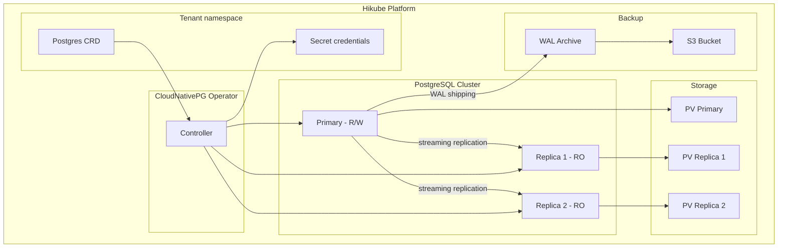
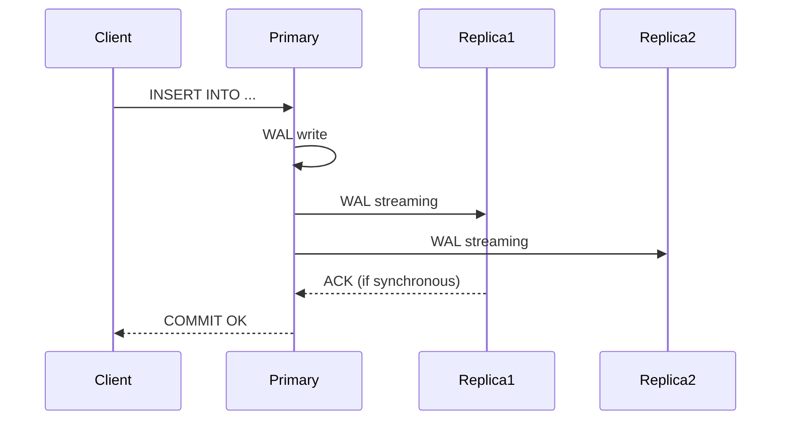

# Concepts — PostgreSQL

## Architecture

PostgreSQL on Hikube is a managed service based on the **CloudNativePG** operator. Each instance deployed via the `Postgres` resource creates a replicated cluster with automatic failover, streaming replication, and built-in backup.

---

## Terminology

| Term | Description |
|------|-------------|
| **Postgres** | Kubernetes resource (`apps.cozystack.io/v1alpha1`) representing a managed PostgreSQL cluster. |
| **Primary** | Main instance that accepts reads and writes. |
| **Replica** | Read-only instance, synchronized via streaming replication from the primary. |
| **CloudNativePG** | Kubernetes operator that manages the lifecycle of PostgreSQL clusters (deployment, failover, backup). |
| **PITR** | Point-In-Time Recovery — restoration to a specific point in time using continuous WAL archiving. |
| **WAL** | Write-Ahead Log — PostgreSQL transaction log, the foundation of PITR and replication. |
| **Quorum** | Minimum number of synchronous replicas required before confirming a write. |
| **resourcesPreset** | Predefined resource profile (nano to 2xlarge) to simplify sizing. |

---

## Replication and high availability

CloudNativePG ensures high availability through:

1. **Streaming replication**: replicas receive WAL in real time from the primary
2. **Automatic failover**: if the primary goes down, a replica is automatically promoted
3. **Synchronous replication** (optional): the primary waits for write confirmation from replicas before committing a transaction

The `quorum` field defines the number of synchronous replicas:
- `quorum: 0` (default) — asynchronous replication, best performance
- `quorum: 1` — at least 1 synchronous replica, protection against data loss

:::tip
For production, configure `replicas: 3` and `quorum: 1` for a good balance between performance and durability.
:::

---

## Backup and restore

PostgreSQL on Hikube supports two backup mechanisms:

### Continuous backup (WAL archiving)

WAL files are continuously archived to an S3 bucket. This enables **PITR** (Point-In-Time Recovery) — restoring the database to any point in the past.

### Scheduled backup

A cron schedule triggers full backups (base backup) at regular intervals. The retention policy (`retentionPolicy`) determines the retention duration.

| Parameter | Description |
|-----------|-------------|
| `backup.schedule` | Cron schedule (e.g., `0 2 * * *`) |
| `backup.retentionPolicy` | Retention duration (e.g., `30d`) |
| `backup.s3*` | S3 bucket credentials and endpoint |

---

## User and database management

Each PostgreSQL cluster allows declaring:

- **Users** with password
- **Databases** with owner
- **Roles**: `admin` (read/write), `readonly` (read-only)

Credentials are stored in a **Kubernetes Secret** named `<instance>-credentials`.

---

## Resource presets

| Preset | CPU | Memory |
|--------|-----|--------|
| `nano` | 250m | 128Mi |
| `micro` | 500m | 256Mi |
| `small` | 1 | 512Mi |
| `medium` | 1 | 1Gi |
| `large` | 2 | 2Gi |
| `xlarge` | 4 | 4Gi |
| `2xlarge` | 8 | 8Gi |

:::warning
If the `resources` field (explicit CPU/memory) is set, `resourcesPreset` is ignored. The two approaches are mutually exclusive.
:::

---

## Limits and quotas

| Parameter | Value |
|-----------|-------|
| Max replicas | Depending on tenant quota |
| Storage size | Variable (`size` in Gi) |
| Connections per user | Configurable per database |

---

## Further reading

- [Overview](./overview.md): service presentation
- [API Reference](./api-reference.md): all parameters of the Postgres resource
