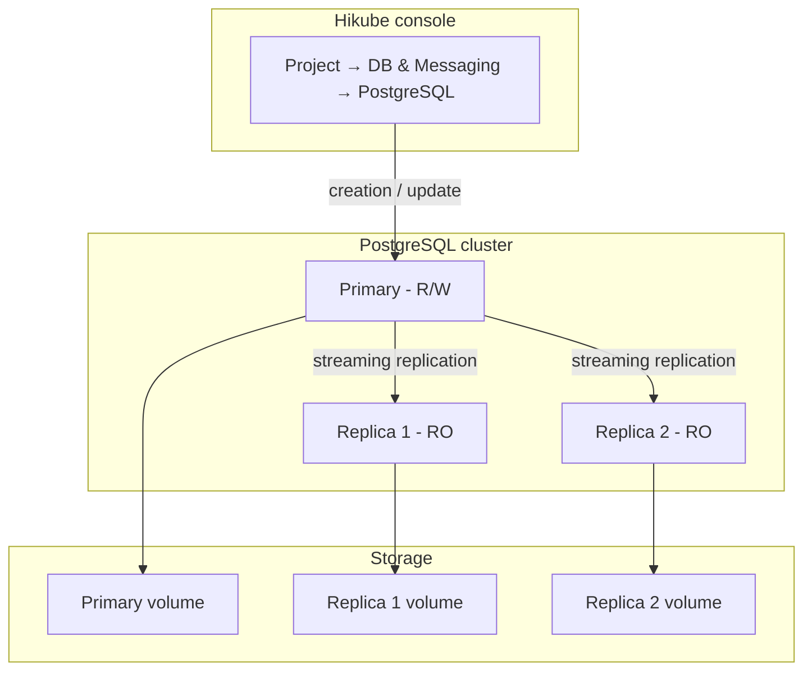
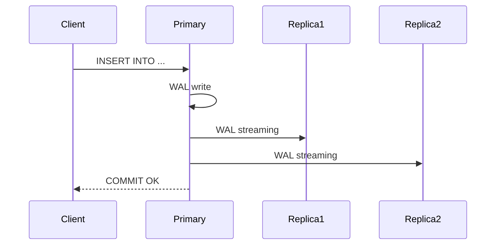

# Concepts — PostgreSQL

## Architecture

PostgreSQL on Hikube is a managed service. Each cluster created from the console is a set of replicated PostgreSQL instances, with automatic failover and streaming replication. It belongs to a **project** and consumes that project's quotas (CPU, memory, storage).

```mermaid
graph TB
    subgraph "Hikube console"
        UI[Project → DB & Messaging → PostgreSQL]
    end

    subgraph "PostgreSQL cluster"
        P[Primary - R/W]
        R1[Replica 1 - RO]
        R2[Replica 2 - RO]
    end

    subgraph "Storage"
        PV1[Primary volume]
        PV2[Replica 1 volume]
        PV3[Replica 2 volume]
    end

    UI -->|creation / update| P
    P -->|streaming replication| R1
    P -->|streaming replication| R2
    P --> PV1
    R1 --> PV2
    R2 --> PV3
```

---

## Terminology

| Term | Description |
|-------|-------------|
| **PostgreSQL Cluster** | Managed instance created from the console, made up of a primary and optional replicas. |
| **Project** | Isolated space that groups your resources and carries the quotas. |
| **Primary** | Main instance that accepts reads and writes. |
| **Replica** | Read-only instance, synchronized from the primary through streaming replication. |
| **Instance preset** | Resource template (CPU, memory) allocated to each node of the cluster. |
| **External access** | Option that exposes the cluster on the Internet through a public IP address. |
| **Extension** | PostgreSQL module (for example `pgcrypto`, `vector`) enabled per database. |
| **WAL** | Write-Ahead Log — the PostgreSQL transaction log, the basis of replication. |

---

## Replication and high availability

High availability relies on:

1. **Streaming replication**: replicas continuously receive WAL from the primary
2. **Automatic failover**: if the primary goes down, a replica is promoted automatically

```mermaid
sequenceDiagram
    participant Client
    participant Primary
    participant Replica1
    participant Replica2

    Client->>Primary: INSERT INTO ...
    Primary->>Primary: WAL write
    Primary->>Replica1: WAL streaming
    Primary->>Replica2: WAL streaming
    Primary-->>Client: COMMIT OK
```

The number of replicas is chosen at creation, in the **Number of replicas** field:

| Offered value | Use |
|-----------------|-------|
| **1 (Standalone)** | Development, testing |
| **2 (High Availability)** | Production with one standby |
| **3 (Max High Availability)** | Critical production |

:::warning
The number of replicas cannot be changed after creation ("The mode cannot be changed after creation"). Choose it according to your availability needs. To change it, [contact support](mailto:support@hidora.io).
:::

Synchronous replication (quorum) is not offered in the console; contact support.

---

## Databases, users and rights

Each cluster has:

- a **`postgres`** database created automatically;
- the **databases** you add, at creation or later (**Databases** tab), with their **extensions**;
- the **users** you create (**Users** tab). Each user is granted, database by database, one of the following two rights:
  - **Administrator (Admin)**: read and write;
  - **Read-only**: read only.

A user's password is generated by the platform and displayed **only once**, at creation or after a rotation. It cannot be viewed afterwards: if it is lost, generate a new one with **Change Password**.

### Naming rules

| Item | Rule |
|---------|-------|
| Cluster name | 3 to 16 characters: lowercase letters, digits and hyphens; starts with a letter, ends with a letter or a digit |
| Username | 3 to 16 characters: lowercase letters, digits and underscores (`_`); starts with a lowercase letter or an underscore. No hyphen (`-`). |
| Database name | 1 to 63 characters: lowercase letters, digits and underscores |

The usernames `postgres`, `admin`, `root`, `owner`, `superuser`, `streaming_replica`, `cnpg_pooler_pgbouncer`, as well as those starting with `pg_`, are reserved.

---

## Instance presets

The **Instance preset** defines the capacity allocated to **each node** of the cluster. The list displayed by the wizard is authoritative; for reference:

| Preset | CPU | Memory |
|--------|-----|---------|
| `nano` | 250m | 128Mi |
| `micro` | 500m | 256Mi |
| `small` | 1 | 512Mi |
| `medium` | 1 | 1Gi |
| `large` | 2 | 2Gi |
| `xlarge` | 4 | 4Gi |
| `2xlarge` | 8 | 8Gi |

The wizard's default preset is `small`. Defining custom CPU/memory resources (outside presets) is not offered in the console; contact support.

---

## Network access

- **External access disabled** (default): the cluster is not exposed on the Internet. The **Host** field on the cluster page shows **Not defined**.
- **External access enabled**: the platform assigns a public IP address, shown in the **Host** field. The port is the standard PostgreSQL port, `5432`.

External access can be enabled or disabled after creation, from **Edit**. Its cost (public IP address) is included in the wizard's **Estimated Cost**.

---

## Backup and restore

Backup configuration and restore are not offered in the console; contact support. See [Configure backups](./how-to/configure-backups.md).

---

## Quotas and cost

From the **Configuration** step onwards, the creation wizard displays the **Estimated Cost** (monthly and hourly) and the cluster's impact on the project quotas (CPU, memory, storage). Consumption takes into account the preset, the number of replicas and the disk size. If the cluster exceeds the available quotas, the **Next** button stays disabled.

| Parameter | Value |
|-----------|--------|
| Disk size | 1 to 4,096 GB, within the project's storage quota |
| Replicas | 1, 2 or 3 |

---

## Going further

- [Overview](./overview.md): service presentation
- [Quick start](./quick-start.md): create your first cluster
