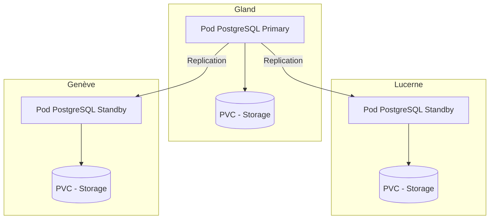

# PostgreSQL on Hikube

Hikube offers a managed PostgreSQL service, based on the **CloudNativePG** operator, recognized and widely adopted by the community.  
The platform supports the deployment and management of a **replicated and self-healing** PostgreSQL cluster, ensuring robustness, performance, and high availability without user effort.

---

## 🏗️ Architecture and Operation

The managed PostgreSQL service on Hikube is based on the **CloudNativePG** operator, which automates the complete lifecycle management of the database: creation, update, replication, and disaster recovery.  

The architecture is built around a **replicated cluster**:  

- A **primary node** that handles writes and serves as the reference for data consistency.  
- One or more **replicas** (standby) that receive modifications in real-time through synchronous or asynchronous replication.  
- An **auto-failover** mechanism that automatically promotes a replica as the new primary in case of failure, ensuring **high availability** without manual intervention.  

This approach guarantees:  

- **Resilience** against hardware or software failures  
- **Read scalability** through query distribution across replicas  
- **Operational simplicity**, as the platform manages cluster coordination and maintenance  

---

## 💡 Use Cases

- **Critical business applications** requiring a reliable and highly available database  
- **E-commerce and ERP**, where service continuity is essential  
- **Multi-tenant SaaS**, allowing load distribution between primary and replicas  
- **Business Intelligence and reporting**, thanks to optimized reads on replicas  
- **Cloud-native applications**, integrated into Kubernetes environments  

