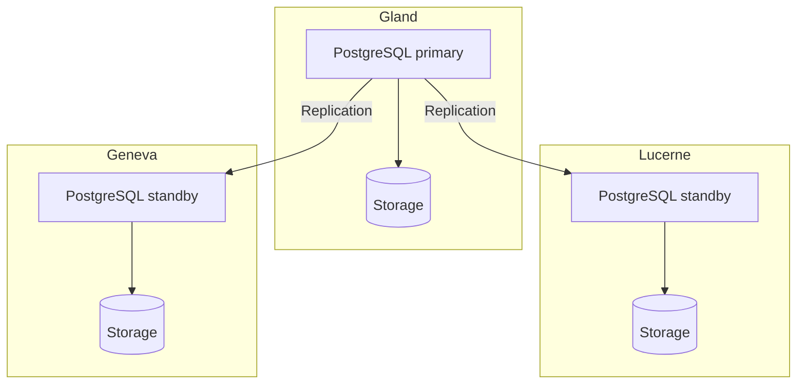

import NavigationFooter from '@site/src/components/NavigationFooter';

# PostgreSQL on Hikube

Hikube offers a managed PostgreSQL service.
The platform handles the deployment and management of a **replicated, self-healing** PostgreSQL cluster, which you create and manage from the [Hikube console](https://console.hikube.cloud) (**DB & Messaging** → **PostgreSQL** menu).

---

## Architecture and operation

The platform automates the database lifecycle: creation, updates, replication and incident recovery.

The architecture is built around a **replicated cluster**:

- A **primary node** that handles writes and serves as the reference for data consistency.
- One or more **replicas** (standby) that continuously receive changes through replication.
- An **auto-failover** mechanism that automatically promotes a replica to new primary in the event of a failure, with no manual intervention.

This approach ensures:

- **Resilience** against hardware or software failures
- **Read scalability** by distributing queries across replicas
- **Operational simplicity**, as the platform handles cluster coordination and maintenance

```mermaid
graph TD
    subgraph Gland
        P1[PostgreSQL primary] --> PVC1[(Storage)]
    end

    subgraph Lucerne
        P2[PostgreSQL standby] --> PVC2[(Storage)]
    end

    subgraph Geneva
        P3[PostgreSQL standby] --> PVC3[(Storage)]
    end

    P1 -->|Replication| P2
    P1 -->|Replication| P3
```

---

## What you manage from the console

| Feature | Available |
|----------|------------|
| Cluster creation (version 15 to 18, preset, disk size, 1 to 3 replicas, external access) | Yes |
| Databases and PostgreSQL extensions | Yes |
| Users, per-database rights (admin / read-only), password rotation | Yes |
| Changing the version, preset, disk size and external access | Yes |
| Changing the number of replicas after creation | No, [contact support](mailto:support@hidora.io) |
| Backups and restore | No, [contact support](mailto:support@hidora.io) |

---

## Use cases

- **Business-critical applications** requiring a reliable, highly available database
- **E-commerce and ERP**, where service continuity is essential
- **Multi-tenant SaaS**, distributing load between the primary and replicas
- **Business Intelligence and reporting**, thanks to optimized reads on replicas
- **Cloud-native applications**, deployed on your Hikube Kubernetes clusters

<NavigationFooter
  nextSteps={[
    {label: "Concepts", href: "../concepts"},
    {label: "Quick start", href: "../quick-start"},
  ]}
  seeAlso={[
    {label: "All databases", href: "../../"},
  ]}
/>
