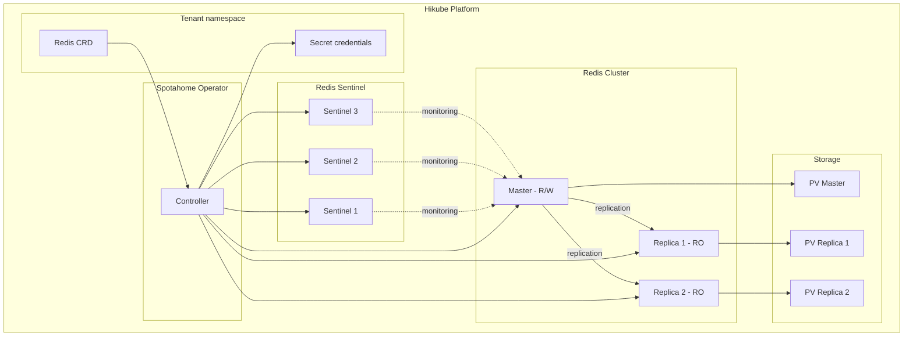
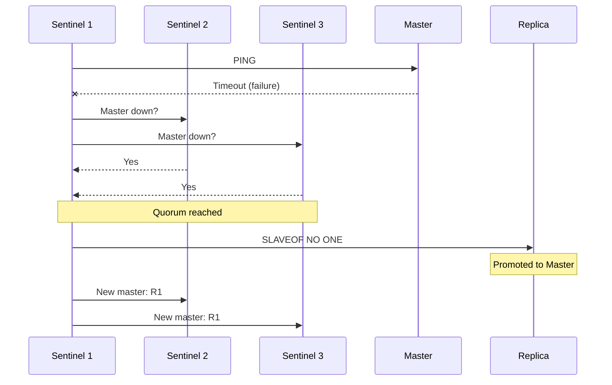

# Concepts — Redis

## Architecture

Redis on Hikube is a managed service based on the **Spotahome Redis Operator**. Each instance deployed via the `Redis` resource creates a master-replica cluster with **Redis Sentinel** for automatic failover.

---

## Terminology

| Term | Description |
|------|-------------|
| **Redis** | Kubernetes resource (`apps.cozystack.io/v1alpha1`) representing a managed Redis cluster. |
| **Master** | Primary instance that accepts reads and writes. |
| **Replica** | Read-only instance, synchronized from the master. |
| **Sentinel** | Monitoring process that detects master failures and orchestrates automatic failover. |
| **Spotahome Redis Operator** | Kubernetes operator that manages the deployment and lifecycle of Redis clusters. |
| **authEnabled** | Enables password authentication (`requirepass`). |
| **resourcesPreset** | Predefined resource profile (nano to 2xlarge). |

---

## High availability with Sentinel

Redis Sentinel ensures high availability by:

1. **Continuously monitoring** the master and replicas
2. **Detecting** master failure by consensus (quorum among Sentinels)
3. **Automatically promoting** a replica to become the new master
4. **Reconfiguring** the other replicas to follow the new master

:::tip
Configure `replicas: 3` minimum to guarantee Sentinel quorum and enable automatic failover.
:::

---

## Persistence

Redis on Hikube supports persistent storage:

| Parameter | Description |
|-----------|-------------|
| `size` | Persistent volume size (e.g., `10Gi`) |
| `storageClass` | `local` (performance) or `replicated` (high availability) |

Redis data is written to disk via native Redis mechanisms (RDB/AOF), ensuring durability even in case of restart.

:::warning
For production, always use `storageClass: replicated` to protect data against node failure.
:::

---

## Authentication

Redis supports optional authentication:

- `authEnabled: true` — a password is generated and stored in the Secret `<instance>-credentials`
- `authEnabled: false` — passwordless access (avoid in production)

---

## Resource presets

| Preset | CPU | Memory |
|--------|-----|--------|
| `nano` | 250m | 128Mi |
| `micro` | 500m | 256Mi |
| `small` | 1 | 512Mi |
| `medium` | 1 | 1Gi |
| `large` | 2 | 2Gi |
| `xlarge` | 4 | 4Gi |
| `2xlarge` | 8 | 8Gi |

:::warning
If the `resources` field (explicit CPU/memory) is set, `resourcesPreset` is ignored.
:::

---

## Limits and quotas

| Parameter | Value |
|-----------|-------|
| Max replicas | Depending on tenant quota |
| Storage size (`size`) | Variable (in Gi) |
| Redis databases | Single database (db 0 by default) |

---

## Further reading

- [Overview](./overview.md): service presentation
- [API Reference](./api-reference.md): all parameters of the Redis resource
