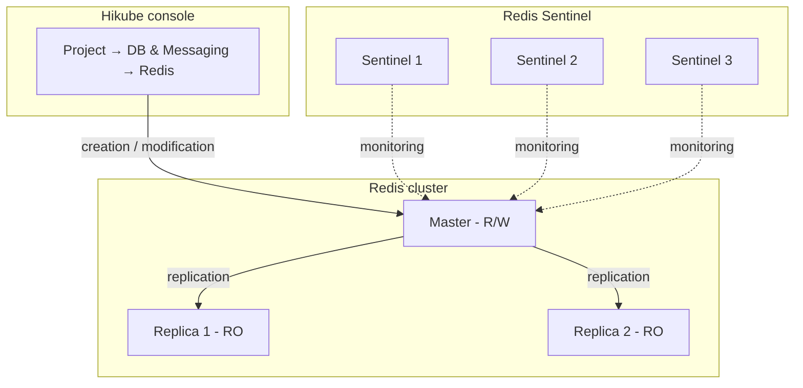
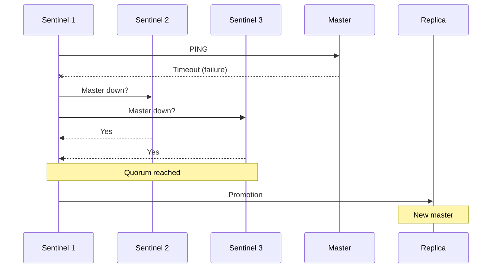

# Concepts — Redis

## Architecture

Redis on Hikube is a managed service. Each cluster created from the console is a master-replicas set, supervised by **Redis Sentinel** for automatic failover. It belongs to a **project** and consumes that project's quotas.

```mermaid
graph TB
    subgraph "Hikube console"
        UI[Project → DB & Messaging → Redis]
    end

    subgraph "Redis cluster"
        M[Master - R/W]
        R1[Replica 1 - RO]
        R2[Replica 2 - RO]
    end

    subgraph "Redis Sentinel"
        S1[Sentinel 1]
        S2[Sentinel 2]
        S3[Sentinel 3]
    end

    UI -->|creation / modification| M
    M -->|replication| R1
    M -->|replication| R2
    S1 -.->|monitoring| M
    S2 -.->|monitoring| M
    S3 -.->|monitoring| M
```

---

## Terminology

| Term | Description |
|------|-------------|
| **Redis Cluster** | Managed instance created from the console, made up of a master and any replicas. |
| **Project** | Isolated space that groups your resources and carries the quotas. |
| **Master** | Main instance that accepts reads and writes. |
| **Replica** | Read-only instance, synchronized from the master. |
| **Sentinel** | Supervision process that detects master failures and orchestrates automatic failover. |
| **Preset** | Resource template (CPU, memory) allocated to each node of the cluster. |
| **Public network** | Option (also called **External access**) that exposes the cluster on the Internet through a public IP address. |
| **Authentication** | Access protection with a cluster-wide password. |

---

## High availability with Sentinel

Redis Sentinel provides high availability by:

1. **Monitoring** the master and the replicas continuously
2. **Detecting** a master failure by consensus among Sentinels
3. **Promoting** a replica to new master automatically
4. **Reconfiguring** the other replicas to follow the new master

```mermaid
sequenceDiagram
    participant S1 as Sentinel 1
    participant S2 as Sentinel 2
    participant S3 as Sentinel 3
    participant M as Master
    participant R1 as Replica

    S1->>M: PING
    M--xS1: Timeout (failure)
    S1->>S2: Master down?
    S1->>S3: Master down?
    S2-->>S1: Yes
    S3-->>S1: Yes
    Note over S1,S3: Quorum reached
    S1->>R1: Promotion
    Note over R1: New master
```

The **Number of replicas** is chosen at creation (from 1 to 8).

:::tip
Automatic failover works from **2 replicas**: three sentinels are always deployed and form the quorum. Choose **3 replicas** or more for production, to tolerate more failures.
:::

:::warning
The number of replicas cannot be changed after creation ("The mode cannot be changed after creation"). To change it, [contact support](mailto:support@hidora.io).
:::

---

## Persistence

Each node has a persistent volume whose capacity is set by the **Volume size (GB)** field ("Storage capacity allocated to each node in the cluster"). Redis writes its data to disk through its native mechanisms, which lets the data survive restarts.

---

## Authentication

The **Enable authentication** option is on by default in the wizard:

- **Enabled**: a password is generated at creation and displayed only once, together with the `default` user. You can renew it at any time from the **Security** section of the cluster page (**Rotate password**).
- **Disabled**: the cluster accepts connections without a password. Avoid this, especially with the public network enabled.

Redis on Hikube does not expose multi-user management (ACL) in the console: access relies on this cluster-wide password.

---

## Network access

- **Public network disabled** (default, "Private" in the summary): the cluster is not exposed on the Internet. The **Connection** section of the cluster page shows "Waiting for allocation..." instead of the host.
- **Public network enabled** ("Public"): the platform assigns a public IP address, displayed in the **Host** field. It gives access to the master on the standard Redis port, `6379`, and follows the master after a failover.

---

## Presets

The **Preset** defines the capacity allocated to **each node** of the cluster. The list displayed by the wizard is authoritative; for reference:

| Preset | CPU | Memory |
|--------|-----|--------|
| `nano` | 250m | 128Mi |
| `micro` | 500m | 256Mi |
| `small` | 1 | 512Mi |
| `medium` | 1 | 1Gi |
| `large` | 2 | 2Gi |
| `xlarge` | 4 | 4Gi |
| `2xlarge` | 8 | 8Gi |

The preset's memory caps the size of the dataset Redis can keep in memory. Custom CPU/memory resources are not offered in the console; contact support.

---

## Quotas and cost

The wizard displays the **Estimated cost** and the cluster's impact on the project quotas. If the cluster exceeds the available quotas, the **Next** button stays disabled.

| Parameter | Value |
|-----------|-------|
| Replicas | 1 to 8 |
| Volume size | 1 to 4,096 GB per node, within the project quota |
| Redis databases | Logical database `0` by default |

---

## Further reading

- [Overview](./overview.md): service presentation
- [Quick start](./quick-start.md): create your first cluster
