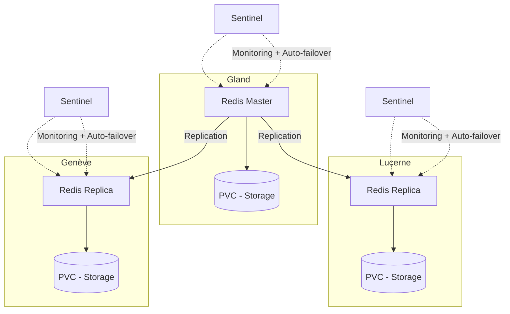

# Redis on Hikube

Hikube offers a **managed Redis service**, based on the **[Spotahome Redis Operator](https://github.com/spotahome/redis-operator)**, widely used in the community.  
The platform supports the deployment and management of a **replicated and self-healing** Redis cluster, relying on **Redis Sentinel** to ensure failure detection and auto-failover.  
This service guarantees speed, low latency, and high availability, without user effort.  

---

## Base Structure

### **Redis Resource**

#### YAML Configuration Example

```yaml
apiVersion: apps.cozystack.io/v1alpha1
kind: Redis
metadata:
  name: example
  namespace: default
spec:
```

---

## 🏗️ Architecture and Operation

The managed Redis service on Hikube is designed to offer **high availability** and **resilience** through a replicated architecture.  

- A **master node** handles all writes and serves as the source of truth for data.  
- One or more **replica nodes** receive data through replication to ensure read scalability.  
- **Redis Sentinel** continuously monitors the cluster state, detects failures, and can automatically promote a replica as the new master (**auto-failover**).  

This combination guarantees:  

- **Continuous availability** even in case of master failure  
- **High performance** with read distribution across replicas  
- **Operational simplicity**, management being automated by the platform and the Spotahome operator  



## 🎯 Use Cases

The **managed Redis service on Hikube** is particularly suitable for:  

- **Application cache** : accelerate web applications (e-commerce, SaaS, API) by reducing response time thanks to in-memory storage.  
- **Distributed sessions** : manage user sessions quickly and reliably in multi-instance environments.  
- **Queue and light streaming** : use Redis as a message broker (pub/sub, queues) for real-time communications.  
- **Real-time analytics** : fast processing of metrics, logs, or streaming events.  
- **Gaming and IoT** : manage temporary states, rankings, and volatile data with low latency.  

