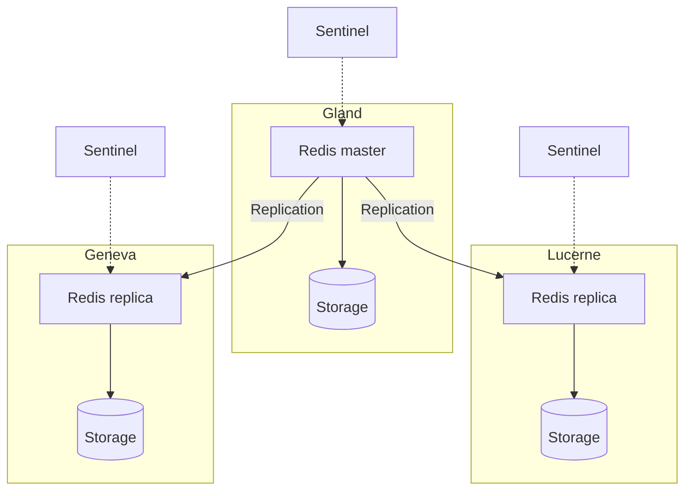

import NavigationFooter from '@site/src/components/NavigationFooter';

# Redis on Hikube

Hikube offers a **managed Redis** service.
The platform handles the deployment and management of a **replicated, self-healing** Redis cluster, relying on **Redis Sentinel** for failure detection and auto-failover. You create and manage your clusters from the [Hikube console](https://console.hikube.cloud) (**DB & Messaging** → **Redis** menu).

---

## Architecture and operation

The managed Redis service on Hikube is designed to provide **high availability** and **resilience** through a replicated architecture:

- A **master node** handles all writes and serves as the source of truth for the data.
- One or more **replica nodes** receive the data through replication to provide read scalability.
- **Redis Sentinel** continuously monitors the cluster state, detects failures and can automatically promote a replica to new master (**auto-failover**).

This combination guarantees:

- **Continuous availability** even if the master fails
- **High performance** by spreading reads across replicas
- **Operational simplicity**, as management is automated by the platform

```mermaid
graph TD
    subgraph Gland
        M1[Redis master] --> PVC1[(Storage)]
    end

    subgraph Lucerne
        R1[Redis replica] --> PVC2[(Storage)]
    end

    subgraph Geneva
        R2[Redis replica] --> PVC3[(Storage)]
    end

    S1[Sentinel] -.-> M1
    S2[Sentinel] -.-> R1
    S3[Sentinel] -.-> R2

    M1 -->|Replication| R1
    M1 -->|Replication| R2
```

---

## What you manage from the console

| Feature | Available |
|---------|-----------|
| Cluster creation (version 7 or 8, preset, 1 to 8 replicas, volume size, public network, authentication) | Yes |
| Password rotation | Yes |
| Changing the version, preset, volume size, external access and authentication | Yes |
| Changing the number of replicas after creation | No, [contact support](mailto:support@hidora.io) |

---

## Use cases

- **Application cache**: speed up web applications (e-commerce, SaaS, APIs) by reducing response times through in-memory storage.
- **Distributed sessions**: manage user sessions quickly and reliably in multi-instance environments.
- **Queues and lightweight streaming**: pub/sub, lists and streams for real-time communication.
- **Real-time analytics**: fast processing of metrics, counters or events.
- **Gaming and IoT**: leaderboards, temporary states and volatile data with low latency.

<NavigationFooter
  nextSteps={[
    {label: "Concepts", href: "../concepts"},
    {label: "Quick start", href: "../quick-start"},
  ]}
  seeAlso={[
    {label: "All databases", href: "../../"},
  ]}
/>
