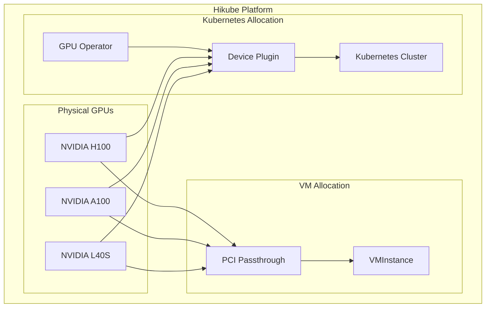
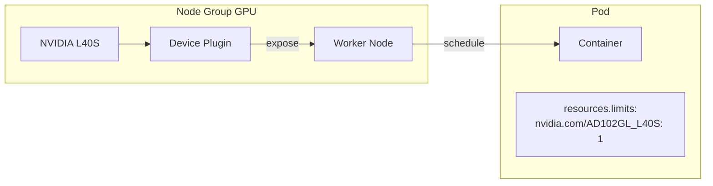

# Concepts — GPU

## Architecture

Hikube allows attaching NVIDIA GPUs directly to virtual machines and Kubernetes clusters. GPU allocation is managed by the **NVIDIA GPU Operator** on the Kubernetes side, and by **PCI passthrough** on the virtual machine side (KubeVirt).

---

## Terminology

| Term | Description |
|------|-------------|
| **GPU Operator** | NVIDIA GPU Operator — automatically manages drivers, the device plugin, and the GPU runtime on Kubernetes nodes. |
| **Device Plugin** | Kubernetes plugin that exposes GPUs as schedulable resources (`nvidia.com/<model>`). |
| **PCI Passthrough** | Technique that assigns a physical GPU directly to a VM, providing native performance. |
| **CUDA** | NVIDIA parallel computing platform, used for GPU acceleration (ML, HPC, rendering). |
| **Instance Type** | CPU/RAM resource profile for the VM. Sized based on the number of GPUs (8-16 vCPU per GPU recommended). |

---

## Available GPU types

| GPU | Architecture | Memory | Performance (INT8) | Use case |
|-----|-------------|--------|-------------------|----------|
| **L40S** | Ada Lovelace | 48 GB GDDR6 | 362 TOPS | Inference, development, prototyping |
| **A100** | Ampere | 80 GB HBM2e | 312 TOPS | ML training, fine-tuning |
| **H100** | Hopper | 80 GB HBM3 | 1979 TOPS | LLM, exascale computing, distributed training |

### GPU identifiers in manifests

| GPU | `gpus[].name` / `nvidia.com/` value |
|-----|---------------------------------------|
| L40S | `nvidia.com/AD102GL_L40S` |
| A100 | `nvidia.com/GA100_A100_PCIE_80GB` |
| H100 | `nvidia.com/H100_94GB` |

---

## GPU on virtual machines

GPUs are attached to VMs via **PCI passthrough**:

- The physical GPU is dedicated to the VM (native performance)
- Declared in `spec.gpus[]` of the `VMInstance` manifest
- Multi-GPU is possible (repeat entries in `gpus[]`)
- NVIDIA drivers must be installed inside the VM

:::tip Recommended CPU/GPU ratio
Plan for **8 to 16 vCPU per GPU**. For a single GPU, a `u1.2xlarge` (8 vCPU, 32 GB RAM) is a good starting point.
:::

---

## GPU on Kubernetes

GPUs are exposed to pods via the **NVIDIA Device Plugin**:

- The GPU Operator must be enabled on the cluster (`plugins.gpu-operator.enabled: true`)
- Pods request a GPU via `resources.limits` (e.g., `nvidia.com/AD102GL_L40S: 1`)
- The Kubernetes scheduler places the pod on a node that has the requested GPU
- GPU nodes are configured in **node groups** with the `gpus[]` field

---

## VM vs Kubernetes comparison

| Criterion | GPU on VM | GPU on Kubernetes |
|-----------|-----------|-------------------|
| **Isolation** | Dedicated GPU (passthrough) | GPU shared via device plugin |
| **Performance** | Native performance | Native performance |
| **Flexibility** | Full OS, manual drivers | Containers, automatic scaling |
| **Multi-GPU** | Via `spec.gpus[]` | Via `resources.limits` |
| **Use case** | Workstations, interactive environments | ML pipelines, large-scale inference |

---

## Limits and quotas

| Parameter | Value |
|-----------|-------|
| GPU per VM | Multiple (depending on availability) |
| GPU per Kubernetes pod | Multiple (via `resources.limits`) |
| GPU types | L40S, A100, H100 |
| Max GPU memory | 80 GB (A100/H100) |

---

## Further reading

- [Overview](./overview.md): GPU service presentation
- [API Reference](./api-reference.md): detailed GPU configuration
