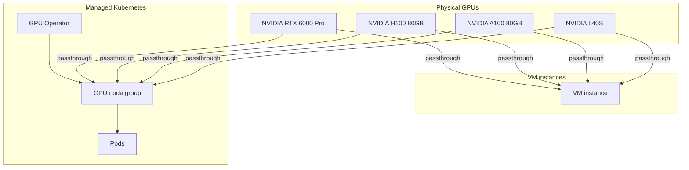
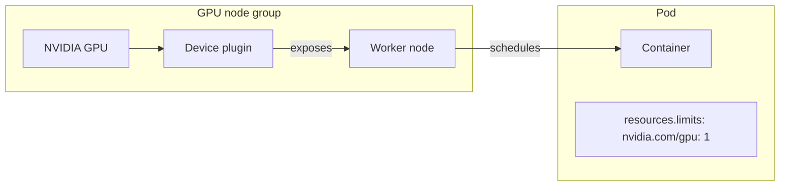

# Concepts — GPU

## Architecture

Hikube attaches physical NVIDIA GPUs to virtual machines and to the nodes of Kubernetes clusters. On the VM side, the GPU is assigned through **PCI passthrough**. On the Kubernetes side, the node receives the GPU the same way, then the **NVIDIA GPU Operator** exposes it to pods.

```mermaid
graph TB
    subgraph "Physical GPUs"
        G1[NVIDIA L40S]
        G2[NVIDIA A100 80GB]
        G3[NVIDIA H100 80GB]
        G4[NVIDIA RTX 6000 Pro]
    end

    subgraph "VM instances"
        VMI[VM instance]
    end

    subgraph "Managed Kubernetes"
        NG[GPU node group]
        GO[GPU Operator]
        POD[Pods]
    end

    G1 & G2 & G3 & G4 -->|passthrough| VMI
    G1 & G2 & G3 & G4 -->|passthrough| NG
    GO --> NG
    NG --> POD
```

---

## Terminology

| Term | Description |
|------|-------------|
| **Hardware Acceleration (GPU)** | Section of the VM wizard where you choose the instance's GPUs. |
| **Node group** | Set of worker nodes of a Kubernetes cluster sharing an instance type and, where applicable, GPUs. |
| **PCI passthrough** | Assignment of a physical GPU directly to a VM or a node, with native performance. |
| **GPU Operator** | NVIDIA Kubernetes addon that installs the drivers, the device plugin and the GPU runtime on the nodes. Enabled automatically as soon as a node group has GPUs. |
| **Device plugin** | Component that exposes GPUs to pods as the schedulable resource `nvidia.com/gpu`. |
| **HAMi** | GPU virtualization addon: shares the same GPU between several pods. Requires the GPU Operator. |
| **CUDA** | NVIDIA parallel computing platform, used for acceleration (ML, HPC, rendering). |

---

## Models and availability

| Model | Memory |
|-------|--------|
| **NVIDIA L40S** | 48 GB |
| **NVIDIA A100 80GB** | 80 GB |
| **NVIDIA H100 80GB** | 80 GB |
| **NVIDIA RTX 6000 Pro** | 96 GB |

The GPU selector shows all the platform's models. A model with no free unit is marked **Unavailable** and cannot be selected. Availability is global: the console does not show the number of free units.

:::note Co-location
A VM, like a Kubernetes node, runs on a single physical server. When you request several GPUs for the same VM (or for each node of a group), they must all be available on the same server. Otherwise, creation fails with the message **The following GPUs are not available: …**, even if each model appears available.
:::

---

## GPU on a virtual machine

- Selected at the **Configuration** step of the wizard, under **Hardware Acceleration (GPU)**: click a card to add a GPU, then use **+** and **−** to change the count. The badge shows the total (for example **2 GPUs total**).
- The section only appears if the platform offers GPUs.
- GPUs can be changed afterwards in **Edit** > **Resources (CPU / RAM)**; the VM restarts.
- Stopping a VM (**Stop**) releases its GPUs. On restart, if they have been assigned elsewhere, the console offers to **Select an alternative GPU**.
- The NVIDIA drivers are not preinstalled in the images.

:::tip CPU/GPU ratio
Plan for **8 to 16 vCPUs per GPU**. For one GPU, a `u1.2xlarge` (8 vCPU, 32 GB) is a good starting point.
:::

---

## GPU on Kubernetes

- Selected at the **Nodes** step of the cluster wizard, **GPU** section of each node group. Each node in the group receives the selected GPUs.
- As soon as a group has GPUs, the **GPU Operator** addon is enabled and can no longer be disabled (**Required when a node group has GPUs**).
- Pods request a GPU through `resources.limits` (`nvidia.com/gpu: 1`).
- A group created **without** GPUs cannot receive any; a group created **with** GPUs can change model or count but must keep at least one GPU. To change category, add a new node group.

```mermaid
graph LR
    subgraph "GPU node group"
        N1[Worker node]
        GPU[NVIDIA GPU]
        DP[Device plugin]
    end

    subgraph "Pod"
        C[Container]
        RL["resources.limits: nvidia.com/gpu: 1"]
    end

    GPU --> DP
    DP -->|exposes| N1
    N1 -->|schedules| C
```

---

## VM and Kubernetes comparison

| Criterion | GPU on VM | GPU on Kubernetes |
|-----------|-----------|-------------------|
| **Access** | GPU dedicated to the VM | GPU assigned to pods by the scheduler |
| **Drivers** | Installed by you in the OS | Installed by the GPU Operator |
| **Multi-GPU** | Several GPUs in the VM | Several GPUs per node, `resources.limits` per pod |
| **Sharing** | No | Yes, with HAMi |
| **Use cases** | Workstations, interactive environments | ML pipelines, large-scale inference |

---

## Further reading

- [Overview](./overview.md)
- [Provision a GPU on a VM](./how-to/provision-gpu-vm.md)
- [Provision a GPU on Kubernetes](./how-to/provision-gpu-kubernetes.md)
