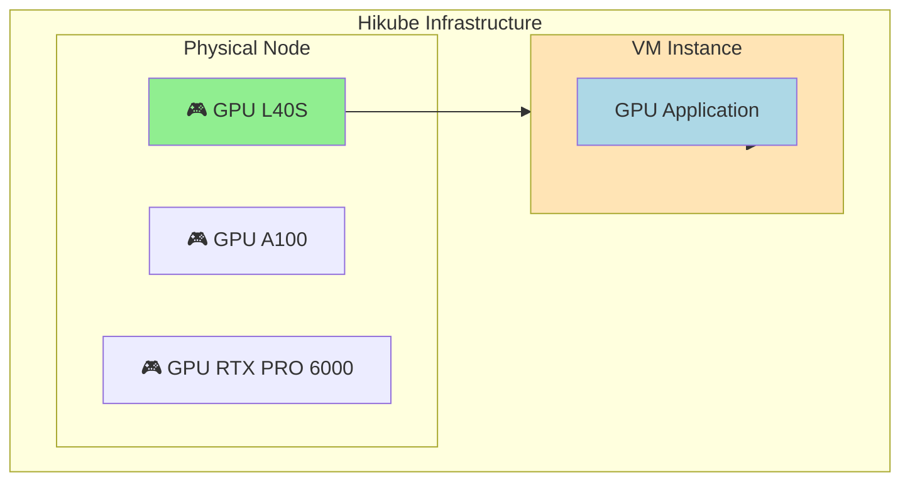
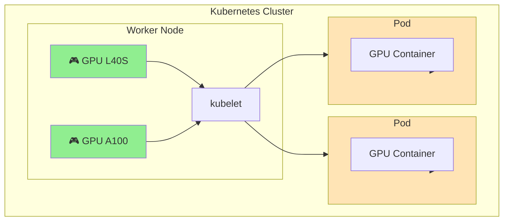

import NavigationFooter from '@site/src/components/NavigationFooter';

# GPUs on Hikube

Hikube provides access to **NVIDIA** accelerators via GPU Passthrough, enabling the execution of workloads requiring hardware acceleration. GPUs are available for two types of workloads: virtual machines and Kubernetes pods.

---

## 🎯 Usage Types

### **GPU with Virtual Machines**

GPUs can be directly attached to virtual machines via VFIO-PCI GPU passthrough, providing complete and exclusive access to the accelerator.

**Use cases:**

- Applications requiring complete GPU control
- Legacy or specialized workloads
- Isolated development environments
- Graphics applications (rendering, CAD)

### **GPU with Kubernetes**

GPUs can be allocated to Kubernetes workers and then assigned to pods via resource requests/limits.

**Use cases:**

- Containerized AI/ML workloads
- Automatic scaling of GPU applications
- GPU resource sharing between applications
- Complex orchestration of parallel jobs

---

## 🖥️ Available Hardware

Hikube offers several NVIDIA GPUs:

### **NVIDIA L40S**

- **Architecture**: Ada Lovelace
- **Memory**: 48 GB GDDR6 with ECC
- **Resource name**: `nvidia.com/AD102GL_L40S`
- **Typical usage**: Generative AI, inference, real-time rendering

### **NVIDIA A100 80 GB (PCIe / SXM4)**

- **Architecture**: Ampere
- **Memory**: 80 GB HBM2e with ECC
- **Resource names**: `nvidia.com/GA100_A100_PCIE_80GB`, `nvidia.com/GA100_A100_SXM4_80GB`
- **Typical usage**: ML training, high-performance computing (the SXM4 variant supports NVLink for multi-GPU)

### **NVIDIA RTX PRO 6000 Blackwell**

- **Architecture**: Blackwell (Server Edition)
- **Memory**: 96 GB GDDR7 with ECC
- **Resource name**: `nvidia.com/GB202GL_RTX_PRO_6000_BLACKWELL_SERVER_EDITION`
- **Typical usage**: LLM, transformers, intensive computing

---

## 🏗️ Architecture

### **GPU Allocation with VMs**


```mermaid
flowchart TD
    subgraph HIKUBE["Hikube Infrastructure"]
        subgraph NODE["Physical Node"]
            GPU1["🎮 GPU L40S"]
            GPU2["🎮 GPU A100"]
            GPU3["🎮 GPU RTX PRO 6000"]
        end
        
        subgraph VM1["VM Instance"]
            APP1["GPU Application"]
        end
    end
    
    GPU1 --> VM1
    VM1 --> APP1
    
    style GPU1 fill:#90EE90
    style VM1 fill:#FFE4B5
    style APP1 fill:#ADD8E6
```

### **GPU Allocation with Kubernetes**


```mermaid
flowchart TD
    subgraph CLUSTER["Kubernetes Cluster"]
        subgraph WORKER["Worker Node"]
            GPU1["🎮 GPU L40S"]
            GPU2["🎮 GPU A100"]
            KUBELET["kubelet"]
        end
        
        subgraph POD1["Pod"]
            CONTAINER1["GPU Container"]
        end
        
        subgraph POD2["Pod"]
            CONTAINER2["GPU Container"]
        end
    end
    
    GPU1 --> KUBELET
    GPU2 --> KUBELET
    KUBELET --> POD1
    KUBELET --> POD2
    POD1 --> CONTAINER1
    POD2 --> CONTAINER2
    
    style GPU1 fill:#90EE90
    style GPU2 fill:#90EE90
    style POD1 fill:#FFE4B5
    style POD2 fill:#FFE4B5
```

---

## ⚙️ Configuration

### **GPU on VM**

```yaml
apiVersion: apps.cozystack.io/v1alpha1
kind: VMInstance
spec:
  runStrategy: Always
  instanceType: "u1.xlarge"
  gpus:
    - name: "nvidia.com/AD102GL_L40S"
  disks:
    - name: vm-gpu-disk
```

### **GPU on Kubernetes Worker**

```yaml
apiVersion: apps.cozystack.io/v1alpha1
kind: Kubernetes
spec:
  nodeGroups:
    gpu-workers:
      instanceType: "u1.xlarge"
      gpus:
        - name: "nvidia.com/AD102GL_L40S"
  addons:
    gpuOperator:
      enabled: true
```

### **GPU in Kubernetes Pod**

```yaml
apiVersion: v1
kind: Pod
spec:
  containers:
  - name: gpu-app
    image: nvidia/cuda:12.0-runtime-ubuntu20.04
    resources:
      limits:
        nvidia.com/gpu: 1
```

---

## 📋 Approach Comparison

| **Aspect** | **GPU on VM** | **GPU on Kubernetes** |
|------------|----------------|------------------------|
| **Isolation** | Complete (1 GPU = 1 VM) | Shared (orchestrated) |
| **Performance** | Native (passthrough) | Native (device plugin) |
| **Management** | Manual | Automated |
| **Scaling** | Vertical only | Horizontal + Vertical |
| **Sharing** | No | Yes (between pods) |
| **Complexity** | Simple | Complex |

---

## 🚀 Next Steps

### **For Virtual Machines**

- [Create a GPU VM](./quick-start.md) → Practical guide
- [API Reference](./api-reference.md) → Complete configuration

### **For Kubernetes**

- [GPU Clusters](../kubernetes/overview.md) → Workers with GPU
  - [Advanced configuration](../kubernetes/api-reference.md) → GPU NodeGroups

<NavigationFooter
  nextSteps={[
    {label: "Concepts", href: "../concepts"},
    {label: "Quick Start", href: "../quick-start"},
  ]}
  seeAlso={[
    {label: "Compute Resources", href: "../../compute/"},
  ]}
/>
